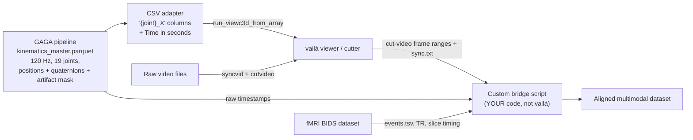

# Adversarial Code & Integration Audit — GAGA Kinematic Pipeline ↔ vailá

## 0. Up-front correction on a key premise

You wrote that vailá will be used "for fMRI and Video" integration. After a thorough sweep of `ref_repo_git/000BEST/vaila-main/vaila-main/`:

- **vailá has zero fMRI / BIDS / NIfTI / TR-trigger support.** No file matches `fmri`, `nifti`, `bids`, `tr_event`. The "multimodal" surface is **video frame alignment** (`syncvid.py`, `cutvideo.py`, `remove_frames2sync.py`) and **CSV time series** (mocap, EMG, force plate).
- **Video sync is integer-frame, not wall-clock or TR-locked.** `cutvideo.parse_sync_file_content` ([`vaila/cutvideo.py:494–511`](ref_repo_git/000BEST/vaila-main/vaila-main/vaila/cutvideo.py)) parses lines `video_file new_name initial_frame final_frame`. Any fMRI alignment must be done by **you**, using vailá only to crop video clips to mocap-onset frames.
- **vailá has no first-class quaternion mocap contract.** Quaternions exist only inside `imu_analysis.py` (scalar-first `(w,x,y,z)`) and `rotation.rotmat2quat` (scipy scalar-last `(x,y,z,w)`). These conventions are not unified.

This reframes the integration question: you are not "integrating with vailá's fMRI module" — you are **using vailá as a video-cutter and CSV viewer** and writing the fMRI bridge yourself.

---

## 1. Flaws and blind spots in your pipeline

References below are concrete, with line ranges.

### 1.1 Quaternion handling is internally inconsistent and partially fake

Three "SLERP" functions, only one of which actually does SLERP:

- `src/resampling.py::resample_quat_slerp` ([line 312–328](src/resampling.py)) — **real** `scipy.spatial.transform.Slerp`, with `quat_enforce_continuity` + `quat_normalize` before and `quat_shortest` + `quat_normalize` after. This is the only mathematically correct path.
- `src/preprocessing.py::quaternion_slerp_interpolation` (~line 489, body 512–522) — **not SLERP**. It hemisphere-flips, then runs **per-component linear** `interp1d`, then renormalizes. This is LERP-with-renorm, a first-order approximation that biases mid-arc orientation toward the chord and breaks at large arcs (>~30°).
- `src/gapfill_quaternions.py::gapfill_quaternion_slerp` (lines 103–110) — **placeholder**: also per-component linear blend + normalize. The audit memory acknowledges SLERP-aware quaternion smoothing is "deferred"; the *name* of the function is misleading because it lies about its semantics.

**Risk:** Anyone reading the source assumes Hamilton-correct SO(3) interpolation everywhere. In practice, depending on which code path a frame traverses, you may get arc-correct or chord-approximated rotations. For Gaga (slow, sustained postural ambiguity), the LERP path is fine; for fast extremity flicks, it isn't.

### 1.2 Quaternion median filter zero-fills NaNs before `medfilt`

`src/filtering.py::apply_quaternion_median_filter` (~1117–1122) temporarily replaces NaNs with **0.0** before `scipy.signal.medfilt`, then restores NaNs. `[0,0,0,0]` is **not a unit quaternion** — it pulls the median toward the null rotation and skews neighboring valid frames. Industry-grade alternative is AI4Animation's [chordal mean of basis vectors](ref_repo_git/000BEST/AI4Animation-master/AI4Animation-master/AI4Animation/SIGGRAPH_2022/Unity/Assets/Scripts/Extensions/QuaternionExtensions.cs) — average `q·x̂`, `q·ŷ` in ℝ³ then re-orthonormalize via `LookRotation`. Or: filter in tangent space (log map → low-pass → exp map).

### 1.3 PCHIP is advertised but linear is used

`src/gapfill_positions.py::bounded_spline_interpolation` docstring promises CubicSpline / PCHIP, but the implementation calls `np.interp` (lines 145–146). The audit memory states PCHIP is "deferred (candidate_pending_tests)", but a reader inspecting the function does not get that signal. This is a silent algorithmic downgrade.

### 1.4 No hysteresis, no minimum dwell, anywhere

- `src/artifacts.py::detect_velocity_artifacts` (lines 13–61) is a **per-axis 6×MAD spike threshold**, OR'd across axes with `binary_dilation(structure=structure)` (one-frame dilation), and any frame with `np.any(...)=True` is masked.
- `src/filtering.py::apply_hampel_filter` (lines 990–1045) likewise: outlier if `|x-median| > n_sigma*MAD/0.6745`, no run-length constraint, no return-to-baseline rule.

For Gaga, where a dancer may pause inside a slow, low-amplitude tremor that is genuinely active but velocity-low, a single 3-frame "non-spike" can flip the joint in and out of the clean mask many times. There is no Schmitt-trigger / dwell on either entry or exit.

### 1.5 OR-union vs AND-union: the second is your real bottleneck

Ticket 008 correctly switched the **global** artifact fraction to OR-union (`global_artifact_frac = 1 - clean_fraction_pca` at `src/v2_feature_engine.py:258–263`). But the **PCA-input mask** in `_build_all_joint_clean_mask` (lines 532–539) remains **AND-union** ("clean only where ALL 19 joints are clean"). For 19 independent joints each with even 1% artifact rate, the AND mask drops ~17% of frames; with 5% per joint you keep ~38% of frames. **A single chronically-bad joint silently halves your usable frame count.**

Pyomeca's xarray pattern would let you express this differently — keep the artifact mask as a `(channel, time)` boolean DataArray and let downstream choose union semantics per analysis, rather than baking AND into the PCA gate.

### 1.6 Adaptive PSD filter has internal contradictions and silent fall-throughs

- **Two PSD APIs disagree on the dance band.** `src/filtering.py::compute_psd_comparison` (line 2382) uses `dance=(1.0, 13.0) Hz`; `src/filter_validation.py::compute_psd_welch` uses `dance_band=(1.0, 15.0) Hz`. Both verdict strings exist (`REVIEW_OVERSMOOTHING`), so depending on which entry point fires, the same signal can pass or fail. (Documented partially via UD-001 in the memory file; the band mismatch itself is not.)
- **`chunked_filtfilt` returns short segments unfiltered** (`src/filtering.py:198–205`). This is the most plausible mechanical explanation of the "S04 introduces NaN" anomaly in [audit_outputs/PROJECT_MEMORY_FOR_IMPLEMENTATION.md](audit_outputs/PROJECT_MEMORY_FOR_IMPLEMENTATION.md): Winter `filtfilt` needs `padlen` samples on each side; isolated clean runs of length ≤ `padlen` either NaN out or pass through unfiltered, depending on the branch.
- **Smart-bias-lerp** ([`src/filtering.py:756–781`](src/filtering.py)) blends two candidate cutoffs by a "trust factor" mapped to 6–12 Hz — this is a heuristic, not a residual-analysis criterion. Winter's classic residual-versus-cutoff plot (which Pyomeca does **not** even implement, but is the textbook method) is replaced by an ad-hoc interpolation. Sensitivity to this is unaudited.

### 1.7 Order-of-operations smear: filter runs on already-interpolated artifact frames

Sequence per memory + [`src/filtering.py`](src/filtering.py):

1. Detect spikes → set to NaN
2. **Stage-1 interp** (`pd.Series.interpolate(method='pchip', limit=fs*0.25)`)
3. Hampel
4. Winter adaptive

The Hampel and Winter steps see interpolated positions as if they were genuine measurements. The artifact mask is **not propagated to the filter** as a sample weight. Industry pattern (Pyomeca-style `interpolate_na` + Butterworth) at minimum keeps an `outlier_mask` DataArray alongside, so a downstream PCA can exclude both the original artifact and a ±k-sample halo where the filter response is still settling. Your `__is_artifact` column only carries the **original** detection — not the **filter contamination halo**.

### 1.8 PCA uses 1 scalar feature per joint, throws away SO(3) structure

`src/v2_feature_engine.py::_get_dynamics_columns` returns **only** `f"{j}__zeroed_rel_omega_mag"` — the *magnitude* of relative angular velocity. This collapses the 3-DOF tangent vector to a scalar and discards direction. Two distinct movements (e.g. shoulder pronation vs. abduction at identical |ω|) become indistinguishable PCA inputs. AI4Animation's PAE (`SIGGRAPH_2022/PyTorch/PAE/PAE.py:69–83`) operates per-channel on the full velocity vector then extracts phase per channel via `atan2`. At minimum you should test PCA on the 3-vector ω in body frame (`{j}__omega_x/y/z`) — 57 features instead of 19 — before claiming `d_eff_norm` characterizes a session.

Compounding this: `StandardScaler` is applied before reference-anchored PCA ([`src/v2_feature_engine.py:587–594`](src/v2_feature_engine.py)) but **deliberately bypassed** in the session-native Gini path (lines 770–774). This is correct for Gini (you need the natural variance), but it means the **anchored** Gini is computed on z-scored data where all 19 joints contribute equally to total variance by construction — your anchored Gini distribution is much narrower than it would be on un-normalized data. The "anchored" and "native" Gini results are not directly comparable; the audit should flag this as a methodological hazard.

### 1.9 The NB06 single-NaN axis-drop is documented but not gated

Memory file (top of [PROJECT_MEMORY_FOR_IMPLEMENTATION.md](audit_outputs/PROJECT_MEMORY_FOR_IMPLEMENTATION.md)): NB06 Cell 7's `notna().all()` gate causes column counts to vary across sessions (773 vs 803). Deferred — fine. But the **feature engine does not assert it.** `compute_atf` and `compute_total_movement` silently skip missing columns (`if vel_col not in df.columns: ... atf=NaN`). A subject with a chronically dropped joint axis becomes an outlier whose ATF for that joint is silently NaN, then `np.median(valid_atfs)` happily computes a whole-body median over 18 joints while another subject's median is over 19. This is **not** flagged in `feature_reliability_table.csv`.

### 1.10 Hips angular features survive PCA but Hips linear features are zero by construction

LD-12 + NB06 logic: `pos_rel[col] = segment_pos - root_pos`, so Hips `lin_rel_*` = 0. But `Hips__zeroed_rel_omega_mag` is the **angular velocity of Hips in body-relative frame** — and `compute_q_local` for Hips (the root) is the **global** orientation rate. Including Hips in the 19-joint PCA mixes global-body rotation (root yaw drift, postural sway) with relative joint kinematics, on equal-variance footing after StandardScaler. This is plausibly desirable but it's an *implicit* methodological choice you should make explicit in `EXTERNAL_BEST_PRACTICES.md`.

### 1.11 No coordinate-frame round-trip test

`src/pipeline.py:140–143` declares "OptiTrack Frame (Y-Up, Z-Forward) for internal consistency; ISB conversion only on final export". `src/coordinate_systems.py::optitrack_to_isb_position` does `[Z_ot, Y_ot, X_ot]` + mm→m (lines 104–131). There is **no unit test** that `isb→ot→isb` is identity. Pyomeca's pattern is to keep units in `attrs["units"]` and assert on read; the GAGA pipeline has no such invariant.

### 1.12 Resampling is OK; quaternion resample is the only one with FP guard

`src/resampling.py::resample_time_grid` is fixed (Ticket 003), and `resample_quat_slerp` includes the `min(grid[-1], t1)` clamp. The PCHIP position resample (`resample_pos_pchip`, lines 263–268) does **not** check whether NaNs in input cause spline ringing. PCHIP is monotone-preserving by construction but ringing-free only on dense, finite input; sparse clean runs near a long NaN gap will produce edge artefacts that survive into S04.

---

## 2. Library-specific takeaways

### 2.1 vailá — the headless-injection map

**Architectural patterns worth borrowing:** essentially none — vailá is a Tkinter-first GUI app with subprocess dispatch. The CSV contract is the only thing of analytical interest.

**Operationally relevant facts:**

- **Canonical CSV columns**: `Time` (seconds) + `{LABEL}_X/Y/Z` (uppercase from C3D export at [`vaila/readc3d_export.py:1535–1551`](ref_repo_git/000BEST/vaila-main/vaila-main/vaila/readc3d_export.py)) or `{label}_x/y/z` lowercase (`vaila/readcsv.py::reshapedata` at lines 182–213). Mixed casing across the codebase.
- **In-memory canonical**: `points: float64 ndarray (n_frames, n_markers, 3)` in **meters**, `fps: float`, `marker_labels: list[str]`. This is the shape expected by `viewc3d.run_viewc3d_from_array(points, marker_labels, fps, filepath="")` ([`vaila/viewc3d.py:4612–4616`](ref_repo_git/000BEST/vaila-main/vaila-main/vaila/viewc3d.py)) — your headless injection door.
- **Silent mm→m heuristic**: `reshapedata` ([line 213](ref_repo_git/000BEST/vaila-main/vaila-main/vaila/readcsv.py)) and `read_csv_generic` multiply by `0.001` whenever `np.mean(np.abs(points)) > 100`. If your data are in meters but include any large translation (e.g. a `lin_rel_p*` column erroneously written in mm), parts of your session will be silently rescaled.
- **No quaternion mocap contract.** Extra `qx, qy, qz, qw` columns in your CSV will be **ignored** by vailá's mocap loaders; you must consume them outside vailá.
- **No fMRI/BIDS module exists.** You will write the fMRI bridge.

### 2.2 Pyomeca — the xarray accessor pattern

Pyomeca is a **canonical-typing-via-xarray** library. Its lessons:

1. **`@xr.register_dataarray_accessor("meca")`** ([`pyomeca/dataarray_accessor.py:12–17`](ref_repo_git/000BEST/pyomeca-master/pyomeca/dataarray_accessor.py)) — one accessor exposing `.meca.low_pass`, `.meca.interpolate_missing_data`, `.meca.detect_outliers`, etc. Your pipeline reinvents this with imperative function calls receiving raw DataFrames; an xarray accessor would let you chain `markers.meca.detect_outliers(threshold=6).meca.interpolate_missing_data().meca.low_pass(order=4, cutoff=10)` and keep `attrs["rate"]`, `attrs["units"]` propagated automatically.
2. **Factory `__new__` returning `xr.DataArray`** ([`pyomeca/markers.py:69–81`](ref_repo_git/000BEST/pyomeca-master/pyomeca/markers.py)) tagged by `name` ("markers"/"angles"/"rototrans"/"analogs") with required `dims=("axis","channel","time")`. This is the dimensionality discipline your `kinematics_master.parquet` (wide, ~803 columns named by string convention) lacks. A schema migration to `(joint, axis, time)` xarray would catch the NB06 axis-drop issue at *construction* time, not 15 stages later.
3. **`from_random_data`** factories ([`markers.py:85–120`](ref_repo_git/000BEST/pyomeca-master/pyomeca/markers.py)) — every type has a `cumsum`-based smooth random trajectory generator. Your `tests/` would benefit from a `gaga_synth_session(n_frames, n_artifacts, artifact_distribution)` builder for unit-testing F1/F2/F4/F5 without needing a real session.
4. **`detect_outliers` is detection-only** ([`pyomeca/processing/misc.py:81–86`](ref_repo_git/000BEST/pyomeca-master/pyomeca/processing/misc.py)) — returns a boolean DataArray; user decides whether to mask, interpolate, or report. Your pipeline conflates detection with mutation (`apply_artifact_truncation` writes NaNs in place). Separation would let you A/B test "raw vs imputed" downstream.
5. **`attrs["rate"]` everywhere** ([`pyomeca/io/read.py:51–64`](ref_repo_git/000BEST/pyomeca-master/pyomeca/io/read.py)). No global `fs` config variable — the rate travels with the data. Your `config.get("fs", 120.0)` fallback is a silent bug-magnet if a 240 Hz session ever enters the pipeline.

What Pyomeca **does not** give you: SLERP, SO(3) log/exp, quaternion sign continuity, PCA, residual-vs-cutoff Winter analysis. Don't import for those.

### 2.3 MoCapLib — the missing-data + Kabsch lesson

MoCapLib is 8 files. The only takeaways that matter:

1. **Occlusion = NaN, encoded at ingest from the C3D residual = −1 sentinel** ([`mocaplib/btkapp.py:263–265`](ref_repo_git/000BEST/mocaplib-master/mocaplib/btkapp.py)). Your pipeline has no equivalent "raw-quality" channel — the artifact column is *derived* from velocity-MAD post hoc. If OptiTrack reports a marker as occluded vs. low-residual-but-present, you lose that distinction. Add a `*_marker_residual` column from the parser if Motive exposes it.
2. **Kabsch SVD rigid-body fill with det-fix** ([`mocaplib/gapfill.py:247–257`](ref_repo_git/000BEST/mocaplib-master/mocaplib/gapfill.py)):

```python
U, S, Vt = np.linalg.svd(C)
R = np.dot(U, np.dot(np.diag([1, 1, np.linalg.det(np.dot(U, Vt))]), Vt))
```

   The `diag([1,1,det])` trick avoids the reflection-vs-rotation ambiguity. This is the right way to fill a missing marker when a 3-marker cluster on the same segment has valid frames — far better than per-axis spline. Relevant if you ever revisit marker-level gap fill upstream of NB06.

3. **Single filter primitive: `filtfilt` Butterworth on axis 0** ([`btkapp.py:35–42`](ref_repo_git/000BEST/mocaplib-master/mocaplib/btkapp.py)). MoCapLib doesn't try to be "adaptive". For a research pipeline, **a fixed, documented, validated cutoff is often more defensible than your smart-bias-lerp interpolation** — easier to peer-review.

### 2.4 AI4Animation — phase manifolds and chordal means

This is the highest-yield library for your work because it actually targets *full-body movement decomposition*.

1. **Phase as `(A·sin(2πφ), A·cos(2πφ))`** ([`SIGGRAPH_2020/.../Utility.cs:510–513`](ref_repo_git/000BEST/AI4Animation-master/AI4Animation-master/AI4Animation/SIGGRAPH_2020/Unity/Assets/Scripts/Utility/Utility.cs); [`PhaseSeries.cs:24–35`](ref_repo_git/000BEST/AI4Animation-master/AI4Animation-master/AI4Animation/SIGGRAPH_2020/Unity/Assets/Scripts/Animation/Series/PhaseSeries.cs)). Wrap-discontinuity-free, interpolatable with `Vector2.Lerp + normalize`, and PCA-friendly. **Direct upgrade path for F4/F5**: instead of `omega_mag` scalars, fit a periodic component per joint per axis, embed as a 2D phase vector with amplitude weighting, run PCA on the 6F-dim space.
2. **Chordal mean of basis vectors instead of quaternion arithmetic mean** ([`QuaternionExtensions.cs:105–113`](ref_repo_git/000BEST/AI4Animation-master/AI4Animation-master/AI4Animation/SIGGRAPH_2022/Unity/Assets/Scripts/Extensions/QuaternionExtensions.cs)):

   ```csharp
   forward += q[i] * Vector3.forward;
   upwards += q[i] * Vector3.up;
   // then: LookRotation(forward, upwards)
   ```

   In numpy this is `R(q)@ẑ` averaged across time, plus `R(q)@ŷ` averaged, then Gram–Schmidt + `Rotation.from_matrix`. This is your fix for `apply_quaternion_median_filter`'s NaN→0 problem.
3. **Periodic decomposition is parametric: `A*sin(2π(F·t − S)) + B`** ([`PhaseModule.cs:876–882`](ref_repo_git/000BEST/AI4Animation-master/AI4Animation-master/AI4Animation/SIGGRAPH_2020/Unity/Assets/Scripts/DataProcessing/Modules/PhaseModule.cs); PAE forward at [`PAE.py:69–83`](ref_repo_git/000BEST/AI4Animation-master/AI4Animation-master/AI4Animation/SIGGRAPH_2022/PyTorch/PAE/PAE.py)). This is the formal version of your Gaga "pulsicity" intuition. Even a scipy.optimize.least_squares per-joint per-second-window fit would give you `(A, F, φ)` triplets that PCA cleanly.
4. **Root-relative kinematics BEFORE periodic / PCA analysis** ([`DeepPhaseModule.cs:124–147`](ref_repo_git/000BEST/AI4Animation-master/AI4Animation-master/AI4Animation/SIGGRAPH_2022/Unity/Assets/Scripts/Animation/Modules/DeepPhaseModule.cs)) — you already do this (`pos_rel`, `q_local`), but they additionally subtract the *root rotation* (not just translation) via `PositionTo(spaceC)`. Your `_zeroed_rel_omega_mag` does this in angular space; do they match? Worth a one-day cross-check.
5. **PCA used only as a visualization of the learned manifold** ([`Plotting.py:16–17`](ref_repo_git/000BEST/AI4Animation-master/AI4Animation-master/AI4Animation/SIGGRAPH_2022/PyTorch/PAE/Plotting.py)) — not as the decomposer itself. This is a critique of your F4: linear PCA on a single magnitude scalar per joint is a *very* weak model of movement. If you intend `D_eff` to mean "intrinsic complexity of this session's movement", PAE/PCA-on-phase-vectors would be a stronger operationalization.

---

## 3. Integration blueprint with vailá

### 3.1 The honest picture (mermaid)



The bridge is yours. vailá's contribution is **only**: (a) visual sanity-check of kinematics via `run_viewc3d_from_array`, (b) crop video to the same time window as mocap via `syncvid` + `cutvideo`. Anything else is double processing.

### 3.2 Schema mismatches and the exact bottlenecks

| Your data | vailá's expectation | Conflict |
|---|---|---|
| Wide parquet, 19 joints × {px, py, pz, qx, qy, qz, qw, lin_vel_*, omega_*, __is_artifact} ≈ 803 cols | Wide CSV, `Time` + `{LABEL}_X/Y/Z`; everything else ignored by mocap loaders | All quaternion, velocity, and mask columns are **stripped on load** |
| Units: meters internally, mm in some parquet columns by historical accident | Auto-rescales if `mean(abs) > 100` ([`vaila/readcsv.py:213`](ref_repo_git/000BEST/vaila-main/vaila-main/vaila/readcsv.py)) | A single mislabelled mm column triggers silent ÷1000 of *all axes in that array* |
| Frame 0 = `time_s[0]`, sampled at 120 Hz exactly after S03 clamp | `Time` parsed as-is; FPS recomputed as `1 / median(diff(Time))` in some viewers | If your S03 clamp introduces sub-µs jitter on the final sample, vailá will infer fps ≠ 120 |
| Artifact mask is `__is_artifact` boolean column per joint | No artifact convention; gaps must be **NaN in the position columns** | Your mask must be applied destructively (NaN-mask positions) before export, **or** maintained outside vailá |
| Quaternions: scalar-last `(x, y, z, w)` per `src/quaternion_ops.py` | IMU uses scalar-first `(w, x, y, z)`; mocap path has none | If you ever pass quaternions to vailá IMU helpers, layout will silently swap |
| Coordinate frame: OptiTrack Y-up, Z-forward (per `src/pipeline.py:140`) | C3D-loader-dependent; `modifylabref` will rotate on user request | If anyone clicks "Modify Lab Ref System" your already-aligned data is rotated again |

### 3.3 The recommended injection pattern (do NOT yet implement)

1. **Write a vailá-shaped CSV adapter** that emits one CSV per session containing only `Time` (seconds, computed from `time_s` re-pinned at exactly `1/120`), and per-marker `{LABEL}_X/Y/Z` in **meters** with **NaN where `{joint}__is_artifact` is True**. Keep `mean(abs) < 100` to avoid the silent mm-rescale heuristic.
2. **Keep quaternions, ω, ATF features, etc. in your own parquet** — vailá will not preserve them.
3. **For programmatic visualization**, call `viewc3d.run_viewc3d_from_array(points, marker_labels, 120.0)` directly. Skip the CSV → C3D round-trip; it loses precision.
4. **For video sync only**, use `syncvid` to mark mocap-onset frame numbers in each video, then `cutvideo` to write clipped videos. Treat the output `*_sync.txt` as the canonical "frame N of clip X corresponds to mocap second t = N/fps_clip".
5. **For fMRI alignment**, write your own. The standard pattern is BIDS `events.tsv` + a per-session `task-gaga_run-1_events.json` whose `onset` and `duration` are in seconds in the *fMRI* clock, plus a single `mocap_offset_s` constant per session linking mocap t=0 to fMRI t=0. vailá contributes nothing here.

---

## 4. Redundant / conflicting operations in vailá that must be disabled

If you ever push a session through vailá's CSV pipeline, the following will silently degrade your data. **Each must be turned off or avoided**:

| vailá module / function | What it does | How to neutralize |
|---|---|---|
| `vaila/interp_smooth_split.py::run_batch` | Linear NaN fill + optional Butterworth + optional savgol on all CSVs in a directory | Set `[interpolation] method = "skip"` and `[smoothing] method = "none"` in `smooth_config.toml`; **do not** invoke "Smooth & Filter" from the GUI |
| `vaila/modifylabref.py::run_modify_labref` | Applies a user-chosen Euler rotation to all marker coords | Never invoke; if scripted, monkey-patch `rotdata` to return input unchanged |
| `vaila/cluster_analysis.py` (Butterworth + Euler from cluster) | Auto-applies `apply_filter(method='butterworth')` inside its analysis loop ([`filtering.py:38–52`](ref_repo_git/000BEST/vaila-main/vaila-main/vaila/filtering.py)) | Do not feed your kinematics through cluster_analysis; it is a separate analysis path |
| `vaila/cube2d_kinematics.py::butter_lowpass_filter` | Hard-coded **6 Hz** Butterworth low-pass | Do not use this module; if you must, fork and pass cutoff |
| `vaila/readcsv.py::read_csv_generic` and `reshapedata` | Auto mm→m when `mean(abs) > 100` | Pre-scale your CSV to meters with `max(abs) < 100`; if you cannot, write a thin adapter that calls `read_csv_generic` with a forced `unit_factor=1.0` (would require fork) |
| `vaila/readc3d_export.py::convert_c3d_to_csv` round-trip | Writes mm if C3D contains mm; reads same; loses precision | Skip the C3D round-trip entirely; go straight CSV → `run_viewc3d_from_array` |
| `vaila/linear_interpolation_split.py::run_linear_interpolation` | Legacy linear NaN fill fallback | Never invoke |
| `vaila/filtering.py::apply_filter` (5 Hz default cutoff) | Generic Butterworth applied across analysis modules | Not auto-triggered on import; just do not call it on your processed kinematics |

**Modules you can safely use without conflict**: `viewc3d.run_viewc3d_from_array`, `syncvid.sync_videos`, `cutvideo` ffmpeg cut, `sync_flash.get_median_brightness` (helper only), `remove_frames2sync` (video-only).

**Modules with no kinematic touch (safe by construction)**: `forceplate_*` (force plate), `emg_labiocom.py` (EMG), `markerless_2d_analysis.py` (2D pose), `animal_open_field.py` (animal tracking), `mp_facemesh.py` (face landmarks).

---

## 5. Concrete asks for clarification before any code changes

These would tighten the integration plan if you decide to act on it (no action requested in this audit):

1. Confirm the **fMRI clock anchor**: is mocap t=0 your behavioral cue onset, the first OptiTrack frame, or a TTL trigger? vailá cannot help here; the answer determines what the bridge script does.
2. Confirm whether you want video sync **frame-accurate** (vailá-native) or **time-accurate** (your bridge must round trips through `fps_clip`).
3. Decide which Phase-13 ticket (if any) should incorporate the audit findings above. Most can be filed as post-Minimal-v1 work; one — the OR-union AND-mask asymmetry in PCA (§1.5) — is a methodological hazard worth raising before the reference-anchored Gini results are published.

---

*This audit cites code paths at line-level granularity. It does not propose immediate edits; any change to `src/` requires a Phase-13 ticket per [PROJECT_MEMORY_FOR_IMPLEMENTATION.md](audit_outputs/PROJECT_MEMORY_FOR_IMPLEMENTATION.md) §"Phase 13 Implementation Rules".*