# Gold-Standard Pattern Synthesis & Zero-Regression Integration

## 0. Framing

Six libraries surveyed, each chosen for what it does *well*:

| Library | Strongest dimension | Weakness for your use case |
|---|---|---|
| **Pyomeca** | Data schema discipline (xarray + accessor + factory + `attrs`) | No SO(3), no PCA |
| **scikit-kinematics** | SO(3) primitives + strategy-pattern IMU filters | Single rigid body only, no multi-segment |
| **MoCapLib** | Minimal correct ingestion + Kabsch gap-fill | No skeleton, no orientation pipeline |
| **AI4Animation** | Feature engineering for movement (phase manifolds, chordal mean) | C# / Unity-native; conceptual not direct port |
| **optitrack_motive** | Streaming NatNet schema discipline + quality bitmasks | Not CSV; no offline parquet pattern |
| **vailá** | Operational lessons (what NOT to do — GUI-first, hardcoded cutoffs, silent unit rescaling) | No analytic API worth importing |

The goal of this synthesis: extract the elegant primitives and assemble them into V2 without rewriting V1. The deliverable is a **shopping list** plus a **zero-regression adapter pattern** that lets you toggle V1 ↔ V2 implementations per stage for direct comparison.

---

## 1. The Gold Standard Pattern Hunt

### 1.1 Data Schema — the gold standard is Pyomeca

**Winner: Pyomeca's xarray-accessor + factory-`__new__` + `attrs` discipline.**

The pattern in [`pyomeca/dataarray_accessor.py:12–17`](ref_repo_git/000BEST/pyomeca-master/pyomeca/dataarray_accessor.py):

```python
@xr.register_dataarray_accessor("meca")
class DataArrayAccessor(object):
    """Meca DataArray accessor used for processing or file writing."""
    def __init__(self, xarray_obj: xr.DataArray):
        self._obj = xarray_obj
```

Plus factory `__new__` ([`pyomeca/markers.py:69–81`](ref_repo_git/000BEST/pyomeca-master/pyomeca/markers.py)) returning a typed `xr.DataArray`:

```python
return xr.DataArray(
    data=data,
    dims=("axis", "channel", "time"),
    coords={"axis": ["x", "y", "z", "ones"], ...},
    name="markers",
    attrs={"rate": 100, "units": "mm", ...},
)
```

Plus C3D ingest that copies metadata into `attrs` ([`pyomeca/io/read.py:51–64`](ref_repo_git/000BEST/pyomeca-master/pyomeca/io/read.py)):

```python
attrs["rate"] = reader.header().frameRate() * data_by_frame
attrs["units"] = reader.parameters().group(group).parameter("UNITS").valuesAsString()[0]
time = np.linspace(start=0, stop=data.shape[-1] / attrs["rate"], num=data.shape[-1], endpoint=False)
```

**Why it wins for 19-joint full-body state:**

- **Dimension naming forces correctness**: `dims=("joint","axis","time")` makes `Hand__lin_vel_rel_mag` impossible by construction; every quantity is indexed by joint name and axis name, not by a string column convention.
- **Units and sample rate travel with the data**: no global `fs` config variable. The NB06 axis-drop bug you carry as deferred technical debt cannot occur — a NaN in one axis-time cell does not propagate to other axes of the same joint.
- **Accessor chaining**: `kine.gaga.detect_artifacts().gaga.impute_rpca().gaga.smooth_iekf().gaga.dmd()` is one expression — no intermediate `_check_outputs` helpers.
- **Reproducible synthetic data**: Pyomeca's `from_random_data` ([`markers.py:85–120`](ref_repo_git/000BEST/pyomeca-master/pyomeca/markers.py)) uses `cumsum` to create smooth random trajectories — the missing primitive for your `tests/synth_gaga.py`.

**Runner-up: scikit-kinematics' dual API (functional + thin class).** Hot-path operations stay in vectorized `q_mult`/`q_inv` functions; the `Quaternion` class wraps them only at API boundaries ([`skinematics/quat.py:178–183`](ref_repo_git/scikit-kinematics-master/skinematics/quat.py)):

```python
def __mul__(self, other):
    if isinstance(other, int) or isinstance(other, float):
        return Quaternion(self.values * other)
    else:
        return Quaternion(q_mult(self.values, other.values))
```

For per-joint quaternion arrays of shape `(T, J, 4)`, you don't actually want `Quaternion` objects in the hot path — but you do want `q_mult(qa, qb)` to broadcast cleanly. Borrow the dual API; skip the OOP wrapper for batch.

**Runner-up #2: optitrack_motive's `MotiveReceiver.normalizer_data` pattern** ([`motive_receiver.py:162–189`](ref_repo_git/optitrack_motive-main/optitrack_motive/motive_receiver.py)) — sort rigid bodies by id, align to marker sets by index, skip `"all"`, expose by `model_name`. This is the discipline you need at the **ingest** edge of V2 if you ever go NatNet-live for Stage 3.

**Loser: vailá's wide CSV with auto mm→m heuristic.** [`vaila/readcsv.py:213`](ref_repo_git/000BEST/vaila-main/vaila-main/vaila/readcsv.py) silently rescales when `mean(abs) > 100`. This is the canonical "don't do this" — implicit conversions that depend on the data's own magnitude are a class of bug that the Pyomeca `attrs["units"]` pattern eliminates by construction.

---

### 1.2 Signal Processing — the gold standard is scikit-kinematics' strategy pattern

**Winner: scikit-kinematics' `IMU_Base._calc_orientation` strategy dispatcher** ([`imus.py:258–329`](ref_repo_git/scikit-kinematics-master/skinematics/imus.py)):

```python
def _calc_orientation(self):
    method = self.qtype
    if method == 'analytical':
        (quaternion, position, velocity) = analytical(self.R_init, self.omega, ...)
    elif method == 'kalman':
        quaternion = kalman(self.rate, self.acc, np.deg2rad(self.omega), self.mag)
    elif method == 'madgwick':
        AHRS = Madgwick(rate=self.rate, Beta=0.5)
        ...
    self.quat = quaternion
```

Switch filters at runtime: `sensor.set_qtype('madgwick')`. Per-frame streaming via `Update()`:

```python
def Update(self, Gyroscope, Accelerometer, Magnetometer):
    qDot = 0.5 * quat.q_mult(q, np.hstack([0, Gyroscope])) - self.Beta * step
    q = q + qDot * self.SamplePeriod
    self.Quaternion = vector.normalize(q).flatten()
```

**Why it wins for V2:** This is the architectural primitive you need to satisfy your zero-regression requirement (§3). One pipeline class, multiple swappable filters, runtime selection by string name. Whether you choose component Butterworth (V1) or MEKF/USQUE/IEKF or NA-MEMD (V2 candidates), the rest of the pipeline doesn't change.

**The angular-velocity formula worth stealing verbatim** ([`skinematics/quat.py:921–929`](ref_repo_git/scikit-kinematics-master/skinematics/quat.py)):

```python
dq_dt = signal.savgol_filter(q, window_length=winSize, polyorder=order, deriv=1, delta=1./rate, axis=0)
angVel = 2 * q_mult(dq_dt, q_inv(q))
return angVel[:,1:]
```

This is `ω = 2·dq/dt ∘ q⁻¹`, the **multiplicative formula** for angular velocity — not the per-component finite difference your V1 uses. Savitzky-Golay handles the denoising in the same call. Stronger than your `quaternion_log_angular_velocity` because SG smooths the derivative, but weaker because it lacks sign unwrapping (which you have). Combine them: SG-derivative on a sign-unwrapped quaternion stream.

**Runner-up: MoCapLib's `filtfilt` Butterworth as the single primitive** ([`mocaplib/btkapp.py:35–42`](ref_repo_git/000BEST/mocaplib-master/mocaplib/btkapp.py)):

```python
def filt_bw_bp(data, fc_low, fc_high, fs, order=2):
    nyq = 0.5 * fs
    low = fc_low / nyq
    high = fc_high / nyq
    b, a = butter(order, [low, high], analog=False, btype='bandpass', output='ba')
    axis = -1 if len(data.shape)==1 else 0
    y = filtfilt(b, a, data, axis, padtype='odd', padlen=3*(max(len(b),len(a))-1))
    return y
```

**Why this is gold:** *one well-documented, validated, fixed-cutoff zero-phase filter beats your V1 smart-bias-lerp heuristic for peer-reviewability*. The reviewer of your Gaga paper can verify a 6 Hz Butterworth cutoff against established biomechanics literature ([Winter 2009](https://www.wiley.com/en-us/Biomechanics+and+Motor+Control+of+Human+Movement%2C+4th+Edition-p-9780470398180)). They cannot verify your `trust_factor ∈ [6, 12] Hz` interpolation. Defensibility > sophistication for research code.

**Runner-up #2: AI4Animation's chordal mean of basis vectors** ([`QuaternionExtensions.cs:105–113`](ref_repo_git/000BEST/AI4Animation-master/AI4Animation-master/AI4Animation/SIGGRAPH_2022/Unity/Assets/Scripts/Extensions/QuaternionExtensions.cs)):

```csharp
forward += quaternions[i] * Vector3.forward;
upwards += quaternions[i] * Vector3.up;
// then: LookRotation(forward, upwards)
```

Python equivalent:

```python
def chordal_mean(qs):
    Rs = scipy.spatial.transform.Rotation.from_quat(qs)
    forward = Rs.apply([0,0,1]).mean(axis=0)
    upwards = Rs.apply([0,1,0]).mean(axis=0)
    return Rotation.from_matrix(gram_schmidt(forward, upwards)).as_quat()
```

This is what should *replace* V1's `apply_quaternion_median_filter` NaN→0 fill. It is the textbook quaternion-average for SLAM/robotics and trivially handles missing data (just drop NaN rows from the sum).

**Loser: V1's adaptive Winter "smart-bias-lerp"** in [`src/filtering.py:756–781`](src/filtering.py). The audit covered this; the point here is *every other library has rejected adaptive-cutoff approaches in favor of fixed, validated cutoffs OR data-driven decompositions (MEMD/EMD)*. There is no middle ground that survives peer review.

---

### 1.3 Kinematic Feature Engineering — the gold standard is AI4Animation's parametric primitives

**Winner: AI4Animation's `(A·sin(2πφ), A·cos(2πφ))` 2D phase manifold** ([`Utility.cs:510–513`](ref_repo_git/000BEST/AI4Animation-master/AI4Animation-master/AI4Animation/SIGGRAPH_2020/Unity/Assets/Scripts/Utility/Utility.cs); embedding at [`PhaseSeries.cs:24–35`](ref_repo_git/000BEST/AI4Animation-master/AI4Animation-master/AI4Animation/SIGGRAPH_2020/Unity/Assets/Scripts/Animation/Series/PhaseSeries.cs)):

```csharp
public static Vector2 PhaseVector(float phase, float magnitude=1f) {
    phase *= 2f * Mathf.PI;
    return magnitude * new Vector2(Mathf.Sin(phase), Mathf.Cos(phase));
}
```

And the periodic-component parameterization from `PhaseModule.Trigonometric` ([`PhaseModule.cs:876–882`](ref_repo_git/000BEST/AI4Animation-master/AI4Animation-master/AI4Animation/SIGGRAPH_2020/Unity/Assets/Scripts/DataProcessing/Modules/PhaseModule.cs)):

```csharp
return A * System.Math.Sin(2.0*System.Math.PI * (F * t - S)) + B;
```

**Why it wins for V2:** Phase as a 2D vector eliminates wrap discontinuities (no `arctan2` jumps), interpolates via vector lerp + renormalize, and PCA-decomposes cleanly. The four-parameter fit `(A, F, S, B)` is exactly the formal version of Gaga's "pulsicity" intuition — and it directly extends to PAE/DeepPhase via the unsupervised PyTorch implementation ([`PAE.py:69–83`](ref_repo_git/000BEST/AI4Animation-master/AI4Animation-master/AI4Animation/SIGGRAPH_2022/PyTorch/PAE/PAE.py)). For Gaga's improvisational segments the periodicity assumption is contested (see V2 blueprint §4.1) — but the math is the right primitive when periodicity does hold.

**Runner-up: scikit-kinematics' Shepperd-style matrix-to-quaternion with explicit gimbal-lock branching** ([`rotmat.py:546–620`](ref_repo_git/scikit-kinematics-master/skinematics/rotmat.py); gimbal-lock NaN-marking at [`quat.py:643–661`](ref_repo_git/scikit-kinematics-master/skinematics/quat.py)):

```python
bz = beta == 0
alpha = np.nan * np.ones_like(beta)
gamma = np.nan * np.ones_like(beta)
alpha[bz] = np.arcsin(Rs[bz,1,0])
gamma[bz] = 0
alpha[~bz] = np.arctan2(Rs[~bz,0,2], Rs[~bz,1,2])
gamma[~bz] = np.arctan2(Rs[~bz,2,0], Rs[~bz,2,1])
```

**Why this is gold:** *mark degeneracy with NaN instead of silently returning garbage.* For PCA pipelines that derive scalar features from Euler angles, this is the difference between a defensible feature ("we report NaN at gimbal lock and drop the frame") and a silent statistical bias.

**Runner-up #2: AI4Animation's `Symmetry[]` array and `GetMirror(axis)` for body-side bilateral analysis** ([`MotionData.cs:736–746`](ref_repo_git/000BEST/AI4Animation-master/AI4Animation-master/AI4Animation/SIGGRAPH_2020/Unity/Assets/Scripts/DataProcessing/Core/MotionData.cs)). Critical for Gaga left/right asymmetry analysis. Your V1 has no concept of bilateral mirroring; AI4Animation makes it a single array lookup.

**Runner-up #3: MoCapLib's Kabsch SVD rigid-body fill with determinant correction** ([`gapfill.py:247–257`](ref_repo_git/000BEST/mocaplib-master/mocaplib/gapfill.py)):

```python
U, S, Vt = np.linalg.svd(C)
R = np.dot(U, np.dot(np.diag([1, 1, np.linalg.det(np.dot(U, Vt))]), Vt))
```

The `diag([1,1,det])` trick avoids reflection-vs-rotation ambiguity. *This is the right way* to fill a missing marker when its segment cluster has valid frames. Pair with V2's Robust-PCA imputation: Kabsch for short cluster-coherent gaps, RPCA for longer whole-body gaps.

**Loser: V1's `__zeroed_rel_omega_mag` scalar.** Covered exhaustively in the V2 blueprint. The point here is *every other library that does feature engineering for motion preserves directional information* — AI4Animation as 2D phase vectors, Pyomeca as 4×4 Rototrans, scikit-kinematics as quaternion arrays. V1 stands alone in collapsing to a scalar magnitude.

---

## 2. The Shopping List of Best Practices (per concern, with citations)

### 2.1 Data container

| Take | From | At | Use in V2 |
|---|---|---|---|
| `xr.register_dataset_accessor("gaga")` for chainable processing | Pyomeca | [`dataarray_accessor.py:12–17`](ref_repo_git/000BEST/pyomeca-master/pyomeca/dataarray_accessor.py) | One accessor on a Dataset, all V2 ops as methods |
| Required `dims=("joint","axis","time")` + `coords` | Pyomeca | [`markers.py:69–81`](ref_repo_git/000BEST/pyomeca-master/pyomeca/markers.py) | V2 schema (eliminates NB06 axis-drop class) |
| `attrs["rate"]`, `attrs["units"]`, `attrs["coord_frame"]` propagated by IO | Pyomeca | [`io/read.py:51–64`](ref_repo_git/000BEST/pyomeca-master/pyomeca/io/read.py) | V2 ingest; removes `config.get("fs", 120.0)` fallback |
| `from_random_data` factory using `cumsum` | Pyomeca | [`markers.py:85–120`](ref_repo_git/000BEST/pyomeca-master/pyomeca/markers.py) | `tests/synth_gaga.py` for V2 validation harness |
| Per-frame dict contract `{frame_id, timestamp, rigid_bodies, labeled_markers}` | optitrack_motive | [`motive_receiver.py:192–210`](ref_repo_git/optitrack_motive-main/optitrack_motive/motive_receiver.py) | If/when V2 ingests NatNet-live for Stage 3 |
| Header-as-`attrs` dict from CSV ingest | optitrack-main (MATLAB sibling) | [`readRigidBody.m:56–64`](ref_repo_git/optitrack-main/readRigidBody.m) | Preserve Motive header metadata into xarray `attrs` |
| Sort rigid bodies by id_num then align to marker_sets by index | optitrack_motive | [`motive_receiver.py:162–189`](ref_repo_git/optitrack_motive-main/optitrack_motive/motive_receiver.py) | Stable joint ordering across sessions |
| Quality bitmask decoder (`occluded`, `point_cloud_solved`, `model_solved`) | optitrack_motive | [`motive_receiver.py:24–30`](ref_repo_git/optitrack_motive-main/optitrack_motive/motive_receiver.py) | Multi-flag mask DataArray, not a single boolean |

### 2.2 Quaternion / SO(3) primitives

| Take | From | At | Use in V2 |
|---|---|---|---|
| Vectorized `q_mult` / `q_inv` / `unit_q` on `(N,4)` arrays | scikit-kinematics | [`quat.py:461–531, 741–786`](ref_repo_git/scikit-kinematics-master/skinematics/quat.py) | Hot-path math for `(T,J,4)` tensors |
| `Quaternion` class with `__mul__` Hamilton product overload | scikit-kinematics | [`quat.py:178–183`](ref_repo_git/scikit-kinematics-master/skinematics/quat.py) | API boundary ergonomics only |
| Shepperd matrix→quaternion with `copysign` branch | scikit-kinematics | [`rotmat.py:546–620`](ref_repo_git/scikit-kinematics-master/skinematics/rotmat.py) | Robust R→q for V2 6D-rep round-trips |
| Named Euler sequences (Fick/Helmholtz/Euler) with documented composition | scikit-kinematics | [`rotmat.py:323–340, 660–672`](ref_repo_git/scikit-kinematics-master/skinematics/rotmat.py) | Document V2's body sequence choice unambiguously |
| Explicit gimbal-lock NaN-marking branch | scikit-kinematics | [`quat.py:643–661`](ref_repo_git/scikit-kinematics-master/skinematics/quat.py) | Use whenever Euler outputs are exported |
| Chordal mean of basis vectors for quaternion average | AI4Animation | [`QuaternionExtensions.cs:105–113`](ref_repo_git/000BEST/AI4Animation-master/AI4Animation-master/AI4Animation/SIGGRAPH_2022/Unity/Assets/Scripts/Extensions/QuaternionExtensions.cs) | Replace V1's `apply_quaternion_median_filter` NaN→0 fill |
| Quaternion-as-scalar-last `(x,y,z,w)` matches Motive on wire | optitrack_motive | [`NatNetClient.py:304–324`](ref_repo_git/optitrack_motive-main/optitrack_motive/streaming/NatNetClient.py) | Keep V2 scalar-last for zero-cost Motive interop |
| Angular velocity via SG-derivative + `2·dq/dt ∘ q⁻¹` | scikit-kinematics | [`quat.py:921–929`](ref_repo_git/scikit-kinematics-master/skinematics/quat.py) | Pair with V1's sign-unwrap; SG denoises in-step |
| Sandwich-product vector rotation `q·v·q⁻¹` (vectorized) | scikit-kinematics | [`vector.py:433–436`](ref_repo_git/scikit-kinematics-master/skinematics/vector.py) | Rotate 19 joint offsets per frame in one call |

### 2.3 Filtering / smoothing

| Take | From | At | Use in V2 |
|---|---|---|---|
| Strategy-pattern dispatcher: `set_qtype(name)` switches filter at runtime | scikit-kinematics | [`imus.py:258–329`](ref_repo_git/scikit-kinematics-master/skinematics/imus.py) | **The zero-regression V2 backbone** (see §3) |
| Stateful `filter.Update(sample)` per-sample, composable in streaming loops | scikit-kinematics | [`imus.py:614–680`](ref_repo_git/scikit-kinematics-master/skinematics/imus.py) | Adapter for per-joint streaming smoothers |
| Single `filt_bw_lp/bp/bs` Butterworth via `filtfilt` on `axis=0` | MoCapLib | [`btkapp.py:35–42`](ref_repo_git/000BEST/mocaplib-master/mocaplib/btkapp.py) | Defensible fallback when adaptive methods fail |
| Sign-unwrapping inside `q_mult` for `|θ|>180°` | scikit-kinematics | [`quat.py:525–528`](ref_repo_git/scikit-kinematics-master/skinematics/quat.py) | Quaternion derivatives must see continuous sequences |

### 2.4 Imputation

| Take | From | At | Use in V2 |
|---|---|---|---|
| Kabsch SVD rigid-body fill with `diag([1,1,det])` reflection fix | MoCapLib | [`gapfill.py:247–257`](ref_repo_git/000BEST/mocaplib-master/mocaplib/gapfill.py) | Short cluster-coherent gaps (Pillar A.1) |
| Donor-marker pattern fill preserving symmetry offsets | MoCapLib | [`gapfill.py::fill_marker_gap_pattern`](ref_repo_git/000BEST/mocaplib-master/mocaplib/gapfill.py) | Bilateral gap-fill when one side is intact |
| Marker residual = −1 → NaN convention | MoCapLib | [`btkapp.py:263–265`](ref_repo_git/000BEST/mocaplib-master/mocaplib/btkapp.py) | V2 ingest: preserve raw `marker_residual` alongside `is_artifact` |

### 2.5 Feature engineering

| Take | From | At | Use in V2 |
|---|---|---|---|
| 2D phase vector `(A·sin(2πφ), A·cos(2πφ))` | AI4Animation | [`Utility.cs:510–513`](ref_repo_git/000BEST/AI4Animation-master/AI4Animation-master/AI4Animation/SIGGRAPH_2020/Unity/Assets/Scripts/Utility/Utility.cs) | Per-joint phase coords for periodic-segment analysis |
| Parametric `A·sin(2π(F·t−S))+B` per-joint per-window fit | AI4Animation | [`PhaseModule.cs:876–882`](ref_repo_git/000BEST/AI4Animation-master/AI4Animation-master/AI4Animation/SIGGRAPH_2020/Unity/Assets/Scripts/DataProcessing/Modules/PhaseModule.cs) | Periodic-feature extractor (optional Pillar) |
| Phase interpolation via `Vector2.Lerp` + renormalize, NOT `arctan2` | AI4Animation | [`PhaseSeries.cs:64–72`](ref_repo_git/000BEST/AI4Animation-master/AI4Animation-master/AI4Animation/SIGGRAPH_2020/Unity/Assets/Scripts/Animation/Series/PhaseSeries.cs) | Avoid phase-wrap discontinuities in V2 |
| Root-relative kinematics before periodic / dynamics analysis | AI4Animation | [`DeepPhaseModule.cs:124–147`](ref_repo_git/000BEST/AI4Animation-master/AI4Animation-master/AI4Animation/SIGGRAPH_2022/Unity/Assets/Scripts/Animation/Modules/DeepPhaseModule.cs) | Already done in V1 spatially; extend to *rotational* root-relative |
| `Symmetry[]` array + `GetMirror(axis)` for bilateral analysis | AI4Animation | [`MotionData.cs:736–746`](ref_repo_git/000BEST/AI4Animation-master/AI4Animation-master/AI4Animation/SIGGRAPH_2020/Unity/Assets/Scripts/DataProcessing/Core/MotionData.cs) | Add `LEFT_RIGHT_MIRROR` coord to xarray Dataset |

### 2.6 Validation and reproducibility

| Take | From | At | Use in V2 |
|---|---|---|---|
| Round-trip property tests: `seq2quat ↔ quat2seq` at ε=1e-12 | scikit-kinematics + Pyomeca | `tests/test_rotmat.py` / `tests/test_processing_rt.py` | Required for every V2 SO(3) function |
| Test fixtures via `from_random_data` cumsum trajectories | Pyomeca | [`markers.py:120`](ref_repo_git/000BEST/pyomeca-master/pyomeca/markers.py) | V2 unit tests with deterministic synthetic data |
| `set_record_streaming` / `set_mock_streaming` for deterministic tests | optitrack_motive | NatNetClient public API | If/when V2 has a live NatNet adapter |
| Strict `.mcal` validation with `McalValidationError` and required fields | optitrack_motive | [`mcal.py`](ref_repo_git/optitrack_motive-main/optitrack_motive/mcal.py) | Pattern for V2 reference-pose validation: fail fast, no silent defaults |

### 2.7 Patterns to actively REJECT (anti-shopping list, for completeness)

| Reject | From | Reason |
|---|---|---|
| Auto mm→m heuristic on `mean(abs) > 100` | vailá | Implicit conversion; magnitude-dependent silent corruption |
| Hardcoded 6 Hz Butterworth in analysis module | vailá `cube2d_kinematics.py` | Magic number outside config |
| Tkinter-coupled "analysis" entry points | vailá | Forces GUI; not headless-friendly |
| Zero-fill NaN before `medfilt` on unit quaternions | (V1 mirrors this pattern) | `[0,0,0,0]` is not a unit quaternion |
| Component-wise linear interp masquerading as SLERP | (V1's `quaternion_slerp_interpolation`, `gapfill_quaternion_slerp`) | Function name lies about semantics |

---

## 3. The Zero-Regression Integration Strategy

### 3.1 The architectural pattern: `xarray` Dataset + `gaga` accessor + Strategy dispatcher

Single design that lets V1 and V2 implementations coexist behind one API.

```mermaid
flowchart LR
  P1["V1 parquet<br/>(frozen baseline)"]
  P2["Optional: NatNet live<br/>(Stage 3)"]
  ADAPTER["v1_parquet_to_xr() shim<br/>(lossless conversion,<br/>preserves all 803 V1 columns<br/>as DataArrays)"]
  DS["xarray.Dataset<br/>dims joint axis time<br/>attrs rate units coord_frame<br/>data_vars position quaternion R6 log_omega is_artifact"]
  ACCESSOR[".gaga accessor<br/>chainable methods<br/>that dispatch by 'method' kw"]
  IMP["impute<br/>method 'v1_pchip' or 'v2_rpca'"]
  SMOOTH["smooth<br/>method 'v1_winter' or 'v2_iekf' or 'v2_namemd'"]
  PCA["decompose<br/>method 'v1_pca_omega_mag' or 'v2_pca_state' or 'v2_pga_so3' or 'v2_dmd'"]
  COMPLEX["complexity<br/>method 'v1_pr' or 'v2_panel'"]
  EXPORT["export<br/>identical feature_scalars.csv<br/>schema for downstream"]

  P1 --> ADAPTER --> DS --> ACCESSOR
  P2 -.-> ADAPTER
  ACCESSOR --> IMP --> SMOOTH --> PCA --> COMPLEX --> EXPORT
```



### 3.2 The accessor skeleton (no implementation in plan mode; design only)

The accessor lives in a new file `src_v2/gaga_accessor.py` (separate from frozen `src/`):

```python
@xr.register_dataset_accessor("gaga")
class GagaAccessor:
    def __init__(self, ds: xr.Dataset):
        self._ds = ds

    def impute(self, method: str = "v1_pchip", **kw) -> xr.Dataset:
        return _IMPUTERS[method](self._ds, **kw)

    def smooth(self, method: str = "v1_winter", **kw) -> xr.Dataset:
        return _SMOOTHERS[method](self._ds, **kw)

    def decompose(self, method: str = "v1_pca_omega_mag", **kw) -> xr.Dataset:
        return _DECOMPOSERS[method](self._ds, **kw)

    def complexity(self, method: str = "v1_pr", **kw) -> dict:
        return _COMPLEXITY[method](self._ds, **kw)
```

Where `_IMPUTERS`, `_SMOOTHERS`, etc. are registries:

```python
_IMPUTERS: dict[str, Callable] = {}

def register_imputer(name: str):
    def deco(fn):
        _IMPUTERS[name] = fn
        return fn
    return deco

@register_imputer("v1_pchip")
def _v1_pchip(ds, **kw):
    """Calls into the frozen V1 code via the shim."""
    from src.preprocessing import detect_and_mask_artifacts
    ...
    return ds_modified

@register_imputer("v2_rpca")
def _v2_rpca(ds, **kw):
    """V2 Robust PCA imputation. Pure new code in src_v2/imputers.py."""
    ...
    return ds_modified
```

### 3.3 Concrete per-stage V1↔V2 toggle map

| Stage | `method=` for V1 | `method=` for V2 | Calls V1 code via |
|---|---|---|---|
| Imputation | `v1_pchip` | `v2_rpca_kabsch` | `src.gapfill_positions.gap_fill_positions` |
| Orientation smoothing | `v1_medfilt` | `v2_iekf` / `v2_usque` / `v2_tangent_savgol` | `src.filtering.apply_quaternion_median_filter` |
| Position filtering | `v1_winter` | `v2_namemd` / `v2_bw_fixed_6hz` | `src.filtering.apply_adaptive_winter_filter` |
| Angular velocity | `v1_log_map` | `v2_sg_multiplicative` | `src.angular_velocity.quaternion_log_angular_velocity` |
| State representation | `v1_omega_mag_scalar` | `v2_state_228d` (pos+R6+log_omega) | `src.v2_feature_engine._get_dynamics_columns` |
| Decomposition | `v1_pca_anchored` | `v2_pca_state` / `v2_pga_so3` / `v2_hankel_dmd` / `v2_cebra_time` | `src.v2_feature_engine.build_pca_engine` |
| Complexity scalar | `v1_pr` (single PR) | `v2_panel` (7-metric) | `src.v2_feature_engine.compute_d_eff` |
| Joint attribution | `v1_gini_omega` | `v2_gini_state_loadings` / `v2_bingham_per_joint` | `src.v2_feature_engine.compute_joint_gini` |

### 3.4 The shim layer (V1 parquet → xarray Dataset)

The single mechanically-tricky file: `src_v2/io/from_v1_parquet.py`. Lossless conversion, no algorithm changes:

```python
def v1_parquet_to_xr(path: Path) -> xr.Dataset:
    df = pd.read_parquet(path)
    fs = _infer_fs_from_time_col(df["time_s"])
    n_frames = len(df)

    # Build positions (J, 3, T)
    pos = np.stack([
        np.stack([
            df[f"{j}__lin_rel_p{a}"].values for a in ("x","y","z")
        ]) for j in ALL_19_JOINTS
    ])

    # Build quaternions (J, 4, T) in xyzw
    quat = np.stack([
        np.stack([
            df[f"{j}__q{a}"].values for a in ("x","y","z","w")
        ]) for j in ALL_19_JOINTS
    ])

    # Build artifact mask (J, T)
    art = np.stack([
        df.get(f"{j}__is_artifact", np.zeros(n_frames, dtype=bool)).values
        for j in ALL_19_JOINTS
    ])

    return xr.Dataset(
        data_vars={
            "position":   (("joint","axis","time"),     pos),
            "quaternion": (("joint","quat_comp","time"), quat),
            "is_artifact":(("joint","time"),            art),
        },
        coords={
            "joint": ALL_19_JOINTS,
            "axis":  ["x","y","z"],
            "quat_comp": ["x","y","z","w"],
            "time":  df["time_s"].values,
        },
        attrs={
            "rate": fs,
            "units_position": "m",
            "units_quat": "dimensionless",
            "coord_frame": "OptiTrack_Y_up",
            "pipeline_version": "v1_frozen_baseline",
            "source_path": str(path),
        },
    )
```

This shim is the ONE thing that must work perfectly. Once it does, every V1 parquet can flow through the V2 accessor without re-running NB01–NB06.

### 3.5 Regression discipline (preserves the V1 golden-hash baseline)

| Mechanism | V1 baseline | V2 incremental |
|---|---|---|
| Content-based SHA256 (per [`PROJECT_MEMORY_FOR_IMPLEMENTATION.md`](audit_outputs/PROJECT_MEMORY_FOR_IMPLEMENTATION.md) Authoritative Golden Baseline) | Frozen at 14 hashes | Not touched — V2 reads V1 parquets |
| V1-method round-trip via accessor: `ds.gaga.smooth(method='v1_winter').gaga.decompose(method='v1_pca_anchored').gaga.complexity(method='v1_pr')` | Must reproduce V1 features bit-for-bit | Required CI test before each V2 PR |
| V2-method run alongside V1 | n/a | Outputs to `v2_feature_scalars.csv` alongside V1 `feature_scalars.csv`; never overwrites V1 |
| Comparative validation notebook | n/a | New `notebooks/07_v1_vs_v2_compare.ipynb` plots V1 vs V2 features per session |

### 3.6 Migration phasing (4 sprints, ~10 weeks)

| Sprint | Goal | Files touched | Risk |
|---|---|---|---|
| **S1 — Shim + Accessor scaffolding** | `src_v2/io/from_v1_parquet.py` + `src_v2/gaga_accessor.py` + dispatcher registries + V1 wrappers for every existing method | `src_v2/*` (new); `src/*` untouched | Low — pure new code |
| **S2 — Adopt scikit-kinematics primitives** | Replace V1's bespoke `q_mult`/`q_inv` in V2 paths with scikit-kinematics functions (vendored or installed). Add chordal mean. Verify round-trip vs V1 | `src_v2/quat_primitives.py` | Low — proven library |
| **S3 — V2 imputation + smoothing** | Implement `v2_rpca`, `v2_kabsch_fill`, `v2_iekf`, `v2_tangent_savgol` per V2 blueprint Pillars A/B | `src_v2/imputers.py`, `src_v2/smoothers.py` | Medium — new math, but adapter pattern isolates risk |
| **S4 — V2 decomposition + complexity panel** | Implement `v2_pca_state`, `v2_pga_so3`, `v2_hankel_dmd`, `v2_panel` per V2 blueprint Pillars D/E/F | `src_v2/decomposers.py`, `src_v2/complexity.py` | Medium — most science-heavy |

Each sprint ends with a CI gate: **the V1-method dispatch must still reproduce the frozen golden hashes**. If it doesn't, the shim is broken; do not merge.

---

## 4. Open decisions before any implementation begins

1. **scikit-kinematics — vendor or install?** scikit-kinematics is BSD-2 (permissive, [`__init__.py:23`](ref_repo_git/scikit-kinematics-master/skinematics/__init__.py)). Vendoring keeps `requirements.txt` light; installing keeps it maintainable. Recommend installing.
2. **xarray addition to `requirements.txt`** — already implied by V2 blueprint; confirm here.
3. **`src_v2/` separate tree vs `src/v2_*.py` flat naming** — recommend `src_v2/` tree (clear V1 freeze; clean teardown if V2 is abandoned).
4. **Accessor name** — `gaga` (recommended; matches `meca`, `mtk` precedent) or `kine` (more generic).
5. **CI gate strictness** — should the V1-dispatch regression test compare against exact V1 hashes or against a 1e-9 tolerance? Recommend exact hashes for content-rounded SHA256 (per existing Ticket 003 discipline).
6. **Notebook strategy** — does each new V2 method get its own notebook (NB07_v2_rpca, NB08_v2_iekf, …) or do they all live behind the accessor in NB07 only? Recommend the latter; the accessor IS the API surface.

---

## 5. References to library primitives borrowed in this synthesis

- Pyomeca xarray accessor: [`pyomeca/dataarray_accessor.py:12–17`](ref_repo_git/000BEST/pyomeca-master/pyomeca/dataarray_accessor.py)
- Pyomeca factory `__new__`: [`pyomeca/markers.py:69–81`](ref_repo_git/000BEST/pyomeca-master/pyomeca/markers.py)
- Pyomeca C3D `attrs` propagation: [`pyomeca/io/read.py:51–64`](ref_repo_git/000BEST/pyomeca-master/pyomeca/io/read.py)
- scikit-kinematics `Quaternion.__mul__`: [`skinematics/quat.py:178–183`](ref_repo_git/scikit-kinematics-master/skinematics/quat.py)
- scikit-kinematics `q_mult`: [`skinematics/quat.py:461–531`](ref_repo_git/scikit-kinematics-master/skinematics/quat.py)
- scikit-kinematics `unit_q` (3→4 auto-completion): [`skinematics/quat.py:741–786`](ref_repo_git/scikit-kinematics-master/skinematics/quat.py)
- scikit-kinematics SG angular velocity: [`skinematics/quat.py:921–929`](ref_repo_git/scikit-kinematics-master/skinematics/quat.py)
- scikit-kinematics Shepperd convert: [`skinematics/rotmat.py:546–620`](ref_repo_git/scikit-kinematics-master/skinematics/rotmat.py)
- scikit-kinematics gimbal-lock NaN-mark: [`skinematics/quat.py:643–661`](ref_repo_git/scikit-kinematics-master/skinematics/quat.py)
- scikit-kinematics IMU strategy dispatcher: [`skinematics/imus.py:258–329`](ref_repo_git/scikit-kinematics-master/skinematics/imus.py)
- scikit-kinematics Madgwick `Update`: [`skinematics/imus.py:614–680`](ref_repo_git/scikit-kinematics-master/skinematics/imus.py)
- scikit-kinematics vector sandwich rotate: [`skinematics/vector.py:433–436`](ref_repo_git/scikit-kinematics-master/skinematics/vector.py)
- MoCapLib `filtfilt` Butterworth: [`mocaplib/btkapp.py:35–42`](ref_repo_git/000BEST/mocaplib-master/mocaplib/btkapp.py)
- MoCapLib Kabsch with det-fix: [`mocaplib/gapfill.py:247–257`](ref_repo_git/000BEST/mocaplib-master/mocaplib/gapfill.py)
- MoCapLib NaN-from-residual: [`mocaplib/btkapp.py:263–265`](ref_repo_git/000BEST/mocaplib-master/mocaplib/btkapp.py)
- AI4Animation phase vector: [`Utility.cs:510–513`](ref_repo_git/000BEST/AI4Animation-master/AI4Animation-master/AI4Animation/SIGGRAPH_2020/Unity/Assets/Scripts/Utility/Utility.cs)
- AI4Animation chordal mean: [`QuaternionExtensions.cs:105–113`](ref_repo_git/000BEST/AI4Animation-master/AI4Animation-master/AI4Animation/SIGGRAPH_2022/Unity/Assets/Scripts/Extensions/QuaternionExtensions.cs)
- AI4Animation periodic parameterization: [`PhaseModule.cs:876–882`](ref_repo_git/000BEST/AI4Animation-master/AI4Animation-master/AI4Animation/SIGGRAPH_2020/Unity/Assets/Scripts/DataProcessing/Modules/PhaseModule.cs)
- AI4Animation Symmetry array: [`MotionData.cs:736–746`](ref_repo_git/000BEST/AI4Animation-master/AI4Animation-master/AI4Animation/SIGGRAPH_2020/Unity/Assets/Scripts/DataProcessing/Core/MotionData.cs)
- optitrack_motive NatNet rigid-body unpack: [`NatNetClient.py:304–324`](ref_repo_git/optitrack_motive-main/optitrack_motive/streaming/NatNetClient.py)
- optitrack_motive `normalizer_data`: [`motive_receiver.py:162–189`](ref_repo_git/optitrack_motive-main/optitrack_motive/motive_receiver.py)
- optitrack_motive quality bitmask decoder: [`motive_receiver.py:24–30`](ref_repo_git/optitrack_motive-main/optitrack_motive/motive_receiver.py)
- optitrack-main MATLAB CSV header parser: [`readRigidBody.m:56–64`](ref_repo_git/optitrack-main/readRigidBody.m)
- optitrack-main unit conversion: [`optitrack_convert_units.m:32–41`](ref_repo_git/optitrack-main/optitrack_convert_units.m)

---

*This synthesis is a design document. The V1 baseline is frozen per your directive; the V2 blueprint sits in `c:\Users\drorh\.cursor\plans\v2_kinematic_blueprint_3b9cf66b.plan.md` as the science-side proposal. This document is the engineering-side proposal — how to ship V2 without breaking V1, by adopting the gold-standard primitives identified above behind a single chainable accessor.*