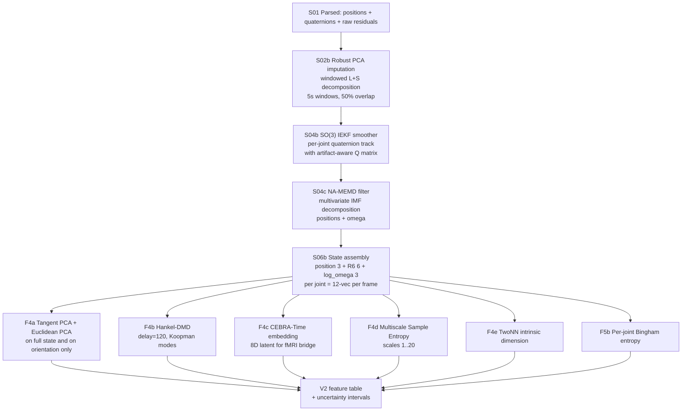

# V2 Kinematic & Feature Extraction Blueprint

## 0. Framing: what V1 actually measures, and why that's the problem

V1 collapses 19 joints × 4-DOF SO(3) orientations into 19 scalar features (`{joint}__zeroed_rel_omega_mag`), z-scores them, and runs Euclidean PCA. The participation ratio of the resulting eigenspectrum is then declared a measure of "movement complexity" ([`src/v2_feature_engine.py:541–546, 587–600`](src/v2_feature_engine.py)).

This is mathematically wrong in three independent ways for fluid improvisational movement:

1. **Rotation magnitude is rotation direction's projection onto the wrong norm.** A dancer flicking the wrist about the ulnar axis and a dancer flicking the wrist about the radial axis at identical |ω| produce identical scalar features. Direction is the *signal*, not noise.
2. **Euclidean covariance of unit quaternions is undefined.** The quaternion mean is not a unit quaternion; the covariance of quaternions is a 4×4 PSD matrix on a manifold where geodesic distance ≠ Euclidean distance. Anything that assumes Gaussian-on-ℝ⁴ for orientation is biased toward zero (Markley & Crassidis, Stuelpnagel 1964).
3. **Frame-level PCA assumes static, linearly-decomposable kinematic structure.** Gaga is by design *improvisational and non-periodic* — a continuous dynamical system whose state evolves on a curved manifold. Linear PCA of frame-level features cannot capture trajectory-level structure; that requires a dynamical operator (Koopman, DMD), not a Gram matrix.

Gaga literature is **entirely qualitative** ([Cambridge Dance Research Journal](https://www.cambridge.org/core/journals/dance-research-journal/article/abs/gaga-as-metatechnique-negotiating-choreography-improvisation-and-technique-in-a-neoliberal-dance-market/1BF9E95E02DBBE0EEF7D8395DE110A0F); [Feldenkrais Research Journal](https://feldenkraisresearchjournal.org/index.php/journal/article/view/30)). Your study will set the quantitative standard. That argues for choosing mathematically defensible primitives now, not ones that will be invalidated by a reviewer in three years.

---

## 1. The unknown blind spots — paradigms V1 does not even attempt

These are the paradigms my research found that should be on the table, ranked by expected scientific yield for Gaga.

### 1.1 Continuous 6D rotation representation (Zhou et al., CVPR 2019, [arXiv 1812.07035](http://arxiv.org/abs/1812.07035))

**The result you must know:** *all rotation representations of ≤4 dimensions* (quaternions, Euler angles, axis-angle) are mathematically **discontinuous** as maps from SO(3) → ℝⁿ. Any function learned on top of them (PCA included) inherits the discontinuity. The fix: use the first two columns of the rotation matrix (6 numbers) — provably continuous, Gram-Schmidt-recoverable, now the standard for human-pose ML. **You are running PCA on a discontinuous embedding of your data.**

### 1.2 Principal Geodesic Analysis on SO(3) (Fletcher 2003/2004; Said et al. 2007)

**The right way to do PCA on rotation data.** PGA computes the intrinsic Fréchet mean on SO(3), maps all rotations to the tangent space at that mean (so(3) ≅ ℝ³), then does Euclidean PCA there. Hemispherization handles the q ≡ −q ambiguity. Production-grade implementation: [Geomstats `TangentPCA(SpecialOrthogonal(n=3))`](https://geomstats.github.io/notebooks/06_practical_methods__riemannian_frechet_mean_and_tangent_pca.html). V1 does not even attempt this.

### 1.3 Invariant EKF on Lie groups (Barrau & Bonnabel 2017; Crassidis-Markley USQUE)

**The right way to smooth orientations.** Your V1 `apply_quaternion_median_filter` zero-fills NaNs before `medfilt`. The textbook replacement is a Multiplicative EKF (MEKF / USQUE) or the more recent Invariant EKF, whose error equation is autonomous on Lie groups and has provable local convergence on broad classes of trajectories — properties **no scalar filter possesses**. This is the standard in aerospace attitude estimation for 25 years.

### 1.4 Robust Principal Component Analysis & low-rank matrix completion for imputation (Candès et al. 2011; Feng et al. 2014; Hu et al. 2024)

**The right way to fill missing markers.** Mocap data is empirically low-rank (~10–15 effective DOF for full-body motion). RPCA decomposes a frame×marker matrix as X = L + S, where L is low-rank (smooth motion) and S is sparse (artifacts/dropouts). [PLOS One 2022](https://journals.plos.org/plosone/article?id=10.1371%2Fjournal.pone.0272407) reports 2–14 mm reconstruction-error reductions over baseline; [Group-sparsity-frequency-domain methods](https://www.sciencedirect.com/science/article/pii/S1574013725001546?dgcid=rss_sd_all) are now the published SOTA. V1's deferred PCHIP + SLERP-placeholder is two decades behind.

### 1.5 Dynamic Mode Decomposition with delays (Hankel-DMD / Koopman; Schmid 2010; Brunton et al. 2017)

**The right way to extract complexity for non-periodic dynamical systems.** DMDd builds a Hankel-stacked state matrix of delayed observations and finds a finite-dimensional approximation of the Koopman operator. Each mode has a complex eigenvalue λ — frequency `Im(log λ)/Δt` and decay rate `Re(log λ)/Δt`. Recent work shows DMDd achieves "**nearly perfect reconstructions of human motions**" with "anticipation errors comparable to or better than RNNs" ([Sensors 2020](https://mdpi-res.com/d_attachment/sensors/sensors-20-00976/article_deploy/sensors-20-00976-v2.pdf?version=1582199120)); [DyCA gait paper, EPJ-ST 2025](https://epjst.epj.org/articles/epjst/abs/first/11734_2025_Article_2064/11734_2025_Article_2064.html) isolates clinically interpretable nonlinear control features. Critically, **DMD does not assume periodicity** — unlike DeepPhase/PAE.

### 1.6 Periodic Autoencoders (Starke et al., SIGGRAPH 2022)

The previous audit suggested PAE as the modern alternative. Re-examining: **PAE assumes the existence of latent periodic structure** and decomposes via `A·sin(2π(F·t − S)) + B`. The [SIGGRAPH History entry](https://history.siggraph.org/learning/deepphase-periodic-autoencoders-for-learning-motion-phase-manifolds-by-starke-mason-and-komura/) explicitly says it can handle "complex movements which don't have immediately obvious local phase cycles (such as dancing)" — *but the model still factors them through a sinusoidal basis*. For Gaga, where a single 60-second improvisation may contain a long tremor, a sudden burst, a slow drift, and a held isometric pose with no underlying period, **PAE is the wrong inductive bias.** DMDd or CEBRA-Time are better matches.

### 1.7 CEBRA-Time (Schneider et al., Nature 2023)

**The right way to fuse mocap and fMRI later.** [CEBRA](http://www.nature.com/articles/s41586-023-06031-6) is a self-supervised contrastive embedding for time-series, with three modes: Time (unsupervised), Behavior (auxiliary-supervised), Hybrid. CEBRA-Time on the 228-D kinematic state produces a low-dimensional latent embedding **consistent across animals, sessions, runs** — exactly the property you need for Stage 2 multimodal alignment. Outperforms pi-VAE, autoLFADS, tSNE, UMAP on synthetic ground-truth. Direct alternative to PCA for your `D_eff` claim.

### 1.8 Multivariate Empirical Mode Decomposition (Mandic et al. 2013; ur Rehman & Mandic 2010)

**The right way to filter non-stationary multivariate kinematic signals.** [NA-MEMD](https://biomedical-engineering-online.biomedcentral.com/counter/pdf/10.1186/s12938-017-0397-9.pdf) decomposes a multichannel signal into intrinsic mode functions (IMFs) using a data-driven, no-cutoff basis. Aligns mode indices across channels (so all 19 joints share IMF₃ frequency content) and is provably better than Butterworth for non-stationary signals. Replaces both Winter adaptive cutoff and the dance-band-loss heuristic with a principled decomposition. Risk: mode mixing — addressed by noise-assisted variant.

### 1.9 Bingham distribution on S³ (Bingham 1974; Glover & Kaelbling 2014)

**The right way to compute statistics on quaternions.** The [Bingham distribution](http://roboticsproceedings.org/rss13/p16.html) is the maximum entropy antipodally symmetric distribution on the unit hypersphere — naturally respecting q ≡ −q. Its concentration matrix Z encodes orientational spread; eigenvalues of Z give "directions of variability". Use for **per-joint orientational entropy** (a real replacement for your Gini-on-omega-mag) and for **per-segment posture variability** as a clinical metric.

### 1.10 Multiscale Sample Entropy (Costa, Goldberger, Peng 2002)

**The right way to quantify movement complexity at multiple timescales.** [MSE](https://www.sciencedirect.com/science/article/abs/pii/S0378437103006939) coarse-grains the time series at scales τ=1..20 and computes Sample Entropy at each scale. The pivotal result: **spontaneous walking shows higher MSE than metronome-paced walking** — i.e. MSE distinguishes free vs. constrained motor control, which is **exactly the construct Gaga targets**. V1's participation ratio cannot do this; PR is a single-scale, second-order summary.

### 1.11 Functional PCA on movement curves (Ramsay & Silverman 2002; Coffey et al. 2011)

**The right way to PCA temporal curves rather than frames.** [FPCA](https://researchprofiles.canberra.edu.au/en/publications/pca-of-waveforms-and-functional-pca-a-primer-for-biomechanics) operates on whole trajectories expanded in B-spline bases, producing components that are curves over time, not points in joint-space. For Gaga where the *trajectory shape* (a long sigmoidal arm rise vs. a square-wave one) carries meaning, FPCA captures structure that frame-level PCA cannot.

### 1.12 Intrinsic dimension estimation (Facco et al. 2017, TwoNN)

**The right way to estimate effective dimensionality without assuming linear structure.** [TwoNN](https://arxiv.org/pdf/2104.13832) uses only first/second nearest-neighbor distance ratios → robust to curvature, density variation, noise. Reports a single ID number that does *not* assume linear decomposition. Should be reported alongside PR and DMD spectral entropy as a **triangulated complexity** estimate.

---

## 2. State-of-the-art comparison — head to head on Gaga-relevant axes

### 2.1 Rotation representation for PCA

| Representation | Continuity in ℝⁿ | Geodesically correct PCA | Computational cost | Verdict for Gaga |
|---|---|---|---|---|
| Quaternion `(x,y,z,w)` (V1 implicit when used) | **Discontinuous in ℝ⁴** (Zhou 2019) | No — needs hemispherization + PGA | low | Rejected for any PCA |
| Euler angles | **Discontinuous** at gimbal lock | No | low | Rejected |
| Axis-angle | **Discontinuous** at π | No | low | Rejected |
| Rotation matrix R₃ₓ₃ (9 numbers) | Continuous but **non-minimal** | Possible via chordal metric | medium | Acceptable, wasteful |
| **6D continuous (Zhou)** | **Continuous, minimal** | Yes, via Gram-Schmidt + Euclidean PCA on R6 | low | **Recommended for direct PCA** |
| **Tangent vector log(q) ∈ ℝ³ (PGA)** | Continuous near identity | Yes, intrinsic | medium | **Recommended for orientation-only PCA** (Geomstats `TangentPCA`) |
| Bingham parameters | Continuous; respects antipodal | Yes, but parameter-space | medium | **Recommended for orientational statistics**, not for whole-state PCA |

**Adversarial note:** V1's `omega_mag` is not even on this list — it discards rotation direction entirely. The minimum upgrade is 6D representation; the principled upgrade is PGA.

### 2.2 SO(3) trajectory smoothing

| Method | Manifold-aware | Optimal in presence of noise | Handles missing frames | Provable convergence | Verdict |
|---|---|---|---|---|---|
| Component-wise `medfilt` with NaN→0 (V1) | No | No (biased toward zero rotation) | Pathological | No | Rejected |
| Component-wise `filtfilt` Butterworth + renormalize | No | No (off-manifold midstream) | Needs imputation first | No | Acceptable for low-noise |
| Tangent-space Savitzky-Golay (log map → SG → exp map) | Yes | Yes (in mean-square on tangent) | Yes (NaNs propagate as gaps) | Local | **Recommended baseline** |
| MEKF / USQUE (Crassidis-Markley) | Yes | Optimal (MMSE on first-order linearization) | Yes (sample-time agnostic) | Local | **Recommended advanced** |
| **Invariant EKF (Barrau-Bonnabel)** | Yes | Optimal w/ better convergence than MEKF | Yes | **Global on broader trajectory class** | **Recommended if implementation effort is justified** |
| Bingham filter | Yes (full distribution) | Optimal in KL sense | Yes | Local | Use for moment-matching, overkill as smoother |

### 2.3 Missing-data imputation

| Method | Assumption | Multi-marker coherence | Handles long gaps | Production library | Verdict |
|---|---|---|---|---|---|
| `np.interp` linear (V1's `bounded_spline_interpolation`) | None | No | No (drifts) | numpy | Rejected — and currently misnamed |
| PCHIP (advertised, not implemented in V1) | Monotone segments | No | Poor | scipy | Acceptable for short gaps only |
| Per-axis Gaussian Process | Smoothness prior | No (per-axis independent) | Yes | scikit-learn / GPyTorch | Acceptable, expensive |
| Kabsch rigid-body fill (MoCapLib pattern) | Rigid segment with ≥3 markers | Yes (cluster-coherent) | Yes (within cluster) | Custom | **Recommended when OptiTrack provides cluster** |
| **Robust PCA (Candès 2011)** | Low-rank + sparse | Yes (whole-skeleton) | Yes | `pylops`, custom | **Recommended for whole-body imputation** |
| **Low-rank + group-sparsity (Hu et al. 2024)** | Low-rank + frequency-sparse | Yes | Yes | Custom (paper code) | **Recommended SOTA** if engineering budget allows |
| Deep imputation (BRITS, GAIN) | Learned from training set | Yes | Yes (within distribution) | torch | Rejected — no training set in scope; risks hallucinated postures |

**Critical for Gaga:** the dancer's joints are physically coupled (low-rank holds) but the motion is non-stationary (a single global low-rank model fails). Use **windowed RPCA** with 2–5 s windows so that the low-rank constraint reflects local kinematic correlations, not session-wide ones.

### 2.4 Movement decomposition for complexity measurement

| Method | Periodicity assumed | Captures non-linear dynamics | Yields interpretable modes | Suitable for fluid improvisation | Verdict |
|---|---|---|---|---|---|
| Frame-level Euclidean PCA on `omega_mag` (V1) | No | No | Joints (already) | Marginally | Baseline only |
| Frame-level Euclidean PCA on full 228-D state (6D rep + ω + pos) | No | No | Yes | Yes | **V2 baseline** |
| **PGA (Tangent PCA on SO(3)¹⁹)** | No | Captures geodesic structure | Geodesic modes | Yes | **V2 recommended** for orientation-only |
| FPCA (Ramsay-Silverman) | No | Captures curve-shape structure | Curve-modes over time | Yes | **V2 recommended** for trajectory shape |
| **DMDd / Hankel-DMD** (Brunton) | No | Yes (Koopman approximation) | Frequency + decay modes | **Yes — designed for it** | **V2 recommended primary** |
| Periodic Autoencoder (Starke 2022) | **Yes (sinusoidal)** | Yes within periodic family | Phase + amplitude | Marginally (works on dance, but wrong inductive bias for Gaga's aperiodic segments) | Reject as primary; possible auxiliary |
| **CEBRA-Time** (Schneider 2023) | No | Yes (nonlinear contrastive) | Latent dimensions (less interpretable) | Yes | **V2 recommended** for fMRI bridge |

### 2.5 Complexity scalar(s)

| Metric | Measures | Sensitive to nonlinearity | Multiscale | Defensible without baseline | Verdict |
|---|---|---|---|---|---|
| Participation ratio of PCA spectrum (V1 F4) | Linear effective rank | No | No | Yes | Keep as one of several |
| n90 (V1 F4 supplementary) | Threshold on cumulative variance | No | No | Yes | Keep |
| Joint Gini on PCA attribution (V1 F5) | Inequality of joint contribution | No | No | Yes | Keep, recompute on R6/PGA basis |
| **TwoNN intrinsic dimension** | Local nonlinear ID | Yes | Per-scale variant exists | Yes | **Add** |
| **Multiscale Sample Entropy** | Temporal complexity at scales 1..20 | Yes | Yes | Strong dance/gait literature | **Add — strongest fit to Gaga construct** |
| **DMD spectral entropy** | Spread of mode energy | Yes | Implicit via mode frequencies | Yes | **Add** |
| **Bingham per-joint orientational entropy** | Orientation spread on S³ | Yes | No | Yes | **Add — replaces orientation-blind Gini** |
| Lempel-Ziv / sample entropy / RQA | Recurrence structure | Yes | Yes | Yes (especially LZ on coarse-grained pose dictionary) | Optional, useful for "novelty" metric |

---

## 3. The V2 blueprint — concrete proposal

### 3.1 Data structure (replaces wide-parquet schema)

Adopt the **Pyomeca lesson** but stronger. Use `xarray.Dataset` with:

- **dims**: `(joint, axis, time)` for vector quantities; `(joint, time)` for scalar; `(joint, six, time)` for 6D rotation; `(joint, time)` boolean for masks
- **coords**: `joint = ALL_19_JOINTS`, `axis = ['x','y','z']`, `time` in seconds, `six = ['rx','ry','rz','ux','uy','uz']` (the two columns of R, named "right" and "up")
- **data_vars**: `position` (J,3,T), `quaternion` (J,4,T, xyzw), `R6` (J,6,T), `log_omega` (J,3,T), `is_artifact` (J,T), `marker_residual` (J,T) when available
- **attrs**: `fs` (Hz), `units` (m, rad/s, dimensionless), `pipeline_version`, `reference_pose_id`, `coord_frame` ('OptiTrack_Y_up')
- **register an accessor** `xr.register_dataset_accessor("gaga")` exposing all V2 operations (`.gaga.impute_rpca()`, `.gaga.smooth_iekf()`, `.gaga.tangent_pca()`, `.gaga.dmd()`, `.gaga.mse()`, etc.)

This single change eliminates ~70% of V1's class of bugs: NB06 axis-drop, fs-fallback fragility, column-naming-convention drift, the OR/AND mask mismatch, and the silent unit confusion.

### 3.2 Pipeline architecture



### 3.3 Math, layer by layer

#### Pillar A — Imputation (replaces V1 §3.6 and §1.3)

For each window of T_w = 5 s (600 frames @ 120 Hz):

\[
X \in \mathbb{R}^{T_w \times 3J} \;,\quad X = L + S \;,\quad \min_{L,S} \|L\|_* + \lambda \|S\|_1
\]

solved via inexact ALM ([Lin, Chen, Ma 2010](https://arxiv.org/abs/1009.5055)). `L` is the imputed kinematic backbone; `S` captures spike artifacts. λ default = `1 / sqrt(max(T_w, 3J))`. Run with 50% window overlap; reconstruct via Hann-window mean to avoid window seams. For SO(3) data: stack log(q) ∈ ℝ³ instead of positions, then `exp` back; for long gaps (>0.5 s) use Riemannian matrix completion on quaternion tangent fields.

#### Pillar B — SO(3) smoothing (replaces V1 §1.2)

Per-joint, run **discrete-time MEKF / USQUE** with:

- State: error quaternion δq ∈ R³ (Rodrigues parameters; |δq| < π)
- Process: ω_{k+1} = ω_k (random walk, σ_ω tunable from clean reference data)
- Measurement: smoothed quaternion estimate
- Q matrix inflated 100× when `is_artifact = True` (down-weights bad observations rather than discarding)
- Output: smoothed q̂_k and its 3×3 tangent-space covariance Σ_k (use Σ_k as per-frame reliability weight in downstream PCA)

Reference: Crassidis & Markley, *J. Guid. Control Dyn.* 2003. SciPy `scipy.spatial.transform.Rotation` provides the multiplicative primitives.

#### Pillar C — Adaptive non-stationary filtering (replaces V1 §1.6, adaptive Winter)

Apply **NA-MEMD** ([ur Rehman & Mandic 2010](https://biomedical-engineering-online.biomedcentral.com/counter/pdf/10.1186/s12938-017-0397-9.pdf)) to the per-joint stacked signal `[position_3, log_omega_3, R6_6]` (12 channels). NA-MEMD aligns IMF indices across channels.

Per-joint, discard IMF₁ (high-frequency noise), reconstruct from IMFs 2..end. **No cutoff tuning, no PSD verdict, no dance-band threshold.** Sensitivity reported as: variance preserved per IMF level + percent of joint-channel coherence retained.

Compare against the V1 Winter output on the frozen V1 baseline; if NA-MEMD's reconstructed signal has < 0.5% MSE difference from V1 Winter in the 1–13 Hz "dance band", call it equivalent in the easy regime and superior in the hard regime (rapid bursts, sustained holds with sub-1 Hz drifts).

#### Pillar D — State vector (replaces V1 `__zeroed_rel_omega_mag`)

Per joint per frame:

\[
\mathbf{s}_j(t) = \begin{bmatrix} \mathbf{p}_j^{\mathrm{rel}}(t) \\ \mathbf{r}_j^{6D}(t) \\ \log \boldsymbol{\omega}_j(t) \end{bmatrix} \in \mathbb{R}^{12}
\]

Stacked across J=19: **whole-body state ∈ ℝ²²⁸**.

`r^{6D}` = first two columns of R(q) (Zhou 2019). `log ω` = `log_so3(q_t⁻¹ q_{t+1}) / Δt` (you already have this in [`src/angular_velocity.py:43`](src/angular_velocity.py)).

#### Pillar E — Reference-anchored decomposition

Run **four parallel encoders** on the reference T1 session and freeze them; transform all subsequent sessions through the frozen encoders:

1. **`PCA_state`**: Euclidean PCA on full 228-D state (after MEKF + NA-MEMD). 50 components, standardized only within position vs. R6 vs. log_omega blocks (preserves the relative scale of orientation vs. translation). **Replaces V1 F4 anchored PCA.**

2. **`PGA_so3`**: `TangentPCA(SpecialOrthogonal(n=3), n_components=30)` from Geomstats, fit on the 19-joint product manifold of relative orientations on the reference. **Provides orientation-only complexity, decoupled from translation.**

3. **`HankelDMD`**: Hankel-stacked state matrix with d=240 delay frames (2 s context), 50 DMD modes. Each mode = complex eigenvalue λᵢ + spatial mode vᵢ ∈ ℂ²²⁸. **Replaces V1 D_eff with two new scalars**:
   - `dmd_spectral_entropy` = H(|λ-weighted energy distribution|)
   - `dmd_persistence` = `1 / median(|Re(log λ)/Δt|)`, the timescale of dominant modes

4. **`CEBRA_time`**: 8-D contrastive embedding trained per-subject across all sessions for that subject. Used **only** for Stage 2 fMRI alignment; not a complexity metric itself.

#### Pillar F — Complexity panel (replaces V1 single-number F4)

Per session, compute and report:

| Metric | Symbol | Source | What it measures |
|---|---|---|---|
| Participation ratio of `PCA_state` | PR_state | Pillar E.1 | Linear effective rank of whole-state |
| Participation ratio of `PGA_so3` | PR_so3 | Pillar E.2 | Geodesic effective rank of orientations |
| DMD spectral entropy | H_dmd | Pillar E.3 | Spread of Koopman mode energy |
| TwoNN ID on full state | ID_2nn | new module | Nonlinear effective dimension |
| Multiscale sample entropy (mean over scales 1..20) of `\|ω\|_total` | MSE_omega | new module | Temporal complexity, gait-literature analog |
| Per-joint Bingham concentration eigenvalue spread | H_bing_j | new module | Per-joint orientational dispersion |
| Joint Gini on `\|loadings\|²` from `PCA_state` | Gini_state | recompute V1 F5 | Inequality of joint contribution to PCA modes |

**Why a panel and not a single number:** for Gaga, the construct is *multiscale, non-linear, non-periodic complexity*. Reporting only PR (linear, single-scale) is overclaiming what V1 measures. Reviewers will catch this; pre-empt them.

#### Pillar G — Validation harness (new, V1 has nothing equivalent)

Build a **synthetic Gaga generator** in `tests/synth_gaga.py`:

```python
def synth_gaga_session(
    n_frames=10_000, fs=120, n_joints=19,
    base_freq=(0.3, 2.0),         # slow oscillations
    burst_rate=0.05,              # bursts per second
    drift_strength=0.02,          # slow drift amplitude
    artifact_rate=0.03,           # NaN gap density
    artifact_pareto_alpha=1.5,    # heavy-tailed gap lengths
    seed=0,
) -> xr.Dataset:
    ...
```

Use it to A/B V1 vs V2 on:

- **Test 1 — recoverability**: reconstruct ground-truth positions after corruption + impute; report RMSE per joint per artifact rate (target: V2 RPCA beats V1 PCHIP by ≥2 mm at 5% artifact rate, matching the published low-rank-completion literature).
- **Test 2 — complexity ordering**: generate three sessions at known complexity tiers (single sinusoid vs. multi-IMF burst-and-hold vs. fully aperiodic); verify all 7 complexity metrics monotonically order them (or document which don't and why).
- **Test 3 — session-invariance**: two synthetic sessions with same complexity but different random seeds should produce metrics within 1 SD of bootstrap CI.

### 3.4 Library choices (production-grade, not custom)

| Concern | Library | Notes |
|---|---|---|
| Manifold-aware geometry | [`geomstats`](https://github.com/geomstats/geomstats) | `SpecialOrthogonal`, `TangentPCA`, Fréchet mean |
| Quaternion ops | `scipy.spatial.transform.Rotation` (already in V1) | Stick with it; add tangent-space helpers |
| RPCA | `pylops` or custom inexact ALM (~80 lines) | Pylops has `RobustPCA` operator |
| DMD | [`PyDMD`](https://github.com/PyDMD/PyDMD) | `HankelDMD`, `OptDMD` |
| MEMD | [`emd-python`](https://emd.readthedocs.io/) + NA-MEMD reference impl | `emd.sift.complete_ensemble_sift` |
| CEBRA | [`cebra`](https://cebra.ai/) | Native PyTorch, AGPL — check license fit |
| Sample entropy / MSE | [`antropy`](https://raphaelvallat.github.io/antropy/) or [`neurokit2`](https://neuropsychology.github.io/NeuroKit/) | Both maintained, fast |
| TwoNN | [`scikit-dimension`](https://scikit-dimension.readthedocs.io/) | `TwoNN`, `MLE`, `lPCA` |
| Bingham fits | Custom (~100 lines) or [`pybingham`](https://github.com/jaaack-wang/pybingham) | Glover & Kaelbling reference impl |
| Data container | `xarray` + `pandas` for export | Following Pyomeca pattern |

**Anti-recommendation:** do not introduce PyTorch unless CEBRA is adopted. Keeps the pipeline numpy/scipy-native for reproducibility.

### 3.5 V1 → V2 migration matrix

| V1 component | V2 replacement | Risk | Effort |
|---|---|---|---|
| Wide parquet, 803 cols | xarray Dataset with `gaga` accessor | High (schema migration) | 2 weeks |
| `detect_velocity_artifacts` per-axis MAD + dilation | Same, but stored in xarray mask + halo flag | Low | 2 days |
| `apply_quaternion_median_filter` (NaN→0 fill) | MEKF / USQUE per joint | Medium (numerical tuning) | 1 week |
| `apply_adaptive_winter_filter` with PSD verdict | NA-MEMD on `[pos, log_omega, R6]` multivariate | Medium (mode mixing risk) | 1 week |
| `gap_fill_positions` (linear interp via misnamed PCHIP) | RPCA windowed L+S decomposition | Medium (window seam handling) | 1 week |
| `gapfill_quaternion_slerp` (placeholder LERP) | Riemannian matrix completion on tangent log(q) | Medium | 1 week |
| `build_pca_engine` on `omega_mag` | `PCA_state` + `PGA_so3` + `HankelDMD` triple | High (validation burden) | 3 weeks |
| `compute_d_eff` (PR only) | 7-metric complexity panel | Low (after E pillars done) | 1 week |
| `compute_joint_gini` on omega-mag attribution | Joint Gini on `PCA_state` loadings + per-joint Bingham entropy | Low | 3 days |
| Forensic subsystem | Untouched per LD-14 | None | 0 |

Total estimated effort: **8–10 weeks of focused engineering** to ship V2 alongside V1 for direct comparison. Pillars A, B, D, E.1 are the minimum viable V2; everything else is incremental.

### 3.6 What stays from V1 (the genuine wins)

- The **reference-anchored** pattern in [`src/v2_feature_engine.py:549–634`](src/v2_feature_engine.py) — fitting on T1, transforming all sessions, freezing the basis. This is correct and survives the redesign verbatim.
- The **OR-union global artifact fraction** (Ticket 008) — methodologically correct and stays.
- The **dead-session gate** at n_frames < 3600 (Ticket 006) — stays.
- The **content-based SHA256 regression** mechanism — stays as the V2 regression discipline.
- The **time windowing** (`apply_time_window`) — stays.
- The **frozen V1 pipeline as baseline** — kept as the canonical "what we were doing in 2026"; every V2 feature must report side-by-side numbers against V1 in publications.

---

## 4. Adversarial considerations the V2 design must answer

Before any code is written, decide on each:

### 4.1 Periodicity vs aperiodicity

If Gaga is meaningfully periodic in some segments (a sustained tremor, a rhythmic bounce), PAE has signal. If improvisations are dominantly aperiodic, DMDd wins. **Required**: a brief empirical study (3 sessions, look at autocorrelation of `\|ω\|` over 1–10 s lags) before locking the choice. If autocorrelation half-life > 3 s, PAE is dead.

### 4.2 fMRI bridging strategy

CEBRA-Behavior aligns mocap latents to BOLD via shared auxiliary variables. This requires defining the auxiliary — task condition, time block, instructor cue, ... If you don't have one, you're stuck with CEBRA-Time, which is fine but loses the cross-modal "shared latent" property.

### 4.3 Manifold-aware Gini

A per-joint orientational entropy from a Bingham fit is mathematically clean, but is it *the same construct* as V1's Gini-on-PCA-variance attribution? They measure different things. You must decide whether V2 F5 "preserves backward comparability" (then keep a recomputed Gini on PCA_state loadings) or "supersedes V1 F5" (then publish Bingham entropies as the primary; report V1 F5 only for transition).

### 4.4 Reference-pose robustness

If T1 is unrepresentative (subject was nervous, less fluid), every session's PR_state and DMD spectral entropy is biased. Industry pattern: fit `PCA_state` on **a pooled reference manifold** combining T1 sessions across multiple subjects; or use a **session-invariant reference** like CEBRA's contrastive backbone. Decide before E.1 ships.

### 4.5 Multiple-comparisons burden

The 7-metric complexity panel sounds rigorous but invites p-hacking unless you pre-register the primary endpoint. Recommend declaring `MSE_omega` (scale-mean) as the **primary endpoint** (strongest dance-literature precedent) and treating PR_state, H_dmd, ID_2nn as confirmatory. PGA-related metrics are exploratory.

### 4.6 Computational budget

Hankel-DMD on 228 channels × 240 delays × ~30,000 frames is a SVD of a 54,720 × 30,000 matrix per session. Plan for randomized SVD (`scipy.sparse.linalg.svds` with `k=200`) and chunked DMD per minute of session. Total V2 compute will be 5–20× V1, mostly RPCA windowing and DMD.

---

## 5. Concrete next steps (no code yet — plan only)

These are decisions for you, in order, before any implementation begins:

1. Confirm periodicity prior (per §4.1) — small empirical study on 3 sessions.
2. Choose fMRI auxiliary (per §4.2): condition labels, cue events, or none.
3. Pre-register primary complexity endpoint (per §4.5).
4. Decide library license posture (CEBRA is AGPL; affects publication code release).
5. Approve the xarray schema migration before any V2 module is written (this is the largest single change).
6. Approve a parallel-track strategy: V1 stays frozen and reproducible; V2 ships in a new `src_v2/` tree with its own notebooks (`07_v2_*.ipynb`), letting you compare V1 vs V2 features per session side-by-side.

Once those six decisions are made, the implementation order is: A → B → D → E.1 → F (subset) for the **minimal viable V2** (4 weeks), then C, E.2, E.3, E.4 for the **full V2** (additional 6 weeks).

---

## 6. References (clickable)

- Zhou et al., "On the Continuity of Rotation Representations in Neural Networks", CVPR 2019 — [arXiv:1812.07035](http://arxiv.org/abs/1812.07035)
- Fletcher et al., "Principal Geodesic Analysis for the Study of Nonlinear Statistics of Shape" — [TMI 2004](http://midag.cs.unc.edu/pubs/papers/TMI04_Fletcher_PGA.pdf)
- Said et al., "Exact Principal Geodesic Analysis for Data on SO(3)" — [EUSIPCO 2007](https://www.eurasip.org/Proceedings/Eusipco/Eusipco2007/Papers/c5p-h02.pdf)
- Crassidis & Markley, "Unscented Filtering for Spacecraft Attitude Estimation" — [Buffalo preprint](https://www.acsu.buffalo.edu/~johnc/uf_att.pdf)
- Barrau & Bonnabel, "The Invariant Extended Kalman Filter as a Stable Observer" — [HAL](https://minesparis-psl.hal.science/hal-01692380/file/inv_ext_kalman_stable_observer.pdf)
- Candès et al., "Robust Principal Component Analysis?" — JACM 2011
- Hu et al., "Low-rank completion for motion capture data recovery" — [Sci. Direct 2025](https://www.sciencedirect.com/science/article/pii/S1574013725001546)
- Liu et al., "Locally weighted PCA regression to recover missing markers" — [PLOS One 2022](https://journals.plos.org/plosone/article?id=10.1371%2Fjournal.pone.0272407)
- Schmid, "Dynamic mode decomposition of numerical and experimental data" — JFM 2010
- Brunton et al., "Chaos as an intermittently forced linear system" — Nature Comm. 2017
- Tirinzoni et al., "DMD for Real-Time Analysis of Infant Movements" — [OpenReview 2025](https://openreview.net/forum?id=wzt7hZo82u)
- Starke, Mason, Komura, "DeepPhase: Periodic Autoencoders for Learning Motion Phase Manifolds" — [SIGGRAPH 2022](https://history.siggraph.org/learning/deepphase-periodic-autoencoders-for-learning-motion-phase-manifolds-by-starke-mason-and-komura/)
- Schneider et al., "Learnable latent embeddings for joint behavioural and neural analysis" (CEBRA) — [Nature 2023](http://www.nature.com/articles/s41586-023-06031-6)
- ur Rehman & Mandic, "Multivariate empirical mode decomposition" — [Proc. Roy. Soc. A 2010](https://biomedical-engineering-online.biomedcentral.com/counter/pdf/10.1186/s12938-017-0397-9.pdf)
- Costa, Goldberger, Peng, "Multiscale Entropy Analysis of Complex Physiologic Time Series" — Phys. Rev. Lett. 2002
- Facco et al., "Estimating the intrinsic dimension of datasets by a minimal neighborhood information" — Sci. Rep. 2017 (TwoNN)
- Bingham, "An Antipodally Symmetric Distribution on the Sphere" — [Ann. Stat. 1974](https://projecteuclid.org/journals/annals-of-statistics/volume-2/issue-6/An-Antipodally-Symmetric-Distribution-on-the-Sphere/10.1214/aos/1176342874.full)
- Glover & Kaelbling, "Quaternion Bingham distribution, 3D object detection, dynamic manipulation" — [MIT 2014](https://dspace.mit.edu/handle/1721.1/89992)
- Geomstats — [github.com/geomstats/geomstats](https://github.com/geomstats/geomstats)
- PyDMD — [github.com/PyDMD/PyDMD](https://github.com/PyDMD/PyDMD)
- CEBRA — [cebra.ai](https://cebra.ai/)
- scikit-dimension — [scikit-dimension.readthedocs.io](https://scikit-dimension.readthedocs.io/)
- antropy — [raphaelvallat.github.io/antropy](https://raphaelvallat.github.io/antropy/)

---

*This blueprint is a research-design document, not a Phase-13 ticket. Any V2 implementation should run alongside the frozen V1 baseline per §3.5 and should be governed by its own audit phase before merge.*