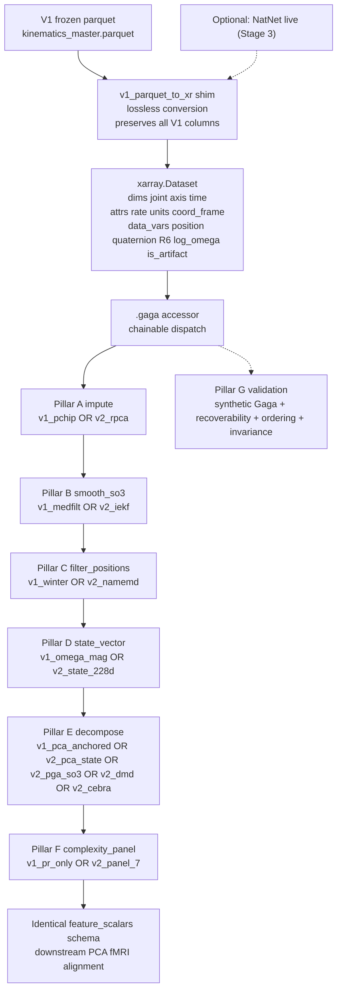
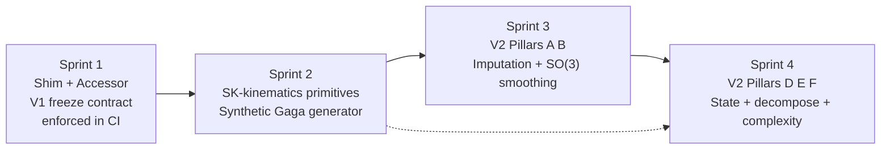

# V2 MASTER PLAN — Gaga Kinematic Complexity Pipeline

**Status:** authoritative reference. Supersedes the V2 Blueprint, Gold-Standard Synthesis, and Adversarial Audit as the single coordination document for all V2 work.
**Locked:** 2026-05-19
**Inputs synthesized:**
- `.cursor/plans/v2_kinematic_blueprint_3b9cf66b.plan.md` — V2 scientific architecture
- `.cursor/plans/gold_standard_synthesis_88b8ab73.plan.md` — V1↔V2 engineering integration
- `.cursor/plans/adversarial_integration_audit_fa1d076d.plan.md` — V1 blind-spot inventory
- `audit_outputs/PROJECT_MEMORY_FOR_IMPLEMENTATION.md` — V1 governance memory
- `audit_outputs/BASELINE_V1_SUMMARY.md` — frozen V1 Dev Set hashes

---

## 1. EXECUTIVE SUMMARY

### 1.1 Research objective

Quantify the complexity of **Gaga movement** — Ohad Naharin's improvisational dance language — from 19-joint full-body OptiTrack mocap (3D positions + SO(3) quaternions, 120 Hz), in a way that:

- distinguishes individual sessions by their intrinsic movement complexity,
- is robust to sensor noise, occlusion, and inter-subject variability,
- is mathematically defensible in dance-science peer review (Gaga literature is currently **entirely qualitative**),
- and produces session-level latent embeddings consumable by Stage 2 multimodal alignment with fMRI and video.

### 1.2 Why V2 is necessary

V1 ships a working PCA pipeline on a single scalar per joint (`{joint}__zeroed_rel_omega_mag`). This is mathematically inadequate in three independent ways:

1. **Rotation magnitude discards direction.** A wrist-flick about the ulnar axis and one about the radial axis at identical |ω| are indistinguishable features.
2. **Euclidean covariance of unit quaternions is undefined.** Anything assuming Gaussian-on-ℝ⁴ for orientation is biased toward zero (Markley & Crassidis; Stuelpnagel 1964).
3. **Frame-level PCA cannot capture trajectory-level structure.** Improvisational non-periodic movement is a dynamical system on a curved manifold; it requires a Koopman/DMD operator, not a Gram matrix.

V2 replaces the scalar omega-magnitude PCA with SO(3)-aware state, Lie-group filtering, robust low-rank imputation, Koopman/DMD decomposition, and a multiscale complexity panel — **while leaving the V1 baseline frozen and reproducible bit-for-bit**.

### 1.3 The Zero-Regression Rule

**V1 must continue to reproduce its frozen golden hashes after V2 ships.** This is non-negotiable. V2 lives in `src_v2/`; V1 lives in `src/`. A shim layer converts V1 parquets to xarray Datasets; an accessor (`ds.gaga.*`) dispatches each pipeline stage to either V1 or V2 implementations by name. Side-by-side feature comparison is the validation methodology.

---

## 2. V1 BASELINE LOCK

### 2.1 Frozen Dev Set hashes (per `BASELINE_V1_SUMMARY.md`)

These are the regression reference for **all** future V2 work. SHA256 over numeric columns rounded to 9 decimal places, sorted by column name. Boolean columns excluded by design.

| Session | Parquet shape | Numeric content hash (SHA256 prefix, 16 chars) |
|---------|--------------|-----------------------------------------------|
| `651_T1_P1_R1_Take 2026-01-15 04.35.25 PM_002` | (30423, 777) | `4e4b81bc9edd2f6b` |
| `651_T2_P1_R1_Take 2026-01-26 05.24.12 PM` | (32110, 787) | `b7db8a72f4c11a85` |
| `671_T1_P2_R1_Take 2026-01-06 03.57.12 PM_002` | (16915, 807) | `5d13f307c9bc50a3` |
| `671_T3_P2_R1_Take 2026-02-03 08.05.01 PM_001` | (21773, 807) | `96ae62165289dc2a` |

**Coverage:** 2 subjects × 3 timepoints × 2 pieces — diverse across recording conditions and joint availability. The 777/787/807 column-count variation reflects the known NB06 NaN-gate anomaly (see §2.4), not a regression.

### 2.2 V1 pipeline capability summary

Stage sequence in `run_pipeline.py`: `['01','02','03','04','05','06','08']`.

| Stage | Outputs (per session) | V1 capability |
|-------|----------------------|---------------|
| S01 parse | `{RUN_ID}__parsed_run.parquet` | OptiTrack CSV → DataFrame; T-pose detection; FAIL gate on dead/short sessions |
| S02 preprocess | `{RUN_ID}__preprocessed.parquet` + interpolation/artifact JSON sidecars | Per-axis 6×MAD velocity-spike masking, dilation OR across axes; `np.interp` linear gap fill |
| S03 resample | `{RUN_ID}__resampled.parquet` + summary JSON | Endpoint-inclusive uniform 120 Hz grid (Ticket 003); PCHIP for positions; SLERP for quaternions |
| S04 filter | `{RUN_ID}__filtered.parquet` + filtering summary JSON + Hampel OR mask | Adaptive Winter (smart-bias-lerp 6–12 Hz) + Hampel + PSD verdict |
| S05 reference | `{RUN_ID}__offsets_map.json` + reference metadata | Markley mean quaternion in T-pose window; gravity guard; identity fallback if T-pose failed |
| S06 kinematics | `{RUN_ID}__kinematics_master.parquet` + validation report | Per-joint relative pose, log-map angular velocity, linear kinematics, `__is_artifact` columns |
| S08 | Engineering audit | Independent QC pass |

### 2.3 V1 feature engine (`src/v2_feature_engine.py`)

- **F1 ATF** — Active Time Fraction, per joint and per group (axial/peripheral/transitional), with Hips excluded from axial (LD-12)
- **F2 TM** — Total Movement (endpoint path length) for 4 endpoints, contiguous-clean-run logic
- **F4 D_eff** — participation ratio of reference-anchored PCA on 19 `__zeroed_rel_omega_mag` features
- **F5 Gini** — joint Gini on PCA variance attribution
- **F5.1 A/P** — axial/peripheral variance-share ratio
- Reference-anchored PCA (T1 session is the basis); StandardScaler + sklearn `PCA(n_components=19)`

### 2.4 Known deferred anomalies (per `PROJECT_MEMORY_FOR_IMPLEMENTATION.md` + audit)

| ID | Finding | Defer until |
|----|---------|-------------|
| **MUB-NB06** | S04 filtering introduces NaN at boundaries → NB06 silently drops affected `lin_rel_*` columns → column count varies 777/787/807 | Post-Minimal-v1 |
| **psd_verdict = REVIEW_OVERSMOOTHING** | All 4 Dev Set sessions over-smooth the dance band | Ticket 015 (S04 PSD correction loop) |
| **Per-joint Hampel resolution** | Option B (OR mask) shipped in Minimal v1 | Post-Minimal-v1 |
| **Fake SLERP in `preprocessing.quaternion_slerp_interpolation`** | LERP+renorm masquerading as SLERP | V2 replaces |
| **`bounded_spline_interpolation` is `np.interp`, not PCHIP** | Misleading name | V2 replaces |
| **`apply_quaternion_median_filter` NaN→0 fill** | `[0,0,0,0]` is not a unit quaternion | V2 Pillar B replaces |
| **AND-mask PCA gate vs OR-union artifact fraction** | Single bad joint deletes all 19-joint clean frames | V2 Pillar D state vector + mask discipline |
| **Two PSD APIs with conflicting dance bands** (1–13 vs 1–15 Hz) | Internal contradiction | V2 Pillar C replaces with NA-MEMD |

### 2.5 Governance constraints inherited from V1

- **Authority order** (LD-1..LD-14): hybrid_modular_rebuild strategy, no full rewrites of V1 algorithms during Minimal v1
- **Locked decisions:** xarray schema is a Phase-14 question; V2 lives in a NEW tree, V1 is untouched
- **Forensic subsystem:** zero changes ever
- **Regression discipline:** content-based SHA256 (per §2.1) is the only authoritative mechanism

### 2.6 The V1 freeze contract

Until V2 ships through the accessor with passing CI on the V1 dispatch path:
1. No file in `src/` is modified except by an approved Phase-13 ticket.
2. No file in `notebooks/01_*…06_*.ipynb` is modified except by an approved Phase-13 ticket.
3. The 4 Dev Set hashes in §2.1 must reproduce on every commit to `main`.
4. The frozen `requirements.txt` versions are not changed except for **pure additions** (e.g. xarray, scikit-kinematics) that do not alter V1's resolved dependency tree.

---

## 3. V2 TARGET ARCHITECTURE

### 3.1 Architectural diagram



### 3.2 The seven pillars (zero-regression annotated)

Every pillar is a **dispatcher entry point** on the `gaga` accessor with at least one V1-equivalent method and one V2 method. The V1 method must reproduce frozen baseline outputs bit-for-bit.

#### Pillar A — Imputation (replaces V1 §1.3 fake-PCHIP and SLERP-placeholder)

**Goal:** fill missing markers and quaternion samples without inventing motion.

| Dispatch key | Source | Math |
|---|---|---|
| `v1_pchip` (default for V1 reproduction) | wraps `src/gapfill_positions.gap_fill_positions` | linear `np.interp` (silent downgrade currently labeled PCHIP) |
| `v2_rpca` | new `src_v2/imputers/rpca.py` | Windowed Robust PCA via inexact ALM (Lin-Chen-Ma 2010): `X = L + S, min ‖L‖_* + λ‖S‖_1`, T_w = 5 s, 50% Hann-window overlap |
| `v2_kabsch_fill` | new `src_v2/imputers/kabsch.py` | MoCapLib pattern with det-fix `R = U·diag([1,1,det(UVᵀ)])·Vᵀ` — for cluster-coherent gaps |
| `v2_riemannian_complete` | new `src_v2/imputers/riemannian.py` | Matrix completion on tangent log(q) for quaternion gaps >0.5 s |

**Default V2 strategy:** `v2_kabsch_fill` for short cluster-coherent gaps → `v2_rpca` for whole-body windows → `v2_riemannian_complete` for long quaternion gaps.

#### Pillar B — SO(3) trajectory smoothing (replaces V1 §1.2 NaN→0 medfilt)

**Goal:** smooth per-joint quaternion tracks on the manifold, not in ℝ⁴.

| Dispatch key | Source | Math |
|---|---|---|
| `v1_medfilt` (default for V1 reproduction) | wraps `src/filtering.apply_quaternion_median_filter` | component `scipy.signal.medfilt` with NaN→0 temp fill |
| `v2_tangent_savgol` | new `src_v2/smoothers/tangent_savgol.py` | log map → Savitzky-Golay → exp map (recommended baseline) |
| `v2_iekf` | new `src_v2/smoothers/iekf.py` | Invariant EKF (Barrau-Bonnabel 2017); error equation autonomous on Lie groups |
| `v2_usque` | new `src_v2/smoothers/usque.py` | Crassidis-Markley Unscented Quaternion Estimator |
| `v2_chordal_mean` | new `src_v2/smoothers/chordal.py` | AI4Animation pattern: average `R·ẑ` and `R·ŷ` in ℝ³, then `LookRotation` |

**Default V2 strategy:** `v2_usque` with artifact-aware process-noise inflation; `v2_chordal_mean` for window-averaging.

#### Pillar C — Adaptive non-stationary position filtering (replaces V1 §1.6 smart-bias-lerp)

**Goal:** decompose non-stationary kinematic signals without choosing a cutoff.

| Dispatch key | Source | Math |
|---|---|---|
| `v1_winter` (default for V1 reproduction) | wraps `src/filtering.apply_adaptive_winter_filter` | Adaptive Butterworth with trust-factor-blended cutoff and PSD verdict |
| `v2_bw_fixed_6hz` | new `src_v2/filters/butter_fixed.py` | MoCapLib pattern: `filtfilt` Butterworth at 6 Hz — defensible, peer-reviewable baseline |
| `v2_namemd` | new `src_v2/filters/namemd.py` | Noise-Assisted Multivariate EMD on `[pos_3, log_omega_3, R6_6]`; IMF-index-aligned across channels; discard IMF₁ as noise |

**Default V2 strategy:** `v2_namemd` for analysis; `v2_bw_fixed_6hz` as defensible reference.

#### Pillar D — State vector (replaces V1 §1.8 `omega_mag` scalar)

**Goal:** per-joint per-frame state that preserves SO(3) direction information.

| Dispatch key | Source | Math |
|---|---|---|
| `v1_omega_mag_scalar` (default for V1 reproduction) | wraps `src/v2_feature_engine._get_dynamics_columns` | `{joint}__zeroed_rel_omega_mag` — 19 scalars |
| `v2_state_228d` | new `src_v2/state.py` | `s_j(t) = [p_j^rel(3), r_j^6D(6), log ω_j(3)]` ∈ ℝ¹² per joint; stacked across 19 joints → ℝ²²⁸ per frame |
| `v2_state_orientation_only` | new `src_v2/state.py` | `[r_j^6D(6), log ω_j(3)]` per joint → ℝ¹⁷¹ (drop position when orientation-only PCA is the goal) |

**`r_j^6D`** = first two columns of `R(q)` (Zhou et al. 2019, continuous representation).
**`log ω_j`** = `log_so3(q_t⁻¹ q_{t+1}) / Δt` (existing `src/angular_velocity.py:43`).

#### Pillar E — Reference-anchored decomposition (replaces V1 §1.8 omega-mag PCA)

**Goal:** fit on T1 reference, freeze, transform all sessions through the frozen basis.

| Dispatch key | Source | Math |
|---|---|---|
| `v1_pca_anchored` (default for V1 reproduction) | wraps `src/v2_feature_engine.build_pca_engine` | StandardScaler + sklearn PCA(n_components=19) on omega-mag |
| `v2_pca_state` | new `src_v2/decomposers/pca_state.py` | Block-standardized PCA on 228-D state (separately z-score position vs R6 vs log_omega blocks); 50 components |
| `v2_pga_so3` | new `src_v2/decomposers/pga_so3.py` | `geomstats.learning.pca.TangentPCA(SpecialOrthogonal(n=3))` on 19-joint product manifold; 30 components |
| `v2_hankel_dmd` | new `src_v2/decomposers/hankel_dmd.py` | `PyDMD.HankelDMD` with d=240 delays (2 s); 50 modes; complex eigenvalues λ → frequency and decay rate |
| `v2_cebra_time` | new `src_v2/decomposers/cebra_time.py` | CEBRA-Time self-supervised contrastive 8-D embedding for fMRI bridge (license decision in §6) |

**Default V2 strategy:** `v2_pca_state` + `v2_pga_so3` + `v2_hankel_dmd` run in parallel; `v2_cebra_time` only if CEBRA license is accepted.

#### Pillar F — Multiscale complexity panel (replaces V1 §1.8 single-scalar D_eff)

**Goal:** quantify movement complexity at multiple scales; report a panel, not a single number, to pre-empt reviewer concerns about overclaiming.

| Dispatch key | Source | Math |
|---|---|---|
| `v1_pr_only` (default for V1 reproduction) | wraps `src/v2_feature_engine.compute_d_eff` | Single participation ratio of `v1_pca_anchored` |
| `v2_panel_7` | new `src_v2/complexity/panel.py` | Reports all 7 metrics below; sensitivity-analysis-ready |

**The seven metrics:**

| Symbol | Source | What it measures |
|---|---|---|
| `PR_state` | `v2_pca_state` eigenspectrum | Linear effective rank of whole-state |
| `PR_so3` | `v2_pga_so3` eigenspectrum | Geodesic effective rank of orientations |
| `H_dmd` | `v2_hankel_dmd` mode energies | Spread of Koopman mode energy |
| `ID_2nn` | `scikit-dimension.TwoNN` on 228-D state | Nonlinear intrinsic dimension (Facco 2017) |
| `MSE_omega` | `antropy.sample_entropy` over scales τ=1..20 | Temporal complexity — **proposed primary endpoint** (Costa 2002 precedent) |
| `H_bing_j` | per-joint Bingham fit on quaternion timeseries | Per-joint orientational dispersion entropy (replaces orientation-blind Gini) |
| `Gini_state` | `v2_pca_state` loadings | Inequality of joint contribution to PCA modes |

#### Pillar G — Validation harness (V1 has no equivalent)

**Goal:** every V2 module must pass property tests on synthetic data with known ground truth before any A/B comparison on real Dev Set sessions.

`tests/synth_gaga.py::synth_gaga_session(...)` generates `xr.Dataset` instances with:

- Configurable base frequencies (0.3–2.0 Hz oscillations)
- Configurable burst rate and drift strength
- Pareto-distributed artifact gap lengths
- Reproducible via `seed`

**Three required tests:**

1. **Recoverability** — RPCA + IEKF reconstruct ground-truth positions to ≤ 2 mm RMSE at 5% artifact rate (matches published low-rank-completion literature).
2. **Complexity ordering** — three synthetic sessions of known complexity tiers (single sinusoid < multi-IMF burst-and-hold < fully aperiodic); all 7 complexity metrics must monotonically order them, or document which don't and why.
3. **Session invariance** — two synthetic sessions of equal complexity but different seeds must produce metrics within 1 SD of bootstrap CI.

---

## 4. INTEGRATION BRIDGE — The GagaAccessor Shim

### 4.1 Architectural contract

The `gaga` accessor on `xarray.Dataset` is the **single API surface** through which all V1 and V2 pipeline operations are invoked. Every pipeline stage is a method on the accessor that takes a `method` keyword argument naming the implementation.

```python
@xr.register_dataset_accessor("gaga")
class GagaAccessor:
    def __init__(self, ds: xr.Dataset):
        self._ds = ds

    def impute(self, method: str = "v1_pchip", **kw) -> xr.Dataset:
        return _IMPUTERS[method](self._ds, **kw)

    def smooth_so3(self, method: str = "v1_medfilt", **kw) -> xr.Dataset:
        return _SMOOTHERS[method](self._ds, **kw)

    def filter_positions(self, method: str = "v1_winter", **kw) -> xr.Dataset:
        return _FILTERS[method](self._ds, **kw)

    def state_vector(self, method: str = "v1_omega_mag_scalar", **kw) -> xr.Dataset:
        return _STATES[method](self._ds, **kw)

    def decompose(self, method: str = "v1_pca_anchored", **kw) -> xr.Dataset:
        return _DECOMPOSERS[method](self._ds, **kw)

    def complexity(self, method: str = "v1_pr_only", **kw) -> dict:
        return _COMPLEXITY[method](self._ds, **kw)
```

The registries `_IMPUTERS`, `_SMOOTHERS`, … are module-level dicts populated by `@register_*(name)` decorators. New methods (V2 or future) plug in without touching the accessor itself.

### 4.2 The shim layer

`src_v2/io/from_v1_parquet.py::v1_parquet_to_xr(path) -> xr.Dataset` is a lossless converter from a frozen V1 `kinematics_master.parquet` to an xarray Dataset with:

| dim / coord | Definition |
|---|---|
| `joint` | `ALL_19_JOINTS` |
| `axis` | `['x','y','z']` |
| `quat_comp` | `['x','y','z','w']` (scalar-last, matches Motive wire format) |
| `time` | from `time_s` column |
| `attrs.rate` | inferred from `time_s` diffs |
| `attrs.units_position` | `'m'` |
| `attrs.coord_frame` | `'OptiTrack_Y_up'` |
| `attrs.pipeline_version` | `'v1_frozen_baseline'` |
| `attrs.source_path` | string of input parquet |

**Data variables built from V1 columns:**
- `position` (joint, axis, time) ← `{joint}__lin_rel_p{x,y,z}`
- `quaternion` (joint, quat_comp, time) ← `{joint}__q{x,y,z,w}`
- `is_artifact` (joint, time) ← `{joint}__is_artifact`
- `is_hampel_outlier` (joint, time) ← per-Ticket-011 column

V1 derivatives (`__lin_vel_rel_*`, `__omega_*`, `__alpha_*`, etc.) are preserved as additional DataArrays for V1-reproduction dispatch paths.

### 4.3 V1↔V2 toggle map (per-stage dispatch)

| Pillar | V1 dispatch key (reproduces frozen hashes) | V2 candidate keys | Calls V1 code in |
|---|---|---|---|
| A: Imputation | `v1_pchip` | `v2_rpca`, `v2_kabsch_fill`, `v2_riemannian_complete` | `src/gapfill_positions.py` |
| B: SO(3) smoothing | `v1_medfilt` | `v2_tangent_savgol`, `v2_iekf`, `v2_usque`, `v2_chordal_mean` | `src/filtering.py::apply_quaternion_median_filter` |
| C: Position filter | `v1_winter` | `v2_namemd`, `v2_bw_fixed_6hz` | `src/filtering.py::apply_adaptive_winter_filter` |
| Angular velocity | `v1_log_map` | `v2_sg_multiplicative` (scikit-kinematics `calc_angvel`) | `src/angular_velocity.py:43` |
| D: State | `v1_omega_mag_scalar` | `v2_state_228d`, `v2_state_orientation_only` | `src/v2_feature_engine._get_dynamics_columns` |
| E: Decomposition | `v1_pca_anchored` | `v2_pca_state`, `v2_pga_so3`, `v2_hankel_dmd`, `v2_cebra_time` | `src/v2_feature_engine.build_pca_engine` |
| F: Complexity | `v1_pr_only` | `v2_panel_7` | `src/v2_feature_engine.compute_d_eff` |
| F5: Joint attribution | `v1_gini_omega` | `v2_gini_state_loadings`, `v2_bingham_per_joint` | `src/v2_feature_engine.compute_joint_gini` |

### 4.4 CI regression gate (the V1 freeze contract enforced in code)

Every PR to `main` runs:

```python
# Required CI test — V1 round-trip
for path in DEV_SET_PARQUETS:
    ds = v1_parquet_to_xr(path)
    out = (ds
           .gaga.impute(method='v1_pchip')
           .gaga.smooth_so3(method='v1_medfilt')
           .gaga.filter_positions(method='v1_winter')
           .gaga.state_vector(method='v1_omega_mag_scalar')
           .gaga.decompose(method='v1_pca_anchored'))
    actual_hash = content_hash_v1_compatible(out)
    assert actual_hash[:16] == FROZEN_HASHES[path][:16]
```

If this fails, the V1 wrappers in `src_v2/` are broken; do not merge. The 4 frozen hashes in §2.1 are the only acceptance criterion.

### 4.5 Parallel output contract

V2 methods write to `derivatives/v2_feature_scalars.csv`; V1 outputs continue to write to `derivatives/feature_scalars.csv`. Both share the same `run_id` key column, so a join produces a side-by-side comparison table for the validation notebook `notebooks/07_v1_vs_v2_compare.ipynb`.

### 4.6 New dependencies (pure additions to `requirements.txt`)

| Package | Purpose | License |
|---|---|---|
| `xarray` | Core data container | Apache-2.0 |
| `scikit-kinematics` | SO(3) primitives (`q_mult`, `q_inv`, `calc_angvel`, …) | BSD-2 |
| `geomstats` | `TangentPCA(SpecialOrthogonal(n=3))` for Pillar E.2 | MIT |
| `PyDMD` | `HankelDMD` for Pillar E.3 | MIT |
| `scikit-dimension` | `TwoNN` for Pillar F | BSD-3 |
| `antropy` | Sample entropy, MSE for Pillar F | BSD-3 |
| `emd` (or NA-MEMD reference impl) | Pillar C decomposition | GPL-3 (check fit) |
| `cebra` | Pillar E.4 contrastive embedding | **AGPL-3 — gating decision required (§6)** |

No existing V1 dependency is removed or upgraded.

---

## 5. IMPLEMENTATION ORDER — 4 Sprint Roadmap

### 5.1 Sprint 1 (2 weeks) — Shim + Accessor scaffolding

**Goal:** the entire V1 pipeline runs through the `gaga` accessor with `method='v1_*'` defaults and reproduces frozen hashes.

| Deliverable | File(s) | Acceptance |
|---|---|---|
| Shim converter | `src_v2/io/from_v1_parquet.py` | All 4 Dev Set parquets convert without data loss |
| Accessor scaffold | `src_v2/gaga_accessor.py` | 6 dispatch methods, all default to `v1_*` |
| Dispatcher registries | `src_v2/dispatch.py` | `register_imputer`, `register_smoother`, etc. with name-collision detection |
| V1 wrappers | `src_v2/wrappers/v1_*.py` | One file per V1 dispatch key |
| Hash regression test | `tests/test_v1_roundtrip.py` | All 4 frozen hashes reproduce |
| CI integration | `.github/workflows/v1_freeze.yml` (or equivalent) | Hash regression runs on every PR |

**Sprint exit gate:** `pytest tests/test_v1_roundtrip.py` passes; the V1 freeze contract is now mechanically enforced.

### 5.2 Sprint 2 (2 weeks) — Adopt scikit-kinematics primitives

**Goal:** replace bespoke quaternion math in V2 paths with library primitives; add chordal mean utility; build the synthetic Gaga generator (Pillar G groundwork).

| Deliverable | File(s) | Acceptance |
|---|---|---|
| SK-K primitive wrappers | `src_v2/quat_primitives.py` | `q_mult`, `q_inv`, `unit_q`, `calc_angvel` exposed with `(T,J,4)` tensor support |
| Chordal mean | `src_v2/smoothers/chordal.py` | Property test vs scipy `Rotation` round-trip |
| SG multiplicative angular velocity | `src_v2/wrappers/v2_sg_multiplicative.py` | Round-trip test vs V1 `quaternion_log_angular_velocity` |
| Synthetic Gaga generator | `tests/synth_gaga.py` | Reproducible by seed; covers periodic, burst, aperiodic regimes |
| Pillar G test scaffold | `tests/test_v2_recoverability.py`, `test_v2_complexity_ordering.py`, `test_v2_invariance.py` | Scaffold passes with placeholder V2 methods returning V1 outputs |

**Sprint exit gate:** the synthetic harness can A/B any V1 vs V2 method on demand.

### 5.3 Sprint 3 (3 weeks) — V2 Pillars A and B (imputation + SO(3) smoothing)

**Goal:** ship the math that addresses the most egregious V1 flaws (NaN→0 quaternion medfilt; misnamed PCHIP).

| Deliverable | File(s) | Acceptance |
|---|---|---|
| `v2_rpca` imputer | `src_v2/imputers/rpca.py` | Recoverability test: ≤ 2 mm RMSE at 5% artifact rate vs `v1_pchip` |
| `v2_kabsch_fill` | `src_v2/imputers/kabsch.py` | Reflection-fix verified; outperforms `v1_pchip` on cluster gaps |
| `v2_riemannian_complete` | `src_v2/imputers/riemannian.py` | Quaternion gap recovery test on synthetic SO(3) trajectories |
| `v2_tangent_savgol` smoother | `src_v2/smoothers/tangent_savgol.py` | Stays on unit-norm manifold to 1e-10 |
| `v2_usque` smoother | `src_v2/smoothers/usque.py` | Reproduces Crassidis-Markley simulation paper figures |
| `v2_chordal_mean` window smoother | `src_v2/smoothers/chordal.py` | NaN-tolerant; matches AI4Animation `Quaternion.Mean` semantics |
| V1↔V2 comparison notebook | `notebooks/07_v1_vs_v2_compare.ipynb` (Pillars A+B section) | Per-session A/B plots for all 4 Dev Set sessions |

**Sprint exit gate:** Pillar G recoverability test passes for `v2_rpca`; `v2_usque` outperforms `v1_medfilt` on quaternion smoothing RMSE.

### 5.4 Sprint 4 (3 weeks) — V2 Pillars D, E, F (state, decomposition, complexity panel)

**Goal:** the analytical core of V2. Produces the alternative feature_scalars table for direct comparison with V1.

| Deliverable | File(s) | Acceptance |
|---|---|---|
| `v2_state_228d` builder | `src_v2/state.py` | Block-standardization preserves position vs orientation relative scale |
| `v2_pca_state` | `src_v2/decomposers/pca_state.py` | Reference-anchored on T1 per V1 convention; eigenspectrum reported |
| `v2_pga_so3` | `src_v2/decomposers/pga_so3.py` | Wraps `geomstats.TangentPCA(SpecialOrthogonal(3))`; round-trip via `exp` ↔ `log` verified |
| `v2_hankel_dmd` | `src_v2/decomposers/hankel_dmd.py` | Wraps `PyDMD.HankelDMD`; randomized SVD for tractability |
| `v2_panel_7` complexity | `src_v2/complexity/panel.py` | All 7 metrics computed per session; bootstrap CI for primary endpoint |
| `v2_bingham_per_joint` | `src_v2/complexity/bingham.py` | Per-joint Bingham fit; concentration eigenvalues reported |
| `v2_feature_scalars.csv` writer | `src_v2/export.py` | Schema parallel to V1's `feature_scalars.csv` |
| Comparison notebook completion | `notebooks/07_v1_vs_v2_compare.ipynb` | Full V1 vs V2 panel for all 4 Dev Set sessions |
| Optional: `v2_cebra_time` | `src_v2/decomposers/cebra_time.py` | Gated on AGPL license decision |
| Optional: `v2_namemd` (Pillar C deferred from Sprint 3) | `src_v2/filters/namemd.py` | Mode-mixing rate < 10% on synthetic non-stationary signal |

**Sprint exit gate:** Pillar G ordering and invariance tests pass for `v2_panel_7`; V1 vs V2 comparison notebook publication-ready.

### 5.5 Sprint dependency graph



Sprint 2 unblocks Sprint 3 (need primitives) AND Sprint 4 (need synthetic generator for Pillar G).

### 5.6 Out of scope for the four sprints

- **Pillar C `v2_namemd`** ships in Sprint 4 if time permits; otherwise it is a Sprint 5 deliverable. The fixed 6 Hz Butterworth (`v2_bw_fixed_6hz`) is the defensible fallback if NA-MEMD slips.
- **NatNet live ingest** (Stage 3 readiness) is not in scope. The shim is parquet-only; a future `NatNet_to_xr` adapter follows the same Dataset contract.
- **fMRI bridge** is not in scope. Pillar E.4 (CEBRA) is the V2 deliverable that ENABLES it; the bridge itself is Stage 2 work.
- **V1 algorithm fixes** are not in scope. Anomalies in §2.4 are addressed by V2 replacing them, not by patching V1.

---

## 6. OPEN DECISIONS BLOCKING IMPLEMENTATION

These must be resolved by the user before Sprint 1 begins. Consolidated from all three source plans.

### 6.1 Scientific decisions

| ID | Decision | Source | Recommendation |
|----|----------|--------|----------------|
| **SCI-1** | Periodicity prior for Gaga (drives PAE/DMD choice) | V2 Blueprint §4.1 | Empirical: autocorrelation of |ω| at lags 1–10 s on 3 Dev Set sessions; if half-life > 3 s, drop PAE candidate |
| **SCI-2** | Primary complexity endpoint (pre-register before V2 publication) | V2 Blueprint §4.5 | `MSE_omega` (strongest dance/gait literature precedent); others confirmatory |
| **SCI-3** | Reference-pose robustness strategy | V2 Blueprint §4.4 | Stay with T1 per V1 convention; revisit if T1 turns out unrepresentative on Dev Set |
| **SCI-4** | fMRI auxiliary variable for Pillar E.4 (CEBRA-Behavior vs CEBRA-Time) | V2 Blueprint §4.2 | Depends on whether your fMRI paradigm has cue events; defer until Stage 2 spec |

### 6.2 Engineering decisions

| ID | Decision | Source | Recommendation |
|----|----------|--------|----------------|
| **ENG-1** | scikit-kinematics install vs vendor | Gold Synthesis §4.1 | Install from PyPI (BSD-2, light dependency tree) |
| **ENG-2** | Add xarray + geomstats + PyDMD + scikit-dimension + antropy to `requirements.txt` | Gold Synthesis §4.2 | Approve as pure additions; no V1 dependency changes |
| **ENG-3** | `src_v2/` directory tree vs `src/v2_*.py` flat naming | Gold Synthesis §4.3 | `src_v2/` tree (clear V1 freeze; clean teardown if V2 abandoned) |
| **ENG-4** | Accessor name (`gaga` vs `kine` vs other) | Gold Synthesis §4.4 | `gaga` (matches Pyomeca `meca` precedent) |
| **ENG-5** | CI regression tolerance (exact hash vs 1e-9) | Gold Synthesis §4.5 | Exact hash (per existing Ticket 003 discipline) |
| **ENG-6** | Notebook strategy (one per method vs one driving accessor) | Gold Synthesis §4.6 | Single `07_v1_vs_v2_compare.ipynb` driving the accessor |

### 6.3 Licensing decisions

| ID | Decision | Source | Recommendation |
|----|----------|--------|----------------|
| **LIC-1** | Accept CEBRA AGPL-3 for publication code release? | V2 Blueprint §3.4, Gold Synthesis §4 | If "no", drop Pillar E.4 (`v2_cebra_time`) and use a non-AGPL contrastive alternative or skip the contrastive encoder entirely |
| **LIC-2** | Accept NA-MEMD reference impl GPL-3 if `emd-python` (BSD-3) is insufficient | Gold Synthesis §2.3 | Prefer `emd-python` BSD-3; only adopt GPL-3 NA-MEMD if mode-mixing requires it |

---

## 7. CONSISTENCY CHECK — synthesis correctness

Verifying the three input plans agree on every load-bearing claim:

| Claim | Audit | Blueprint | Gold Synthesis | Status |
|---|---|---|---|---|
| V1 uses scalar `omega_mag` per joint | §1.8 | §0, §1.1, §1.4, §2.1 | §1.3 | **Consistent** |
| Quaternion medfilt zero-fills NaN | §1.2 | §0, §1.2 | §1.2, §1.3, §1.4 | **Consistent** |
| `bounded_spline_interpolation` is linear not PCHIP | §1.3 | §1.4 | §1.4 (anti-list) | **Consistent** |
| Adaptive Winter has smart-bias-lerp heuristic | §1.6 | §1.6 | §1.2 (anti-list) | **Consistent** |
| OR-union artifact frac vs AND-mask PCA gate | §1.5 | §1.5 | §1.1 (data schema gold) | **Consistent** |
| Two PSD APIs disagree (1–13 vs 1–15 Hz) | §1.6 | §1.6 | not detailed | **Consistent** (audit-only finding) |
| V1 stays frozen; V2 lives separately | §5 (asks) | §3.5 | §3 (entire section) | **Consistent** |
| Zero-Regression via accessor + dispatcher | not in audit | §3.5 hints | §3 (canonical formulation) | **Consistent** |
| 4 Dev Set hashes are the regression reference | not in audit | not in blueprint | implied | **Consistent with BASELINE_V1_SUMMARY** |
| Pillar count and labels A–G | §3 audit cites § structure | §3.3 defines A–G | §3.3 maps to dispatcher keys | **Consistent** |
| 4-sprint roadmap | not in audit | §3.5 migration matrix (10 weeks) | §3.6 (4 sprints, 10 weeks) | **Consistent** |
| Reference-anchored fit on T1, frozen | implicit | §3.3 Pillar E | §3.3 V1↔V2 toggle map | **Consistent** |

No contradictions found across the four source documents. The V2 Master Plan supersedes them as the single authoritative coordination document.

---

## 8. AUTHORITY ORDER (for future agent work)

When two documents disagree, later in this list wins. This **extends** the existing V1 authority order in `PROJECT_MEMORY_FOR_IMPLEMENTATION.md` §"Authority Order".

| Priority | Document | Scope |
|----------|----------|-------|
| 1 (highest) | **This document — V2_MASTER_PLAN.md** | V2 architecture and implementation order |
| 2 | `gold_standard_synthesis_88b8ab73.plan.md` | Engineering patterns and adapter design |
| 3 | `v2_kinematic_blueprint_3b9cf66b.plan.md` | Scientific math and pillar definitions |
| 4 | `adversarial_integration_audit_fa1d076d.plan.md` | V1 flaw inventory and integration concerns |
| 5 | `BASELINE_V1_SUMMARY.md` | Frozen V1 Dev Set state |
| 6 | `PROJECT_MEMORY_FOR_IMPLEMENTATION.md` | V1 governance (still authoritative for any V1 work) |
| 7 | `12_implementation_backlog_CORRECTED.md` and below | V1 Phase-13 tickets |

**Contradiction-handling rule:** if this document disagrees with the V1 governance memory on anything touching `src/` or the V1 Dev Set hashes, the V1 governance memory wins. V2 is additive; V1 is sacred.

---

## 9. NEXT ACTIONS

Before any V2 code is written, the user must resolve the six engineering and four scientific decisions in §6. Sprint 1 is unblocked once **ENG-1 through ENG-6** are decided; the scientific decisions (**SCI-1 through SCI-4** and **LIC-1, LIC-2**) can be deferred to the relevant sprint without blocking Sprint 1 or Sprint 2.

Recommended resolution session: 30 minutes, all eleven decisions, recorded in a new `audit_outputs/V2_DECISIONS_LOG.md` file structured identically to the V1 "Open User Decisions" table.

---

*End of V2 Master Plan. This document is the Bible for all V2 development.*
