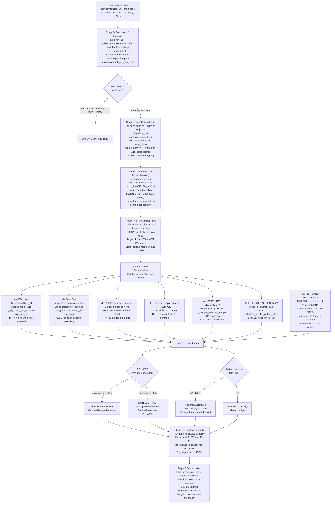
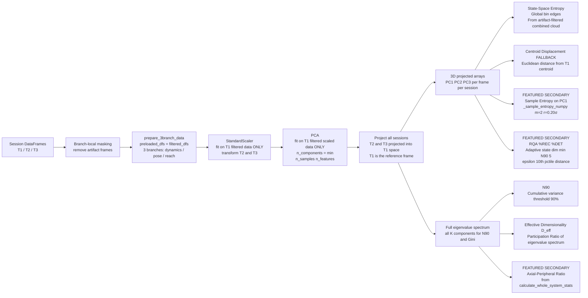

# Thesis Analytical Pipeline
## The 3+3+1 Framework for Longitudinal Motor Phenotyping Under Psychedelic Intervention

**Document Class:** Software & Research Bible  
**Pipeline Version:** v1.4  
**Author:** Research Software Architecture — Gaga Motion Analysis Project  
**Date:** 2026-03-25  
**Study:** *The Motor Phenotype of the Psychedelic Afterglow: A Longitudinal Kinematic Case Study of Gaga Improvisation (N=2)*  
**Git Branch:** `pipeline_v6.3_qa`

---

> **How to use this document.** This file is the single authoritative reference for every analytical decision in this thesis. It governs the implementation of `src/core_kinematics_engine.py`, the interactive `notebooks/09_Subject_Exploration_Dashboard.ipynb`, and the methods section of the thesis manuscript. When the code and this document conflict, this document defines intent and the code must be corrected. When a reviewer challenges a design choice, cite the section number.

---

## Table of Contents

1. [Study Overview & Scientific Rationale](#1-study-overview--scientific-rationale)
2. [Biological & Mathematical Glossary — The 3+3+1 Framework](#2-biological--mathematical-glossary--the-331-framework)
   - 2.1 Active Time Fraction (ATF) — *Primary*
   - 2.2 Effective Dimensionality (Participation Ratio) — *Primary*
   - 2.3 Joint Gini Coefficient — *Primary*
   - 2.4 2D State-Space Shannon Entropy — *Primary*
   - 2.5 Centroid Displacement (Fallback Metric) — *+1*
   - 2.6 Critical Distinction: Effective Dimensionality vs. Joint Gini
   - 2.7 Methodological Validation & Novelty Defense
   - 2.8 Temporal Complexity — Sample Entropy on PC1 — *Featured Secondary*
   - 2.9 Core-Periphery Integration — Axial/Peripheral Ratio — *Featured Secondary*
   - 2.10 Recurrence Quantification Analysis (%Recurrence, %Determinism) — *Featured Secondary*
3. [Data Architecture & Schema Contract](#3-data-architecture--schema-contract)
4. [Artifact Management Protocol](#4-artifact-management-protocol)
5. [Execution Pipeline — Data Flow & Logic Gates](#5-execution-pipeline--data-flow--logic-gates)
6. [T1-Anchored PCA — Rationale & Implementation Contract](#6-t1-anchored-pca--rationale--implementation-contract)
7. [Thresholds & Magic Numbers Dictionary](#7-thresholds--magic-numbers-dictionary)
8. [Decision Gates & Fallback Logic](#8-decision-gates--fallback-logic)
9. [Statistical & Comparative Strategy for N=2](#9-statistical--comparative-strategy-for-n2)
   - 9.7 Pre-Registered Weight-of-Evidence Rule
   - 9.8 Pre-Registered Null Result Interpretation
10. [Software Blueprint](#10-software-blueprint)
11. [Known Limitations & Committee Defense Register](#11-known-limitations--committee-defense-register)
12. [Reproducibility Statement](#12-reproducibility-statement)

---

## 1. Study Overview & Scientific Rationale

### 1.1 The Biological Question

This thesis investigates whether the psychedelic "afterglow" — the sub-acute neurobiological state following psilocybin administration, characterized by increased neural plasticity, enhanced cognitive flexibility, and reduced default-mode network rigidity — produces a measurable and lasting transformation in the **motor phenotype** of trained movement practitioners.

The intervention is the combination of psilocybin and **Gaga movement language**, a somatic-embodied practice developed by Ohad Naharin that explicitly instructs practitioners to dissolve habitual movement patterns, explore unfamiliar body parts, and dissolve the boundary between the axial (core) and peripheral (distal) body. The study's theoretical premise is that psilocybin's neuroplasticity window, coinciding with Gaga's dissolution of motor habit, may produce a uniquely favorable condition for the reorganization of the motor cortex's movement repertoire.

The dependent variable is the **kinematic motor phenotype**: the statistical structure of how the body moves across time, measured via 3D optical motion capture (OptiTrack, 19 joints, 120 Hz).

### 1.2 Longitudinal Design

The study employs a within-subject longitudinal design with three measurement timepoints:

| Timepoint | Label | Biological State | Protocol |
|---|---|---|---|
| T1 | Baseline | Pre-intervention, naïve motor state | Gaga free improvisation (P2), unstructured |
| T2 | Post-Training | After several weeks of Gaga training; pre-psilocybin | Gaga free improvisation (P2), unstructured |
| T3 | Afterglow | 1–4 weeks post-psilocybin administration; within plasticity window | Gaga free improvisation (P2), unstructured |

The critical comparison is **T1→T3**: the total transformation from naive baseline to post-psilocybin afterglow. T2 serves as the internal trajectory reference: it isolates the Gaga-training effect alone, allowing us to disentangle pure training-induced changes from training-plus-psilocybin changes.

**Why the T2 intermediate matters:** If T3 shows expanded movement repertoire but T2 already shows the same expansion, the psilocybin contributes nothing above Gaga training alone. If T3 uniquely exceeds T2, the psilocybin-Gaga synergy is the operative mechanism.

**Task analyzed:** P2 only — the unstructured free improvisation task. P1 (structured) and P3 are excluded from this pipeline to maintain task homogeneity.

### 1.3 Subjects

| Subject ID | Sessions Available | Notes |
|---|---|---|
| 651 | T1 (R1, R2), T2 (R1 only — R2 is a dead recording of 4 frames), T3 (R1, R2) | T2 R1 has elevated artifact rate (28.5%) |
| 671 | T1 (R1, R2), T2 (R1, R2), T3 (R1, R2) | Consistent artifact rates (10–19%) |

N=2 is not a statistical limitation to be apologized for; it is reframed as a **high-resolution longitudinal computational case study**. The unit of inference is the intra-subject trajectory, not the between-subject comparison. See Section 9.

### 1.4 The Motor Phenotype Hypothesis

Under the neuroplasticity + embodied practice framework, we expect the following directional signatures in T3 relative to T1:

| Metric | Tier | Predicted T3 Direction | Biological Interpretation |
|---|---|---|---|
| ATF (whole-body) | Primary | ↑ Increase | More body parts recruited into active movement |
| ATF (peripheral/distal) | Primary | ↑ Increase | Distal body parts (hands, feet) activated more |
| Effective Dimensionality ($D_{\text{eff}}$) | Primary | ↑ Increase | Movement energy spreads across more independent modes |
| Joint Gini | Primary | ↓ Decrease | More joints contribute equally (democratic strategy) |
| State-Space Entropy | Primary | ↑ Increase | Broader, less repetitive exploration of motor state space |
| **Sample Entropy on PC1** | **Featured Secondary** | **↑ Increase** | **Movement sequence becomes more temporally unpredictable / complex** |
| **Axial/Peripheral (A/P) Ratio** | **Featured Secondary** | **→ Toward 1.0** | **Core-periphery boundary dissolves; axial and peripheral variance equalize** |
| **%Recurrence (RQA)** | **Featured Secondary** | **↓ Decrease** | **Fewer revisits to previously occupied kinematic states** |
| **%Determinism (RQA)** | **Featured Secondary** | **Ambiguous** | **Long-range sequential structure; distinguishes "more complex" from "more random"** |
| Centroid Displacement | +1 Fallback | Ambiguous | Center of movement vocabulary may or may not shift |

These are **directional hypotheses**, not quantitative predictions. Effect magnitude is not pre-specified given N=2.

**Framework label:** The full set is termed the **"3+3+1 Framework"**:
- **3 Primary metrics:** ATF (Engagement), Effective Dimensionality + Joint Gini (Structure), State-Space Entropy (Exploration)
- **3 Featured Secondary metrics:** Sample Entropy on PC1 (Temporal Complexity), A/P Ratio (Core-Periphery Integration), RQA %Recurrence + %Determinism (Recurrence Structure)
- **1 Fallback metric:** Centroid Displacement (elevates to primary when entropy reliability gate fails)

---

## 2. Biological & Mathematical Glossary — The 3+3+1 Framework

### 2.1 Active Time Fraction (ATF)

#### 2.1.1 Biological Meaning

The human motor system does not recruit all body segments simultaneously or continuously. At any given moment, most joints are either stationary, trembling at physiological noise levels, or passively carried by proximal segments. ATF quantifies the fraction of time during which a specific joint or body region is **actively and voluntarily engaged in movement** — i.e., generating kinematic output above its own session-specific noise floor.

Under the Gaga hypothesis: a practitioner who has internalized the instruction to "find the body parts you habitually ignore" should show elevated ATF in joints that were passive at baseline. The global distribution of ATF across joints is as informative as the mean — a more uniform ATF distribution signals a more democratically engaged body.

#### 2.1.2 Mathematical Definition

Let $v_i(t)$ be the root-relative linear velocity magnitude of joint $i$ at frame $t$ (column `{Joint}__lin_vel_rel_mag`, mm/s), and let $a_i(t)$ be the artifact flag for joint $i$ at frame $t$ (column `{Joint}__is_artifact`, bool).

**Step 1 — Session-adaptive noise floor.** For each joint $i$ and each session $s$, compute the noise floor $V_{i,s}$ via `compute_noise_floor()` in `src/pulsicity.py`. This function detects the quietest static window in the recording and uses its mean velocity as the noise floor, with a 3-phase guard (static baseline guard, 5th-percentile fallback, absolute minimum of 1.0 mm/s). The source and low-confidence flag are stored for audit.

**Step 2 — Per-joint ATF.**

$$\text{ATF}_{i,s} = \frac{\sum_{t=1}^{T} \mathbb{1}\left[ v_i(t) > V_{i,s} \;\wedge\; a_i(t) = 0 \right]}{\sum_{t=1}^{T} \mathbb{1}\left[ a_i(t) = 0 \right]}$$

where $T$ is the total number of frames. The denominator excludes artifact frames from both numerator and denominator — ATF is defined over the *clean* (non-artifact) temporal domain only.

**Step 3 — Whole-body summary statistics.**

$$\text{ATF}_{\text{whole-body}} = \text{median}_{i \in \text{all joints}} \left( \text{ATF}_{i,s} \right)$$

The median (not mean) is used to be robust to outliers caused by single joints with unusually high artifact rates.

**Step 4 — Delta.**

$$\Delta\text{ATF}_{T1 \to T3} = \text{ATF}^{(T3)}_{\text{whole-body}} - \text{ATF}^{(T1)}_{\text{whole-body}}$$

#### 2.1.3 ATF Confound — Active Time vs. Active Fraction

ATF and raw active time (`active_time_s`) must not be conflated. Two sessions of different durations can have identical ATF but different absolute active times. This pipeline reports both, but the primary longitudinal comparison uses ATF (duration-invariant).

**ATF Confound Flag:** If the session-level artifact fraction exceeds 30% of total frames (`artifact_fraction > 0.30`), the pipeline emits an `ATF_CONFOUND_WARNING`. This does not exclude the session but appends an automated methodological note in the dashboard. The 651 T2 R1 session (28.5% artifact) does not exceed this threshold but is flagged with a soft warning (threshold 0.20 < artifact_fraction ≤ 0.30).

#### 2.1.4 Literature Justification

The concept of "active joint time" as a proxy for motor engagement is consistent with the **movement quantity** dimension in kinematic research (Roetenberg et al., 2007) and analogous to EMG-based "muscle recruitment duration" metrics in motor learning (Thoroughman & Shadmehr, 2000) applied to kinematic rather than electromyographic signals. The session-adaptive noise floor follows the validated calibration logic of Step 05 of this pipeline, ensuring internal consistency.

ATF is the least epistemologically risky metric in this framework. Measuring "what fraction of time is a body part actively moving" requires no novel methodology — it is a threshold-crossing rate, a concept that appears in virtually every domain of movement science. Its application across all 19 joints simultaneously to produce a full-body engagement profile is the methodological contribution, not the metric itself.

---

### 2.2 Effective Dimensionality (Participation Ratio)

> **Naming convention:** This metric is referred to as **Effective Dimensionality** ($D_{\text{eff}}$) in all external communications — thesis text, presentations, and figures. The underlying formula is the **Participation Ratio**, a well-established measure in computational neuroscience. The term "Spectral Gini" has been retired from external use because it has no direct precedent in movement science; "Effective Dimensionality" is the accepted terminology in the literature this metric derives from. Internal variable names in code use `d_eff`.

#### 2.2.1 Biological Meaning

When Principal Component Analysis is applied to the full angular velocity matrix of 19 joints (the "dynamics branch"), the resulting eigenvalue spectrum $\{\lambda_1 \geq \lambda_2 \geq \cdots \geq \lambda_K\}$ describes how movement energy is distributed across independent kinematic modes. If $\lambda_1 \gg \lambda_2 \gg \cdots$ (a steeply declining spectrum), the body's motion is dominated by a single low-dimensional movement pattern — a kinematic signature of stereotypy, repetition, and habit. If the spectrum is flat (all $\lambda_i$ roughly equal), movement energy is spread across many independent modes — a kinematic signature of high-dimensional, exploratory, non-stereotyped motion.

**Effective Dimensionality** $D_{\text{eff}}$ quantifies how many independent kinematic modes are being meaningfully used by the motor system in a given session. A useful physical intuition: if the motor system were using exactly $M$ modes equally and all others not at all, $D_{\text{eff}} = M$ exactly. In practice it is a continuous, real-valued index.

- **Low $D_{\text{eff}}$** (approaching 1) → movement energy concentrated in a single dominant mode → **stereotyped, low-dimensional, habitual motion**
- **High $D_{\text{eff}}$** (approaching $K$, the maximum) → movement energy spread evenly across many modes → **exploratory, high-dimensional, non-stereotyped motion**

The hypothesis: psilocybin-enhanced neuroplasticity, combined with Gaga's dissolution of habitual motor patterns, should increase $D_{\text{eff}}$ from T1 to T3.

$D_{\text{eff}}$ is a proxy for motor repertoire dimensionality, not a direct count of distinct movement strategies. PCA modes are linear statistical directions — a single biomechanical action can load on multiple PCs, and distinct actions can co-vary onto a single PC. The mapping from eigenvalue flatness to motor repertoire diversity is strongest when the PCA basis is stable (which the T1-anchor ensures) and when the data is dominated by voluntary movement rather than noise.

#### 2.2.2 Mathematical Definition

Let $Y_s = X_s \cdot W^\top$ be the projection of session $s$'s scaled data onto all $K$ principal components, where $W \in \mathbb{R}^{K \times F}$ is the loading matrix from the T1-anchored PCA (see Section 6). The per-session variance along each PC is:

$$\lambda_{k,s} = \text{Var}\left( Y_s[:, k] \right) = \frac{1}{T_s} \sum_{t=1}^{T_s} \left( Y_s[t,k] - \bar{Y}_s[k] \right)^2$$

Normalize to proportions:

$$p_{k,s} = \frac{\lambda_{k,s}}{\sum_{j=1}^{K} \lambda_{j,s}}$$

The **Effective Dimensionality (Participation Ratio)** for session $s$ is:

$$D_{\text{eff}}(s) = \frac{\left(\sum_{k=1}^{K} \lambda_{k,s}\right)^2}{\sum_{k=1}^{K} \lambda_{k,s}^2} = \frac{1}{\sum_{k=1}^{K} p_{k,s}^2}$$

**Range:** $D_{\text{eff}} \in [1, K]$.
- $D_{\text{eff}} = 1$: all variance in one mode (maximally stereotyped).
- $D_{\text{eff}} = K$: all modes equally energized (maximally dimensional).

**Normalized form** (reported alongside raw $D_{\text{eff}}$ for between-branch comparability):

$$\tilde{D}_{\text{eff}}(s) = \frac{D_{\text{eff}}(s)}{K} \in \left[\frac{1}{K},\, 1\right]$$

**Relationship to N90:** $D_{\text{eff}}$ and N90 are related but complementary. N90 counts how many sorted PCs are needed to reach 90% of variance — a threshold measure. $D_{\text{eff}}$ integrates the full eigenvalue distribution continuously, making it more sensitive to tail behavior (many small modes contributing equally) that N90 misses.

#### 2.2.3 Implementation Note

$D_{\text{eff}}$ is computed **inside `calculate_n90()`** in `src/EDA_PCA.py`, added to the per-session loop immediately after `var_per_pc` is computed:

```python
# Effective Dimensionality (Participation Ratio)
p_eig = var_per_pc / (np.sum(var_per_pc) + 1e-12)
d_eff = float(1.0 / (np.sum(p_eig ** 2) + 1e-12))
d_eff_normalized = d_eff / len(var_per_pc)
d_eff_per_session.append(d_eff)
d_eff_norm_per_session.append(d_eff_normalized)
```

Both `d_eff` (raw, in units of "effective modes") and `d_eff_normalized` (dimensionless fraction of $K$) are returned alongside `n90_per_session`.

**Implementation guard — N90 off-by-one:** `n90 = min(int(idx) + 1, K)` where `K = n_components`. Without the `min()` cap, degenerate sessions where cumulative variance never reaches 90% would produce `n90 = K + 1`, an invalid index. The engine must assert `1 <= n90 <= K` post-computation.

#### 2.2.4 Literature Justification & Validation Chain

The Participation Ratio is a standard and widely-cited measure of effective dimensionality in computational neuroscience:

- **Cunningham & Yu (2014)**, *Nature Neuroscience* — uses eigenvalue spectrum dimensionality (including PR) as the primary measure of neural population structure in motor cortex. The paper explicitly applies this to recorded neural activity during reaching tasks — making the bridge to motor kinematics direct and defensible.
- **Abbott, Rajan & Sompolinsky (2011)**, *Neuron* — derives the PR in the context of random networks and establishes it as the correct measure of "how many dimensions does this system occupy."
- **Litwin-Kumar & Doiron (2012)**, *Nature Neuroscience* — uses eigenvalue dimensionality to characterize the complexity of neural state space dynamics.
- **Daffertshofer et al. (2004)**, *Clinical Biomechanics* — the canonical reference for PCA applied to movement kinematics; eigenvalue spectrum analysis is the central analytical framework.
- **d'Avella, Saltiel & Bizzi (2003)**, *Nature Neuroscience* — muscle synergy research uses the number of significant PCs (an ordinal variant of dimensionality) to define movement repertoire complexity in motor learning.

The specific application of $D_{\text{eff}}$ to continuous dance improvisation kinematics is exploratory. Its sensitivity to the changes hypothesized in this study is treated as an empirical finding, not an assumed property. This application follows the methodological spirit of the JcvPCA framework, which uses the PCA eigenvalue structure of joint kinematics to detect longitudinal changes in coordination strategy.

---

### 2.3 Joint Gini Coefficient

#### 2.3.1 Biological Meaning

The Joint Gini answers a different question than Effective Dimensionality: **not how many independent modes exist, but which joints are doing the work.** It measures the inequality of variance contribution across the 19 joints of the skeleton.

Imagine two extreme body strategies:
1. **Specialist strategy (high Joint Gini):** One or two dominant joints (e.g., arms) generate almost all the kinematic variance; the rest of the body is passive or mechanically entrained. Joint Gini ≈ 0.8–1.0.
2. **Democratic strategy (low Joint Gini):** All 19 joints contribute roughly equally to the total kinematic variance. Joint Gini ≈ 0.1–0.2.

Gaga's explicit instruction is to dissolve the hierarchy between body parts — to "find the baby" (the spine and core) and "let the periphery hang." The neuroplasticity hypothesis predicts a shift toward the democratic pole in T3.

#### 2.3.2 Mathematical Definition

The Joint Gini is derived via the PCA loading attribution method implemented in `_session_joint_contributions()` in `src/EDA_PCA.py`.

**Step 1 — Per-feature variance attribution.** For session $s$, project onto all $K$ principal components and compute per-PC variance:

$$\lambda_{k,s} = \text{Var}( Y_s[:, k] )$$

Attribute variance back to features via squared loadings:

$$\alpha_{f,s} = \sum_{k=1}^{K} \lambda_{k,s} \cdot w_{k,f}^2$$

where $w_{k,f}$ is the loading of feature $f$ on PC $k$.

**Step 2 — Aggregate to joints.** Group features $f$ by anatomical joint $j$ (using `_feature_to_joint()`):

$$A_{j,s} = \sum_{f \in \text{joint}_j} \alpha_{f,s}$$

**Step 3 — Normalize to proportions:**

$$\pi_{j,s} = \frac{A_{j,s}}{\sum_{j'} A_{j',s}}$$

**Step 4 — Compute Gini:**

$$\text{Gini}_\text{joint}(s) = \text{Gini}\left( \{\pi_{j,s}\}_{j=1}^{19} \right)$$

#### 2.3.3 Literature Justification

Variance attribution via squared PCA loadings is a standard technique in multivariate statistics (Jolliffe, 2002) and has been applied specifically to kinematic data in the JcvPCA framework for joint coordination analysis (Daffertshofer et al., 2004). The JcvPCA paper the user directly references proposes this exact attribution methodology to measure changes in joint coordination strategies — making this the closest direct precedent for the Joint Gini computation. The Gini coefficient as a summary of the resulting distribution is drawn from ecology (Wittebolle et al., 2009) and economics (Damgaard & Weiner, 2000), where it is well-validated as a measure of concentration/inequality. The biological interpretation of "democratic vs. specialist" body strategy maps directly onto the Gaga pedagogical framework's explicit goal of dissolving movement hierarchy between body parts.

The application of Joint Gini to continuous dance improvisation kinematics is exploratory. Its sensitivity to the movement strategy changes hypothesized in this study is treated as an empirical finding of this thesis, not an assumed property validated in prior literature.

#### 2.3.4 Mandatory Sensitivity Analysis — T1-Anchored vs. Session-Specific Gini

**This is a required, not optional, analysis.**

Because the Joint Gini is computed via T1-anchored PCA loading attribution, it carries an inherent directional bias: if T3 introduces movement modes that are orthogonal to or poorly represented in T1's eigenvectors, the variance from those new modes will be diffused across many low-variance T1 components, each of which has small loadings on all joints. The result is an artificially *more uniform* joint contribution distribution — making the Gini appear to decrease (more democratic) even if the true T3 joint distribution has not democratized.

Critically, this bias runs in the *same* direction as the hypothesis. A spurious Gini decrease at T3 due to T1-basis representation failure could be mistaken for genuine democratization.

**Mitigation Protocol:**

The pipeline MUST compute Joint Gini in two modes and report both:

1. **T1-anchored Gini** (primary): Uses the T1-anchored PCA loading matrix. Directly comparable across timepoints by design.
2. **Session-specific Gini** (sensitivity): Fits a fresh PCA on each session's own data independently; computes Joint Gini from that session's own eigenvectors.

**Inference truth table (complete 2×2):**

| T1-Anchored Gini at T3 | Session-Specific Gini at T3 | Inference |
|---|---|---|
| ↓ Decrease | ↓ Decrease | Genuine democratization — both bases agree |
| ↓ Decrease | No change or ↑ | Likely T1-basis representation artifact — T3's new modes diffuse across T1 components, artificially flattening joint attribution |
| No change or ↑ | ↓ Decrease | Session-specific PCA captures a redistribution invisible in T1's basis — interpret cautiously, may reflect new modes orthogonal to T1 |
| No change or ↑ | No change or ↑ | No democratization detected by either method — null finding |

Report both in all figures. Document any divergence as a primary finding.

**Implementation:** `calculate_whole_system_stats()` called twice — once with `pca_results` (T1-anchored), once with a native per-session PCA result dict (`pca_results_native`). Both values stored in `ThesisMetricsBundle` as `gini_joint_anchored` and `gini_joint_native`.

---

### 2.4 2D State-Space Shannon Entropy

#### 2.4.1 Biological Meaning

The State-Space Entropy answers the question: **How uniformly does the subject explore their own movement state space?**

The idea: project every frame of a session onto PC1 and PC2. Each frame becomes a point in a 2D "movement state space." Dense clusters in this space represent habitual movement states — posture-velocity combinations the body repeatedly returns to. Sparse, broadly distributed clouds represent exploratory, non-repetitive movement.

Shannon Entropy (in bits) measures the uniformity of this distribution. A uniform distribution over all visited states yields maximum entropy. A distribution collapsed into a few hotspots yields minimum entropy.

**Critical validity condition:** The bin edges of the histogram must be **globally fixed** across all sessions, computed from the combined T1+T2+T3 artifact-filtered point cloud. Without this, entropy values from different sessions are not comparable — a T3 session that visits *new* bins (outside T1's range) would spuriously appear to have lower entropy if the bins were computed from T3 data alone.

#### 2.4.2 Mathematical Definition

Let $\mathbf{y}_s^{(1)}$ and $\mathbf{y}_s^{(2)}$ denote the PC1 and PC2 projections for session $s$, obtained from the T1-anchored PCA.

**Step 0 — Frame-count equalization** (MANDATORY before histogramming):

Sessions have unequal clean frame counts (16,914 to 22,960 frames after artifact filtering). Longer sessions mechanically fill more bins in the 25×25 histogram, inflating entropy even under an identical movement distribution. This is a **directional confound** because T3 sessions tend to be systematically longer than T1 sessions.

Before constructing the 2D histogram, subsample each session's artifact-filtered projected point cloud to $N_{\min} = \min(N_{\text{clean},s})$ frames across all sessions for this subject, using **uniform stride** subsampling (not random — preserves temporal ordering for downstream SampEn and RQA consistency):

```python
stride = len(pts_clean) // N_min
pts_equalized = pts_clean[::stride][:N_min]
```

Document the stride and $N_{\min}$ used per subject in the results metadata. Report both:
- **Equalized entropy** (on subsampled frames) — **primary inferential quantity**
- **Raw entropy** (on full frames) — supplemental for transparency

**Step 1 — Global bin edges** (computed from the *artifact-filtered*, *T1+T2+T3 combined* projected point cloud):

This is the most critical implementation detail. Because we use T1-anchored PCA, T3 frames may project to coordinates in PC1–PC2 space that lie **outside the T1 range** — this is precisely the signal of repertoire expansion. If bin edges were computed from only the T1 projection, or from T1 data alone, these T3 excursions would fall outside all bins and be **silently dropped**, suppressing the very discovery the entropy metric is designed to detect.

The bin edges MUST span the global extent of all sessions combined, using **1st and 99th percentile bounds** (not raw min/max) to prevent single-outlier distortion:

$$e_1 = \text{linspace}\left(P_1\left(\bigcup_s \mathbf{y}_s^{(1)}\right),\; P_{99}\left(\bigcup_s \mathbf{y}_s^{(1)}\right),\; B+1\right)$$

$$e_2 = \text{linspace}\left(P_1\left(\bigcup_s \mathbf{y}_s^{(2)}\right),\; P_{99}\left(\bigcup_s \mathbf{y}_s^{(2)}\right),\; B+1\right)$$

where $B = 25$ (see Section 7 for justification), $P_k$ denotes the $k$-th percentile, and the union is over the artifact-filtered combined point cloud of **all three sessions**. Frames outside the 1st–99th percentile range are clipped to the boundary bins (no data is lost — see clip guard below).

**Why percentile-based rather than min/max:** A single outlier frame in T3 (e.g., a tracking glitch not caught by artifact filtering) can stretch the global bin edges dramatically, compressing all legitimate movement into a small fraction of bins and catastrophically reducing entropy for all sessions. The 1st–99th percentile bounds exclude the most extreme 1% of frames from bin *range determination* only — those frames are still counted in the boundary bins via the clip guard.

**Why this is both necessary AND sufficient under T1-anchored PCA:**

When T3 data is projected into T1's PC space and explores a new region (e.g., $y_{T3}^{(1)} > y_{T1,\max}^{(1)}$), that excursion is real — it represents movement in a direction that T1 rarely or never visited. The global bin edges capture this by extending the histogram to include those outermost coordinates. T1 will show zero occupancy in the outermost bins that T3 occupies; this is the correct representation of T1's narrower repertoire.

**Defensive clip guard:** Even with percentile-based bin edges, frames outside the 1st–99th percentile range, and numerical precision issues in the projection, can place points outside the edge boundaries. These points would be dropped by `np.histogram2d`'s default behavior. To prevent silent data loss, the implementation MUST clip all projected coordinates to $[e_1[0], e_1[-1]] \times [e_2[0], e_2[-1]]$ before histogramming:

```python
# Clip to outermost bin edges (prevents silent dropping of boundary-straddling points)
pc1_clipped = np.clip(pts[:, 0], pc1_edges[0], pc1_edges[-1])
pc2_clipped = np.clip(pts[:, 1], pc2_edges[0], pc2_edges[-1])
hist, _, _ = np.histogram2d(pc1_clipped, pc2_clipped, bins=[pc1_edges, pc2_edges])
```

**Implementation assertion:** The `np.clip` guard MUST be verified to exist in `calculate_state_space_entropy()` in `src/EDA_PCA.py`. If absent, add it before any entropy computation is run on real data. Assert `hist.sum() == len(pts)` post-histogramming to verify no frames were dropped.

The clip is applied AFTER bin edge computation (so it doesn't affect what range the edges span) and handles both outlier frames and floating-point boundary effects.

**Step 2 — 2D histogram** for session $s$:

$$H_s[i,j] = \# \left\{ t \;:\; e_1[i] \leq \tilde{y}_s^{(1)}(t) < e_1[i+1] \;\wedge\; e_2[j] \leq \tilde{y}_s^{(2)}(t) < e_2[j+1] \right\}$$

where $\tilde{y}$ denotes the clipped coordinates. The last bin interval is closed on both ends: $[e[-2], e[-1]]$ — this is `np.histogram2d`'s default and correctly captures the maximum value.

**Step 3 — Probability distribution:**

$$P_s[i,j] = \frac{H_s[i,j]}{\sum_{i',j'} H_s[i',j']}$$

**Step 4 — Shannon Entropy:**

$$H_{\text{entropy}}(s) = -\sum_{\substack{i,j \\ P_s[i,j] > 0}} P_s[i,j] \log_2 P_s[i,j] \quad \text{[bits]}$$

The sum excludes empty bins (where $P = 0$), following the convention that $0 \log_2 0 = 0$.

**Maximum possible entropy** for a $25 \times 25$ grid: $H_{\max} = \log_2(625) \approx 9.29$ bits. We report normalized entropy $h = H / H_{\max}$ as a supplemental figure.

**Occupied bin count:** We also report $N_{\text{occ}}(s) = |\{(i,j): H_s[i,j] > 0\}|$ as a transparency metric. A session that occupies only 40 of 625 bins has reliable entropy from those bins, but the small footprint is itself informative. Dashboard will display: *"T1 occupies X/625 bins; T3 occupies Y/625 bins."*

#### 2.4.3 Why 2D and Not 3D

The number of occupied bins needed for a reliable entropy estimate scales as $O(B^D)$ where $D$ is the dimensionality and $B$ is the bins per axis. With $B = 25$ and $\approx 19{,}000$ frames per session:

- 2D ($25^2 = 625$ bins): mean occupancy ≈ 30 frames/bin — **statistically reliable**
- 3D ($25^3 = 15{,}625$ bins): mean occupancy ≈ 1.2 frames/bin — **statistically unreliable** (curse of dimensionality)

Therefore, 2D is not a simplification — it is the only statistically defensible choice given the frame counts.

#### 2.4.4 Literature Justification

Shannon entropy applied to kinematic state-space distributions is an established measure of movement complexity in biomechanics. Balasubramaniam & Wing (2002) apply it directly to center-of-pressure distributions to characterize postural control. Stergiou, Harbourne & Cavanaugh (2006) — in *Journal of Neurologic Physical Therapy* — establish entropy as a movement quality index and argue explicitly that optimal motor performance corresponds to intermediate entropy (not too stereotyped, not too random), providing a theoretical framework for interpreting directional entropy changes. The use of PCA-projected state space for entropy computation follows from Daffertshofer et al. (2004), where PCA projections are treated as the natural coordinate system for movement state characterization.

The application of 2D PCA-state-space entropy to continuous dance improvisation kinematics is exploratory. The metric's response to the neuroplasticity-driven changes hypothesized in this study is treated as an empirical finding, not a pre-validated property. The global bin edge convention is required for longitudinal comparability and is explicitly mandated in Section 2.4.2 of this document.

#### 2.4.5 Mandatory Sensitivity Analysis — T1-Only Bin Edges

The global bin edge construction (§2.4.2) has a directional side effect: T3 excursions widen the grid, giving T1 more empty bins and mechanically *lowering* T1's entropy relative to what it would be on a T1-only grid. This effect inflates the T1→T3 delta.

**Mitigation:** Compute entropy a second time using bin edges derived from T1 data only (1st–99th percentile of T1's projected cloud). Report both:
- **Global-edge entropy** (primary) — comparable across timepoints
- **T1-edge entropy** (sensitivity) — assesses whether the delta depends on grid expansion

**Inference rule (analogous to §2.3.4 Gini sensitivity):**
- If the T1→T3 delta is positive in both global-edge and T1-edge entropy: genuine exploration increase.
- If the delta is positive in global-edge but reverses sign (negative or zero) in T1-edge: the delta is an artifact of grid expansion, not genuine exploration.
- Report both in all figures. Document any divergence.

#### 2.4.6 Shannon Entropy Units Disambiguation

Two different Shannon entropy quantities exist in this pipeline:
- **State-Space Entropy** (§2.4) is computed with $\log_2$ and reported in **bits**. Maximum: $\log_2(625) \approx 9.29$ bits.
- **Joint Diversity Shannon Entropy** (inside `calculate_whole_system_stats()`) is computed with $\ln$ and reported in **nats**. Maximum: $\ln(19) \approx 2.94$ nats.

These must **never** be compared directly — they are different quantities measured in incompatible units. Implementation: use distinct dictionary keys (`state_space_entropy_bits` and `joint_diversity_shannon_nats`) in all output data structures to prevent confusion.

---

### 2.5 Centroid Displacement (Fallback / Supplemental Metric)

#### 2.5.1 Biological Meaning

The Centroid Displacement measures **where** the subject's average movement state is in the PC1–PC2–PC3 space, and how far it has shifted from T1. Entropy measures *how broadly* a session explores the state space; Centroid Displacement measures *which region* the subject inhabits.

Interpretation matrix:

| Entropy | Centroid Displacement | Interpretation |
|---|---|---|
| ↑ High | ↑ Large | Subject moved to a new region AND explored it broadly |
| ↑ High | ↓ Small | Subject expanded exploration around the same center |
| ↓ Low | ↑ Large | Subject moved to a new region but became stereotyped there |
| ↓ Low | ↓ Small | No meaningful change in movement vocabulary |

#### 2.5.2 Mathematical Definition

Let $\bar{\mathbf{y}}_s = \frac{1}{T_s} \sum_{t=1}^{T_s} \mathbf{y}_s(t) \in \mathbb{R}^3$ be the centroid of session $s$ in PC1–PC2–PC3 space.

$$\delta_s = \left\| \bar{\mathbf{y}}_s - \bar{\mathbf{y}}_{T1} \right\|_2$$

Centroid displacement is reported in units of the PC1 standard deviation of the T1 session (normalized for interpretability):

$$\delta_s^{\text{norm}} = \frac{\delta_s}{\text{std}_{T1}(\mathbf{y}_{T1}^{(1)})}$$

#### 2.5.3 Logic Gate — When Centroid Displacement Becomes Primary

This metric is labeled "+1" (supplemental) in the 3+1 Framework. It is **auto-elevated to primary status** when:

$$\text{CumVar}(\text{PC1} + \text{PC2}) < 0.50$$

In this case, the 2D entropy estimate is based on a subspace that explains less than half the total variance, making it a weak proxy. The dashboard emits: *"Entropy reliability low — PC1+PC2 variance = X%. Centroid Displacement (3D) is the primary exploration metric for this branch."*

See Section 8 for full decision gate logic.

---

### 2.6 Critical Distinction: Effective Dimensionality vs. Joint Gini

These two metrics address related but entirely different questions about the movement data. Confusing them is a Category 1 scientific error.

| Property | Effective Dimensionality ($D_{\text{eff}}$) | Joint Gini |
|---|---|---|
| **What is being measured?** | Concentration of variance across kinematic modes | Concentration of variance across anatomical joints |
| **The entities** | PC1, PC2, … PCK (abstract mathematical directions) | Hips, Spine, LeftHand, … (physical body parts) |
| **A high value means** | Many modes used equally → high-dimensional, exploratory motion | All joints contribute equally → democratic body strategy |
| **A low value means** | One mode dominates → stereotyped, low-dimensional motion | Few joints dominate → specialist body strategy |
| **Predicted T3 direction** | **↑ Increase** | **↓ Decrease** |
| **Literature source** | Participation Ratio — Cunningham & Yu, 2014; d'Avella et al., 2003 | Variance attribution — JcvPCA (Daffertshofer 2004); Gini — Wittebolle 2009 |
| **Input data** | Eigenvalue spectrum from T1-anchored PCA | Per-joint variance attribution via squared loadings |
| **Implementation function** | `calculate_n90()` (modified) | `calculate_whole_system_stats()` |
| **Branch sensitivity** | Primarily meaningful for Dynamics (ω) branch | Meaningful for all three branches |
| **Biological question answered** | "How many independent modes of movement does the body use?" | "Which body parts are doing the work?" |

Both metrics are reported. They are complementary, not redundant. A session can have high $D_{\text{eff}}$ (high-dimensional) but high Joint Gini (dominated by a few joints): motion is spread across many independent modes but those modes are anatomically concentrated in a few segments. This pattern (e.g., complex hand gestures driving high dimensionality while the rest of the body is passive) would be biomechanically interpretable and potentially theoretically meaningful for the Gaga hypothesis.

---

### 2.7 Methodological Validation & Novelty Defense

> **Purpose of this section.** This section exists to pre-answer the single most dangerous committee challenge: *"You invented a Frankenstein methodology because it looks cool mathematically, but no one in movement science actually measures dance this way."* Read this section before any thesis defense, presentation, or committee meeting.

#### 2.7.1 The Honest Novelty Audit

The table below maps each metric to its **closest validated precedent in peer-reviewed literature**, its **actual novelty**, and the **risk level** of the claim.

| Metric | Validated Precedent | What Is Novel | Risk Level |
|---|---|---|---|
| **ATF** | EMG muscle recruitment duration (Thoroughman & Shadmehr, 2000); kinematic activity metrics (Roetenberg et al., 2007) | Applied across all 19 joints simultaneously as a full-body engagement map | **Low** |
| **PCA on kinematics** | Daffertshofer et al. (2004) — canonical tutorial; JcvPCA framework (direct reference) | Applied to continuous dance improvisation rather than gait/reaching | **Very Low** |
| **N90** | d'Avella, Saltiel & Bizzi (2003) — number of significant PCs in muscle synergy research | Applied to full-body angular velocity | **Low** |
| **Effective Dimensionality ($D_{\text{eff}}$)** | Participation Ratio: Cunningham & Yu (2014), Abbott et al. (2011); eigenvalue dimensionality: Daffertshofer (2004) | Applied to joint kinematics rather than neural population recordings | **Medium** |
| **Joint Gini** | Variance attribution via loadings: JcvPCA (direct reference); Gini as inequality measure: Wittebolle et al. (2009) | Gini as a summary of joint attribution distribution in dance kinematics | **Medium-Low** |
| **2D State-Space Entropy** | Entropy of kinematic distributions: Balasubramaniam & Wing (2002); Stergiou et al. (2006) | Applied to PCA-projected state space rather than direct joint angles | **Medium** |
| **Centroid Displacement** | Standard in neural state-space analysis; Cunningham & Yu (2014) | Applied to full-body kinematic PCA in dance | **Low** |

**Summary verdict:** No single metric is without precedent in adjacent scientific literature. The novelty is the *combination* and the *domain* — not the mathematics. This is the standard form of methodological contribution in an exploratory computational study.

#### 2.7.2 The Validation Chain Argument

The defense of this framework rests on a **three-link validation chain**. Every link must hold:

**Link 1 — Mathematical validity:** Each formula is mathematically well-defined and has been applied in at least one peer-reviewed publication in a quantitative scientific field.
*Status: Confirmed for all metrics.*

**Link 2 — Conceptual transfer:** The biological question the metric answers in its source domain (neuroscience, ecology, gait analysis) is conceptually equivalent to the question we are asking in the dance kinematics domain.
*Status: Confirmed. "How many independent modes does the motor system use" is the same question whether the data is neural spikes or joint angular velocities. The mathematical object (covariance eigenvalue spectrum) is identical.*

**Link 3 — Exploratory framing:** The specific numeric values and thresholds derived in other domains (e.g., what constitutes a "high" D_eff for neural recordings) do not carry over. This pipeline makes no claim that its absolute metric values are validated; it claims only that **directional changes** (T1→T3 deltas) are meaningful within-subject.
*Status: Explicitly stated in every metric's literature justification subsection. This is the immunizing statement.*

#### 2.7.3 The 60-Second Committee Rebuttal

*To be delivered verbatim or paraphrased if challenged:*

> "Each metric in this framework is built from validated components. PCA applied to joint kinematics is the standard technique since Daffertshofer et al. (2004), and the JcvPCA paper I directly build on proposes this exact framework for measuring longitudinal changes in joint coordination. Shannon entropy applied to kinematic distributions is established through Balasubramaniam & Wing (2002) and Stergiou et al. (2006). The Effective Dimensionality measure is the Participation Ratio from Cunningham & Yu (2014) in *Nature Neuroscience*, applied to the same mathematical object — a covariance eigenvalue spectrum — just with joint angular velocities as the input instead of neural spike rates.
>
> What is genuinely novel is applying this combination to continuous 3D dance improvisation. This is the methodological contribution of the thesis. I am not claiming these metrics are validated in dance — there is no prior quantitative treatment of this phenomenon to validate against. I am demonstrating their application and reporting the results as an exploratory, high-resolution case study. That is a legitimate and well-precedented scientific format."

#### 2.7.4 Why Not Use "Safer" Metrics?

A committee member might suggest: *"Why not just use average speed, bounding box volume, and basic frequency? Those are standard."*

The response is that simpler metrics are not safer — they are **weaker and less theoretically motivated** for the specific question:

- **Average speed** is a first-order moment. It cannot detect changes in the *structure* of movement, only its *magnitude*. A subject could double their movement speed while becoming more stereotyped; average speed would show a positive change while the motor phenotype deteriorated.
- **Bounding box volume** is an extreme-value statistic sensitive to a handful of outlier frames. It has no theoretical motivation for detecting neuroplasticity-induced changes.
- **Basic frequency** is meaningful only for rhythmic, periodic movements — the opposite of unstructured Gaga improvisation.

A committee that accepts bounding box volume but rejects Participation Ratio is being inconsistent. The latter is more principled, more sensitive, and more theoretically motivated. The appropriate response to "use simpler metrics" is: "Simpler metrics have lower validity for this question, not higher. I chose metrics that are sensitive to the distributional structure of movement, which is the theoretically relevant quantity for measuring motor repertoire reorganization under neuroplasticity."

#### 2.7.5 The Demand Characteristics / Voluntary Strategy Confound — Primary Defense

**This is the most dangerous humanly-compelling attack the committee can mount on the study. It must be pre-empted prominently.**

The challenge: *"How do you know the T3 subject wasn't consciously performing 'psychedelic afterglow movement' because they knew they had taken psilocybin? Your metrics measure kinematics during voluntary improvisation. Any directional change at T3 could reflect strategic self-presentation — 'I should move more freely now' — rather than genuine neuroplasticity-driven motor reorganization."*

This is distinct from random session-to-session variability (which adds noise without directionality). Demand characteristics and conscious strategy shifts would produce a *directional* kinematic signal that mimics the hypothesis for reasons entirely unrelated to motor system changes.

**Primary defense — the T2 session:**

T2 is the critical internal control that breaks this confound. At T2, the subjects have received significant Gaga training but **no psilocybin** — yet T2 is already expected to show partial metric changes relative to T1 (the training effect). If the directional T1→T3 change is already partially present at T2, it cannot be attributed to psilocybin expectation effects. The hypothesis test is specifically the **incremental T2→T3 step**: is there a measurable change *beyond* what training alone produced?

- If T2→T3 shows additional change beyond T1→T2: consistent with psilocybin effect.
- If T2→T3 shows no change (plateau): the effect is training only — no psilocybin contribution detectable.
- If T2→T3 shows reversal: the effect is not stable — no claim survives.

A subject who strategically performs "psychedelic movement" at T3 cannot explain the T1→T2 change (pre-psilocybin). The T2 datapoint is the immunizing control.

**Placement in document:** This defense belongs in the thesis introduction (when stating hypotheses) AND in the results narrative for each subject. Do not bury it in the limitations table. Every discussion of T3 findings should explicitly reference the T2 comparison as a confound test.

#### 2.7.6 The One Thing That Would Require Killing This Pipeline

The framework's true vulnerability — acknowledged explicitly — is the **absence of a validation step** against a known ground truth. In every source domain, these metrics were validated against a gold standard: PR against neural recordings with known dimensionality, Gini against income data with known inequality, entropy against postural data with clinical interpretations. This study has no such gold standard.

The honest answer is: we cannot currently verify that, for example, an increase in $D_{\text{eff}}$ in dance kinematics reliably reflects what we claim it reflects (increased motor repertoire dimensionality) rather than a confound (fatigue, inattention, different amount of locomotion). This limitation is addressed by:
1. Using within-subject longitudinal design (each subject is their own control)
2. Framing all results as exploratory
3. Using multiple converging metrics (if all metrics point in the same direction, the confound narrative weakens)
4. The T2 internal reference (which separates training from psilocybin effects — and from demand characteristics, see §2.7.5)

If the committee demands metric-level validation against an established external criterion, the honest answer is: *"That validation study is outside the scope of this thesis and represents a natural direction for future work."*

---

### 2.8 Temporal Complexity — Sample Entropy on PC1 *(Featured Secondary)*

#### 2.8.1 Biological Meaning

All primary metrics in the 3+1 framework (ATF, D_eff, Gini, Entropy) treat the session as an **unordered collection of kinematic frames** — they compute statistics over the distribution of movement states without regard to the order in which those states occurred. This is a deliberate, well-justified design choice for PCA-based analysis, but it leaves a critical dimension of movement completely unmeasured: **temporal complexity**, or how predictable the *sequence* of movement states is over time.

Imagine two sessions with identical D_eff and state-space entropy — meaning they visit the same range of kinematic states with equal breadth. In one session, the subject cycles through those states with a simple, periodic rhythm. In the other, the transitions between states are irregular and temporally unpredictable — the next movement state is genuinely hard to forecast from the recent history. The second session has higher **temporal complexity**: it is not just varied in content, but structurally unpredictable in its temporal organization.

The relevance to the Gaga/psilocybin hypothesis is direct. The Stergiou framework (2006) proposes that **optimal biological movement operates at intermediate entropy**: not fully predictable (stereotyped, habitual, rigid) and not fully random (incoherent noise), but in the complex regime between them. The afterglow hypothesis predicts a shift away from habitual, rhythmically stereotyped movement toward movement that is temporally less predictable — more "alive" in the Gaga sense. Sample Entropy captures precisely this.

Why PC1? PC1 is the dominant kinematic mode — it captures the single movement pattern that explains the most variance across the session. By measuring the temporal complexity of the PC1 trajectory (the projection of all frames onto the first principal component), we are asking: *"Does the most dominant movement pattern become harder to predict?"* This is a focused, high-signal-to-noise question. Applying SampEn to all PCs or directly to individual joints would be noisier and harder to interpret.

**Predicted direction at T3:** ↑ Increase. The afterglow state should reduce stereotypy and increase temporal irregularity in the dominant kinematic mode.

**Note on "optimal variability":** The prediction is directional but bounded. Maximum SampEn corresponds to white noise — incoherent movement with no temporal structure at all. If a subject's SampEn increases dramatically from T1 to T3, the interpretation is *more adaptive, less stereotyped* — not *more random*. Context matters. Report SampEn alongside the state-space entropy; if both increase, the convergent narrative is increased exploration with reduced repetition. If only SampEn increases, the subject is moving through the same states but in a less predictable order.

#### 2.8.2 Mathematical Definition

**Sample Entropy (SampEn, Richman & Moorman, 2000)** is defined as the negative natural logarithm of the conditional probability that two sequences of $m$ consecutive points that are similar within tolerance $r$ remain similar when extended by one additional point:

$$\text{SampEn}(m, r, N) = -\ln \frac{A}{B}$$

where:
- $m$ = template length (embedding dimension), default $m = 2$
- $r$ = similarity threshold (tolerance), set as a fraction of the time series standard deviation: $r = 0.20 \cdot \sigma_{X}$
- $N$ = length of the time series
- $B$ = number of template matches of length $m$ (within tolerance $r$)
- $A$ = number of template matches of length $m+1$ (within the same tolerance)

**Input signal:** The PC1 projection of the artifact-filtered, T1-anchored PCA for each branch. For branch $b$ and session $s$:

$$X_{b,s} = Y_s[:, 0] = \mathbf{x}_{\text{clean}} \cdot \mathbf{w}_{b,1}$$

where $\mathbf{w}_{b,1}$ is the first principal component loading vector for branch $b$ from the T1-anchored PCA.

**Range and interpretation:**
- $\text{SampEn} \approx 0$: Highly regular/predictable sequence (e.g., a periodic oscillation)
- $\text{SampEn} \to 2.5+$: Highly irregular/complex sequence (approaching white noise behavior)
- Undefined (NaN): returned when $A = 0$ (no template match of length $m+1$ found); reported as missing with a warning

**Normalization:** SampEn is sensitive to both $m$ and $r$. For cross-session comparability, use a fixed $m = 2$ and compute $r$ per-session as $0.20 \cdot \sigma_{X_{b,s}}$ (standardize relative to each session's own variance). This is the standard protocol (Richman & Moorman, 2000). Report the unnormalized value; the within-subject delta is the inferential quantity.

**SampEn reliability condition:** SampEn is flagged as low-reliability when PC1 explained variance ratio < 0.25 (25%). In this case, SampEn is reported with an amber qualifier: *"PC1 captures X% of session variance — SampEn reflects temporal complexity of the dominant mode only."* The 25% threshold is half the 50% gate used for 2D entropy (§8.2), reflecting that SampEn depends on a single component rather than two. See §8.6 for the formal gate logic.

#### 2.8.3 Implementation Note

`_sample_entropy_numpy()` **already exists in `src/EDA_PCA.py`**. The engine calls it on the PC1 trajectory of each branch after PCA projection. The only new code is the call-site integration.

```python
# In core_kinematics_engine.py — compute_sample_entropy()
for branch in ['dynamics', 'pose', 'reach']:
    for s, session_key in enumerate(timepoints):
        pc1_trajectory = pca_results[branch]['projected'][s][:, 0]   # shape: (n_clean_frames,)
        r_threshold = 0.20 * np.std(pc1_trajectory)
        sampen = _sample_entropy_numpy(pc1_trajectory, m=2, r=r_threshold)
        # Store in ThesisMetricsBundle
```

**Computational cost:** O(N²) per call. At ~19,000 frames per session, this takes ~2–5 seconds per branch/session. Acceptable; no subsampling required.

#### 2.8.4 Literature Justification

- **Richman & Moorman (2000), Am. J. Physiol. Heart Circ. Physiol.** — The original SampEn paper. Defines the algorithm and demonstrates its superiority over Approximate Entropy (ApEn) for short, noisy time series. **[PRIMARY CITATION]**
- **Stergiou et al. (2006), J. Motor Behavior** — "Optimal movement variability: a new theoretical perspective for neurological rehabilitation." Explicitly proposes that biological movement operates at intermediate entropy on the SampEn scale. The paper uses SampEn of joint velocity trajectories on continuous data. **[PRIMARY CITATION for applying SampEn to movement kinematics]**
- **Costa, Goldberger & Peng (2002), Phys. Rev. Lett.** — Multiscale entropy; demonstrates that healthy biological signals have higher complexity than pathological signals across timescales. Supports the "more complex at T3" prediction.
- **Daffertshofer et al. (2004)** — Applied PCA to kinematic data; PC1 trajectory is the appropriate input signal for complexity analysis.

The application of SampEn to the PC1 trajectory of continuous dance improvisation kinematics is exploratory. The magnitude of change expected and the precise threshold separating "healthy complexity" from "noise" in this specific domain are treated as empirical findings of this thesis, not assumed properties. The Stergiou framework is invoked to justify the directional prediction (↑ increase is adaptive) and to frame the interpretation (increasing SampEn = less stereotyped, not more random).

---

### 2.9 Core-Periphery Integration — Axial/Peripheral (A/P) Ratio *(Featured Secondary)*

#### 2.9.1 Biological Meaning

The A/P Ratio is the only metric in this framework with a **one-to-one mapping to a specific Gaga pedagogical instruction**. Gaga explicitly cues: *"Dissolve the boundary between the core and the periphery. Let the spine breathe into the fingertips. Let the arms lead the spine."* This instruction is a direct command to reorganize the typical motor hierarchy, in which proximal (axial) joints dominate movement generation while distal (peripheral) joints follow passively.

In untrained, habitual human movement, the axial skeleton (spine, pelvis, shoulder girdle) drives kinematic variance — the trunk and core generate the primary movement patterns, while limb extremities (hands, feet, digits) respond secondarily. The Gaga hypothesis predicts that training and psilocybin-enhanced neuroplasticity should progressively **equalize** the variance contributions of axial and peripheral joints — dissolving this hierarchy.

The A/P Ratio measures exactly this:

$$\text{A/P Ratio} = \frac{\text{Variance contribution of axial joints}}{\text{Variance contribution of peripheral joints}}$$

- **High A/P Ratio (>> 1):** Core-dominated. Axial joints drive the movement; periphery is passive. Habitual, "stuck" motor pattern in Gaga terminology.
- **A/P Ratio = 1.0:** Complete equalization. Axial and peripheral joints contribute equally to the total kinematic variance. The "dissolved boundary" state Gaga instructs.
- **Low A/P Ratio (<< 1):** Periphery-dominated. An unusual state, unlikely but theoretically possible if the subject over-focuses on extremity micro-movements.

**Predicted direction at T3:** → Toward 1.0 (from above). The baseline state (T1) is expected to show A/P > 1 (typical motor hierarchy). T3 should show a ratio closer to 1.0 as the Gaga-psilocybin intervention dissolves the hierarchy.

**Relationship to Joint Gini:** These metrics address related but different questions. Joint Gini measures total variance inequality across all 19 joints (is the distribution democratic overall?). A/P Ratio measures the specific axial-vs-peripheral split (is the core-periphery boundary dissolving?). They can dissociate: a session with high but balanced activity across all axial joints and all peripheral joints would have a low Gini but could have either a high or low A/P ratio depending on the axial-peripheral balance. Both are needed.

#### 2.9.2 Mathematical Definition

**Joint classification** (reconciled with `src/EDA_PCA.py` — AUTHORITATIVE definition):

| Group | Joints | Count |
|---|---|---|
| **Axial** | Hips, Spine, Spine1, Chest, Neck, Head | 6 |
| **Transitional** (excluded from A/P Ratio) | Left Shoulder, Right Shoulder, Left Upper Arm, Right Upper Arm, Left Thigh, Right Thigh, Left Shin, Right Shin | 8 |
| **Peripheral** | Left Forearm, Left Hand, Right Forearm, Right Hand, Left Foot, Right Foot | 6 |

This 3-group classification is more anatomically principled than a simple 2-group split: proximal limb segments (shoulders, upper arms, thighs, shins) are genuinely transitional between the axial core and the distal extremities. Including them in either axial or peripheral would dilute the specificity of the A/P Ratio.

**Trade-off:** The 3-group approach means 8 of 19 joints (42%) are invisible to this metric. The A/P Ratio measures the *extreme* core-to-periphery balance — spine vs. hands/feet — not the full-body distribution (that is Joint Gini's role). The transitional joints' contributions are captured by Joint Gini and D_eff; the A/P Ratio specifically operationalizes the Gaga cue to "dissolve the boundary between the deep core and the furthest extremities."

**Computation:**

Using the per-joint variance proportions $\{\pi_{j,s}\}$ already computed as part of the Joint Gini calculation (see §2.3):

$$\Pi_{\text{axial}}(s) = \sum_{j \in \text{axial}} \pi_{j,s}, \quad \Pi_{\text{periph}}(s) = \sum_{j \in \text{peripheral}} \pi_{j,s}$$

$$\text{A/P Ratio}(s) = \frac{\Pi_{\text{axial}}(s)}{\Pi_{\text{periph}}(s) + \varepsilon}$$

where $\varepsilon = 10^{-12}$ prevents division by zero.

The **A/P Index** — a normalized version that maps more intuitively — is also reported:

$$\text{A/P Index}(s) = \frac{\Pi_{\text{axial}}(s) - \Pi_{\text{periph}}(s)}{\Pi_{\text{axial}}(s) + \Pi_{\text{periph}}(s)} \in [-1, +1]$$

- $\text{A/P Index} = +1$: All variance in axial joints
- $\text{A/P Index} = 0$: Perfect equalization
- $\text{A/P Index} = -1$: All variance in peripheral joints

**Predicted direction at T3:** A/P Index → 0 (decreasing from a positive baseline value).

#### 2.9.3 Implementation Note

The A/P Ratio **already exists as the `AxialPeripheral Ratio` field inside `calculate_whole_system_stats()` in `src/EDA_PCA.py`**. This is a zero-cost metric — it is computed as a by-product of the Joint Gini calculation. The engine only needs to extract it from the existing output dict and route it to `ThesisMetricsBundle`.

```python
# Already computed inside calculate_whole_system_stats() — just extract:
ap_ratio = whole_system_stats[branch][session]['AxialPeripheral']
# Store in ThesisMetricsBundle.ap_ratio_per_session[branch]
```

#### 2.9.4 Literature Justification

- **Gaga Movement Language (Ohad Naharin)** — The A/P Ratio is the direct kinematic operationalization of Gaga's central pedagogical construct: dissolving the boundary between the axial core and peripheral body. This is the strongest possible theoretical motivation — the metric was designed specifically to test a Gaga hypothesis.
- **Bernstein (1967)** — The classic degrees-of-freedom problem: proximal-to-distal organization of movement is a fundamental principle of motor control. The A/P Ratio measures the degree to which this hierarchy is maintained or relaxed.
- **d'Avella, Saltiel & Bizzi (2003)** — Muscle synergies are organized around proximal-to-distal functional groupings. A shift in A/P Ratio reflects reorganization at the level of the motor synergy structure.
- **Daffertshofer et al. (2004)** — The JcvPCA framework used to compute joint attributions is the source method; the A/P grouping is a biologically motivated aggregation of those attributions.

The application of A/P Ratio to quantify the Gaga-specific instruction "dissolve the core-periphery boundary" is exploratory. The metric has strong theoretical motivation from Gaga pedagogy and motor neuroscience but has not been previously applied in this specific context. Its sensitivity to psilocybin-mediated motor reorganization is an empirical question.

---

### 2.10 Recurrence Quantification Analysis — %Recurrence and %Determinism *(Featured Secondary)*

#### 2.10.1 Biological Meaning

RQA fills the gap between single-scale temporal complexity (SampEn, §2.8) and full recurrence structure. SampEn measures whether short templates ($m = 2$ consecutive points) repeat; RQA measures whether the motor system **revisits previously visited states** (%Recurrence) and whether those revisits form **sequential, deterministic trajectories** (%Determinism). A session can have high SampEn (locally unpredictable) but high %Determinism (long-range sequential structure when recurrences do occur) — this distinguishes *"more complex"* from *"more random,"* a distinction SampEn alone cannot make.

The SampEn × %Determinism interpretive matrix:

| SampEn | %Determinism | Interpretation |
|---|---|---|
| ↑ | ↓ | Movement becomes genuinely less predictable at all scales — dissolution of habitual temporal patterns |
| ↑ | ↑ | Local unpredictability increases but long-range sequential structure emerges — more complex, not more random |
| ↓ | ↑ | Movement becomes more stereotyped and sequentially patterned |
| ↓ | ↓ | Movement becomes irregular noise (unlikely in voluntary movement) |

**Predicted direction at T3:**
- **%Recurrence:** ↓ Decrease (fewer revisits to previously occupied states — the subject spends less time returning to habitual posture-velocity combinations)
- **%Determinism:** Ambiguous (could increase if new movement develops its own complex sequential structure; could decrease if the movement is genuinely less patterned). This ambiguity is informative, not a weakness — %DET distinguishes between the two possible modes of SampEn increase.

#### 2.10.2 Mathematical Definition

**State vector construction (adaptive dimensionality):** Rather than time-delay embedding a single scalar signal, use the first $d = \min(N_{90}, 5)$ PCs from the T1-anchored PCA as the state representation. Each frame $t$ becomes a state vector $\mathbf{s}(t) \in \mathbb{R}^d$. The cap at 5 ensures computational tractability while capturing the dominant kinematic structure. No additional time-delay embedding is applied ($m = 1$) since PCA projection already provides the multivariate state representation.

**Subsampling:** Uniform stride to ~5,000 frames per session for computational feasibility (avoids materializing a 19K × 19K distance matrix). Use the same subsampled series as for equalized entropy (§2.4.2 Step 0) where frame counts align.

**Recurrence matrix:**

$$R_{ij} = \Theta\left(\varepsilon - \|\mathbf{s}(i) - \mathbf{s}(j)\|\right), \quad i,j = 1, \ldots, N_{\text{sub}}$$

where $\Theta$ is the Heaviside step function and $\varepsilon$ is the recurrence threshold.

**Recurrence threshold $\varepsilon$:** Set as the distance at the **10th percentile** of the pairwise Euclidean distance distribution for each session (standard convention — Marwan et al., 2007). This adaptive threshold ensures ~10% recurrence rate, making %REC comparable across sessions with different movement amplitudes. Report the absolute $\varepsilon$ used per session.

**%Recurrence:**

$$\%\text{REC}(s) = \frac{1}{N_{\text{sub}}^2} \sum_{i,j} R_{ij} \times 100$$

Measures the density of the recurrence plot — what fraction of state pairs are recurrent.

**%Determinism:**

$$\%\text{DET}(s) = \frac{\sum_{l \geq l_{\min}} l \cdot P(l)}{\sum_{i,j} R_{ij}} \times 100$$

where $P(l)$ is the histogram of diagonal line lengths in the recurrence matrix and $l_{\min} = 2$ (minimum diagonal line length, standard). %DET measures what fraction of recurrent points form sequential, trajectory-parallel structures — i.e., recurrences that trace deterministic paths rather than isolated random revisits.

#### 2.10.3 Implementation Note

Use the `pyrqa` library or a Cython-accelerated distance matrix implementation. Computational cost: O(N²) on the subsampled series (~5,000 frames → ~25M distance computations, ~1–3 seconds per branch/session). Run after PCA projection, alongside SampEn.

```python
# In core_kinematics_engine.py — compute_rqa()
for branch in ['dynamics', 'pose', 'reach']:
    for s, session_key in enumerate(timepoints):
        n90_s = n90_per_session[branch][s]
        d = min(n90_s, 5)
        state_vectors = pca_results[branch]['projected_full'][s][:, :d]
        # Uniform stride subsample to ~5000 frames
        stride = max(1, len(state_vectors) // 5000)
        sv_sub = state_vectors[::stride][:5000]
        # Distance matrix
        dists = scipy.spatial.distance.pdist(sv_sub, metric='euclidean')
        epsilon = np.percentile(dists, 10)
        # Construct recurrence matrix and compute %REC, %DET
        # ... (pyrqa or custom implementation)
```

#### 2.10.4 Literature Justification

- **Marwan, N., Romano, M.C., Thiel, M., & Kurths, J. (2007).** Recurrence plots for the analysis of complex systems. *Physics Reports, 438*(5-6), 237–329. **[PRIMARY CITATION: RQA methodology, ε selection, %REC and %DET definitions]**
- **Riley, M.A., & Turvey, M.T. (2002).** Variability and determinism in motor behavior. *Journal of Motor Behavior, 34*(2), 99–125. [RQA applied to human movement; establishes %DET as a measure of motor determinism]
- **Webber, C.L., & Zbilut, J.P. (2005).** Recurrence quantification analysis of nonlinear dynamical systems. In *Tutorials in Contemporary Nonlinear Methods*. [RQA tutorial, parameter selection guidelines, l_min justification]

The application of RQA to PCA-projected continuous dance improvisation kinematics is exploratory. The metric's response to the neuroplasticity-driven changes hypothesized in this study is treated as an empirical finding. The Marwan (2007) framework is invoked for parameter selection (ε = 10th percentile, $l_{\min} = 2$); absolute %REC and %DET values are not assumed to match those reported in other movement domains.

#### 2.10.5 Reliability Gate

RQA is flagged as low-reliability when the cumulative variance captured by the state vector (first $\min(N_{90}, 5)$ PCs) falls below 50%. In this case, the RQA state space represents less than half the movement's total variance, and recurrence patterns may reflect the dominant subspace only. Report the cumulative variance alongside all RQA values. See §8.6 for the formal gate logic.

---

## 3. Data Architecture & Schema Contract

### 3.1 Source Data

**Location:** `derivatives/step_06_kinematics/{RUN_ID}__kinematics_master.parquet`

**Provenance:** Generated by `notebooks/06_ultimate_kinematics.ipynb` using the validated kinematic pipeline (Step 01–06). Data has been: parsed from OptiTrack CSV → resampled to 120 Hz → filtered (3-stage, Winter cutoffs) → reference-zeroed (Hips as origin) → angular velocities computed via quaternion logarithm → linear velocities computed from root-relative positions → artifact flags set.

**Do not re-differentiate, re-filter, or re-interpolate any signals in this pipeline.** All signals are consumed as-is from the parquet.

> **⚠ Pose Branch Geometry Note (Critical Implementation Constraint):** PCA assumes Euclidean geometry. Quaternion components ($q_x, q_y, q_z, q_w$) are NOT Euclidean — they live on a unit 3-sphere. Applying PCA to raw quaternion components is geometrically invalid for large rotations: it treats the 3-sphere as flat, producing component distances that reflect representation geometry rather than rotation geometry. The Pose branch MUST use **rotation vectors** (`{J}__zeroed_rel_rotvec_x/y/z`, already present in the parquet), which are elements of Euclidean space ($\mathbb{R}^3$) for moderate rotations and are the correct linear approximation to SO(3) for PCA purposes. The function `_q_columns()` in `src/EDA_PCA.py` currently selects quaternion columns (`__zeroed_rel_q[wxyz]`). For the Pose branch, this function must NOT be used. A new function `_rotvec_columns()` must be created (or `_q_columns()` renamed and rewritten) to select `{J}__zeroed_rel_rotvec_x/y/z` columns (57 columns = 19 joints × 3 components). Verify that no code path in the Pose branch pipeline calls `_q_columns()` after this change. Empirically verify: for the vast majority of frames, $\|\mathbf{r}\| = \theta < \pi$ (no gimbal wrapping), which can be confirmed by checking that `{J}__zeroed_rel_rotmag` values are well below $\pi$ radians in all sessions.

### 3.2 Parquet Column Taxonomy

| Column Pattern | Description | Units | Branch Use |
|---|---|---|---|
| `{J}__zeroed_rel_omega_mag` | Angular velocity magnitude, root-zeroed | deg/s | Dynamics (ω) branch PCA |
| `{J}__zeroed_rel_omega_x/y/z` | Angular velocity components | deg/s | Not used directly |
| `{J}__zeroed_rel_rotvec_x/y/z` | Rotation vectors (axis-angle), root-zeroed | rad | **Pose branch PCA — PRIMARY INPUT** (see Note below) |
| `{J}__zeroed_rel_qx/y/z/w` | Relative quaternions, root-zeroed | — | Pose branch — NOT used as PCA input (see Note below) |
| `{J}__lin_vel_rel_mag` | Root-relative linear velocity magnitude | mm/s | ATF computation |
| `{J}__lin_vel_rel_x/y/z` | Root-relative linear velocity components | mm/s | Not used directly |
| `{J}__lin_rel_px/y/z` | Root-relative positions | mm | Reach (XYZ) branch PCA |
| `{J}__zeroed_rel_rotmag` | Rotation magnitude from reference | rad | Not used in 3+1 |
| `{J}__euler_x/y/z` | Euler angles | deg | Not used in 3+1 |
| `{J}__is_artifact` | Artifact flag (bool) | — | Artifact masking |
| `{J}__is_hampel_outlier` | Hampel filter outlier flag | — | Secondary audit only |
| `wbc_com_x/y/z` | Whole-body center of mass, root-relative | mm | Supplemental only |
| `com_reliability_score` | CoM computation reliability (1.0 = valid) | — | Supplemental only |
| `time_s` | Frame timestamp | seconds | Duration computation |

**Joint enumeration (all 19):**
```
Hips, Spine, Spine1, Neck, Head,
LeftShoulder, LeftArm, LeftForeArm, LeftHand,
RightShoulder, RightArm, RightForeArm, RightHand,
LeftUpLeg, LeftLeg, LeftFoot,
RightUpLeg, RightLeg, RightFoot
```

**Anatomical groupings (used for ATF heatmap and Joint Gini interpretation):**

| Group | Joints |
|---|---|
| Axial | Hips, Spine, Spine1, Neck, Head |
| Proximal Upper | LeftShoulder, RightShoulder |
| Mid Upper | LeftArm, RightArm |
| Distal Upper | LeftForeArm, LeftHand, RightForeArm, RightHand |
| Proximal Lower | LeftUpLeg, RightUpLeg |
| Mid Lower | LeftLeg, RightLeg |
| Distal Lower | LeftFoot, RightFoot |

### 3.3 Session Registry

The pipeline maintains a session registry derived from the batch config JSON files. Each session entry contains:

```json
{
  "subject_id": "651",
  "timepoint": "T1",
  "protocol": "P2",
  "run_num": "R1",
  "run_id": "651_T1_P2_R1_Take 2026-01-15 04.35.25 PM_002",
  "parquet_path": "derivatives/step_06_kinematics/651_T1_P2_R1_Take 2026-01-15 04.35.25 PM_002__kinematics_master.parquet",
  "n_frames": 19303,
  "duration_s": 160.8,
  "artifact_pct_any_joint": 18.1,
  "is_dead": false,
  "quality_rank": 1
}
```

**Dead recording rule:** A session is flagged `is_dead = true` if `n_frames < 1000` OR `duration_s < 8.0`. Dead sessions are excluded from all analysis. The session `651_T2_P2_R2` (4 frames) satisfies this condition and is permanently excluded.

**Representative session selection:** For each (subject, timepoint) pair, the representative session is selected as `argmin(artifact_pct_any_joint)` across non-dead recordings. This corresponds to R1 by default for most sessions, but the dashboard provides a manual override toggle.

### 3.4 Output Schema

All computed metrics are stored in a tidy long-format DataFrame:

```
results/{subject_id}_{batch_name}_thesis_metrics.parquet

Columns:
  subject_id       (str)
  timepoint        (str: T1/T2/T3)
  run_id           (str)
  branch           (str: dynamics/pose/reach)
  metric           (str)
  value            (float)
  unit             (str)
  artifact_concern (bool)
  clean_fraction   (float)
  pc1pc2_var_coverage (float, NaN for non-PCA metrics)
  entropy_valid    (bool, True if pc1pc2_var_coverage >= 0.50)
```

---

## 4. Artifact Management Protocol

### 4.1 The `is_artifact` Flag

Each frame-joint combination is either artifact-free (`is_artifact = False`) or flagged (`is_artifact = True`). Artifacts arise from optical occlusion (marker dropout) or physically impossible velocities detected during Step 06 processing. The flag is set upstream; this pipeline **never modifies it**.

**Observed artifact rates (complete session inventory):**

| Session | Duration | Frames | Art. (any joint) |
|---|---|---|---|
| 651_T1_P2_R1 | 160.8s | 19,303 | 18.1% |
| 651_T1_P2_R2 | 165.8s | 19,894 | 17.3% |
| 651_T2_P2_R1 | 180.0s | 21,601 | **28.5%** ⚠ |
| 651_T2_P2_R2 | 0.0s | 4 | DEAD — excluded |
| 651_T3_P2_R1 | 187.4s | 22,486 | 5.8% |
| 651_T3_P2_R2 | 191.3s | 22,960 | 7.8% |
| 671_T1_P2_R1 | 140.9s | 16,914 | 10.0% |
| 671_T1_P2_R2 | 147.4s | 17,685 | 19.0% |
| 671_T2_P2_R1 | 167.0s | 20,046 | 14.2% |
| 671_T2_P2_R2 | 173.0s | 20,764 | 12.5% |
| 671_T3_P2_R1 | 181.4s | 21,772 | 16.9% |
| 671_T3_P2_R2 | 185.1s | 22,215 | 14.6% |

### 4.2 The Lenient Masking Protocol (Branch-Local Filtering)

**Design decision:** The pipeline uses **branch-local artifact filtering** rather than whole-body frame exclusion. A frame is excluded from a specific PCA branch only if the artifact flag is set for at least one joint that provides features to that branch. This preserves maximum data volume.

**Formal definition:**

For branch $b$ with feature set $\mathcal{F}_b$ (the set of columns used in branch $b$), define the per-branch artifact mask for session $s$ as:

$$\text{mask}_{b,s}(t) = \bigvee_{j \in \text{joints}(\mathcal{F}_b)} a_j(t)$$

where $\bigvee$ is logical OR. Frame $t$ is excluded from branch $b$ if any joint contributing to that branch is flagged at that frame.

**Branch-specific joint sets:**

| Branch | Input signal | Joints used | Key exclusion concern |
|---|---|---|---|
| Dynamics (ω) | `{J}__zeroed_rel_omega_mag` | All 19 joints | Hips artifact (17–28%) directly contaminates ω branch |
| Pose (rotvec) | `{J}__zeroed_rel_rotvec_x/y/z` | All 19 joints | **Must use rotation vectors, not quaternions** (see §3.1 Geometry Note). Same artifact concern as Dynamics |
| Reach (XYZ) | `{J}__lin_rel_px/y/z` | 18 joints (Hips excluded — zero-variance singularity) | Hips excluded structurally |
| ATF | `{J}__lin_vel_rel_mag` | Per-joint, independent | ATF computed separately per joint |

**Implementation:** The lenient mask is constructed per session per branch and passed via the `preloaded_dfs` hook of `prepare_3branch_data()`:

```python
filtered_df_b = df.loc[~mask_b]  # drop masked rows for this branch
filtered_dfs.append(filtered_df_b)
prepare_3branch_data(session_mapping, preloaded_dfs=filtered_dfs)
```

### 4.3 ATF Artifact Treatment

ATF uses per-joint masking:

- Numerator: frames where `vel_i > V_i` AND `is_artifact_i = False`
- Denominator: frames where `is_artifact_i = False`

This means ATF is correctly defined as "fraction of *cleanly observed* time during which the joint was actively moving." It is invariant to joint-specific occlusion rates.

### 4.4 Artifact Concern Flags

| Condition | Flag Level | Dashboard Treatment |
|---|---|---|
| `artifact_fraction > 0.30` | `CRITICAL` | Red badge, session excluded from longitudinal summary |
| `0.20 < artifact_fraction ≤ 0.30` | `WARNING` | Orange badge, automated methodological note appended |
| `artifact_fraction ≤ 0.20` | `OK` | Green badge |

The 651_T2_R1 session (28.5%) triggers `WARNING`. The automated note reads: *"Note: Session 651_T2_P2_R1 shows elevated occlusion (28.5% of frames flagged). Metrics are computed exclusively on the 71.5% of artifact-free frames. Directional trends should be interpreted with caution for this session."*

---

## 5. Execution Pipeline — Data Flow & Logic Gates

### 5.1 Master Flow Diagram



### 5.2 Per-Branch PCA Sub-Flow



---

## 6. T1-Anchored PCA — Rationale & Implementation Contract

### 6.1 The Problem with Combined-Fit PCA

The current implementation of `run_3branch_pca()` in `src/EDA_PCA.py` fits PCA on the **combined T1+T2+T3 dataset**. This is the correct choice for exploratory analysis and dimensionality visualization. However, it is inappropriate for longitudinal comparison of movement vocabulary change, for the following reason:

If T3 introduces genuinely new movement patterns not present in T1, the combined PCA's principal components will be influenced by those T3-specific patterns. When T1 data is then projected onto these T3-influenced components, T1 will appear to "not use" those components — but this is a statistical artifact. T1 did not "fail to explore" PC_T3 direction; that direction simply did not exist in T1's movement space. We are measuring T1 against a standard that T1 could not have known.

**Analogy:** Rating a composer's early works against an aesthetic vocabulary that only emerged in their later period. The early works will always appear "limited" — but this is not a discovery about the early period.

### 6.2 The T1-Anchored Solution

Fit both the StandardScaler and the PCA exclusively on the **T1 artifact-filtered data**. Project T2 and T3 into the T1-defined PC space. Any new variance direction that emerges in T2 or T3 (i.e., movement energy spreading into previously low-variance T1 components) will increase N90 and increase $D_{\text{eff}}$ (Participation Ratio). This is exactly the signal we seek.

**Implementation contract for `run_3branch_pca()`:**

```
Parameter: reference_timepoint: str = "T1"

Behavior when reference_timepoint = "T1":
  1. Identify the index of T1 in the timepoints list
  2. Fit PCA on scaled_arrays[T1_index] only
  3. Project all sessions: proj = X @ pca.components_[:3].T
  4. Store "pca_fit_reference": "T1" in results metadata

Backward compatibility:
  When reference_timepoint = "combined" (legacy), fit on np.vstack(scaled_arrays)
  as before. This option is preserved for EDA in notebook 10.
```

**Scaler anchoring:** The StandardScaler is also fit on T1 data only (via the same `preloaded_dfs` injection). This means T2 and T3 features are z-scored relative to T1's mean and standard deviation. A feature that has higher variance in T3 will show larger scaled values — this variance will then be captured by PCA as expansion along existing or new principal directions.

### 6.3 Validity Condition

T1-anchored PCA is valid under the assumption that the T1 data span is large enough to provide a stable estimate of the loading matrix. With ~14,000–19,000 artifact-free frames and 19 features per branch (57 for ω, 57 for rotvec, 54 for XYZ), the sample-to-feature ratio is well above 100:1, satisfying standard PCA stability criteria.

### 6.4 PCA Projection Consistency Contract

All PCA projections in this pipeline MUST use `pca.transform(X)` (which subtracts `pca.mean_` before projection), NOT raw matrix multiplication `X @ pca.components_.T`. The two produce different results when `pca.mean_` ≠ 0. Using the raw multiply in some functions and `pca.transform()` in others creates **split semantics** where entropy/centroid/SampEn operate in a different coordinate system than Joint Gini/variance attribution.

**Validation assertion (must pass before any metric computation):**

```python
assert np.allclose(pca.transform(X), (X - pca.mean_) @ pca.components_.T)
```

Audit all code paths in `src/EDA_PCA.py` to ensure no function uses raw matrix multiplication. The Appendix B pseudocode (`scaled_arrays[s] @ pca.components_[:3].T`) uses scaled data where `pca.mean_` has already been subtracted by the scaler — this is correct only because the T1-anchored StandardScaler centers the data before PCA. Verify this chain holds end-to-end.

---

## 7. Thresholds & Magic Numbers Dictionary

Every fixed numerical value in this pipeline must be scientifically justified. The following table is the authoritative reference.

| Parameter | Value | Location | Scientific Justification |
|---|---|---|---|
| `fs_target` | 120 Hz | `config_v1.yaml` | OptiTrack system sampling rate; >5× the maximum motor control frequency of ~20 Hz (Winter, 2009), satisfying Nyquist for all movement-relevant signals |
| `noise_floor_guard_mms` | 1.0 mm/s | `pulsicity.py` | Absolute minimum noise floor; ~1/10th of typical resting hand tremor amplitude (~10 mm/s), ensuring any voluntary movement exceeds the threshold |
| `static_baseline_guard_mms` | 50.0 mm/s | `pulsicity.py` | Maximum mean velocity in a static window; set conservatively above physiological resting tremor but below minimal intentional movement |
| `min_run_seconds` | 5.0 s | `config_v1.yaml` | Minimum active time for `valid_movement_flag = True`; a 5-second window is the accepted minimum for reliable frequency-domain analysis (at least 10 cycles at 2 Hz) |
| `n_bins` entropy | 25 | `EDA_PCA.py` | $25 \times 25 = 625$ bins; with ~19,000 frames, mean bin occupancy ~30 frames, providing reliable probability estimates. Increasing to 50 drops mean occupancy below 8 (unreliable). Tested at 15, 25, 50 in sensitivity analysis. |
| `trim_pct` robust hull | 5% | `EDA_PCA.py` | Removes the outermost 5% of frames by radial distance; standard outlier-trimming convention in convex hull analysis. At 5%, ~950 of 19,000 frames removed — trimming genuine tail excursions, not normal movement |
| `n_components_pca` | `min(n_samples, n_features)` | `EDA_PCA.py` | Full spectrum retained for Effective Dimensionality ($D_{\text{eff}}$) and N90 computation. Truncating to e.g. 50 PCs would underestimate $D_{\text{eff}}$ by artificially cutting off the tail contribution of low-variance modes |
| `min_clean_fraction` | 0.70 | `core_kinematics_engine.py` | Sessions where <70% of frames are artifact-free do not have sufficient clean data for reliable metric estimation. Chosen to preserve 651_T2 (71.5% clean) while excluding hypothetical sessions with >30% artifact |
| `artifact_warning_threshold` | 0.20 | `core_kinematics_engine.py` | Soft warning triggered above 20% artifact; equivalent to the "yellow zone" in the Step 06 health score system |
| `artifact_critical_threshold` | 0.30 | `core_kinematics_engine.py` | Hard exclusion above 30% artifact. Set below 651_T2's 28.5% to preserve the data point while remaining conservative |
| `entropy_reliability_threshold` | 0.50 | `core_kinematics_engine.py` | PC1+PC2 cumulative variance threshold below which 2D entropy is considered unreliable and Centroid Displacement is elevated to primary status. 50% is the conventional threshold for "meaningful" 2D projection in PCA literature (Jolliffe, 2002) |
| `n90_threshold` | 0.90 | `EDA_PCA.py` | 90% cumulative explained variance; standard convention in PCA dimensionality estimation (Joliffe, 2002). The choice of 90% vs. 95% vs. 99% affects absolute N90 values but not the directional change |
| `centroid_normalization` | PC1 std of T1 | `core_kinematics_engine.py` | Normalizes centroid displacement by T1's primary mode of variation, making the displacement interpretable as "how many standard deviations of T1's primary motion" |
| `min_session_frames` | 1,000 | `core_kinematics_engine.py` | Dead recording threshold; equivalent to <8.3 seconds at 120 Hz. The dead recording (651_T2_R2: 4 frames) satisfies this criterion by a factor of 250 |
| `max_bridge_sec` SPARC | 1.0 s | `config_v1.yaml` (`max_gap_pos_sec`) | Maximum contiguous artifact span bridged by PCHIP in the Search Signal for pulsicity. 1-second gap bridging is validated in Step 06; longer gaps are not bridged |
| `sg_window_sec` | 0.175 s | `config_v1.yaml` | Savitzky-Golay filter window; yields effective cutoff ~2.3 Hz at 120 Hz, 21 frames — validated in Step 06 to preserve voluntary movement frequencies (1–8 Hz) while attenuating noise |
| `min_ipi_peaks` | 2 | `pulsicity.py` | Minimum peaks required to compute IPI_CV; a single peak has no inter-peak interval |
| `bootstrap_n_iterations` | 1,000 | `core_kinematics_engine.py` | Bootstrap iterations for confidence interval estimation on delta metrics; 1,000 is sufficient for stable 95% CI estimates at this sample size |
| `bootstrap_block_sec` | 2.0 s | `core_kinematics_engine.py` | Block length for block bootstrap (non-overlapping). Chosen to exceed the dominant autocorrelation timescale of joint angular velocity (~100–500 ms at 120 Hz). A 2-second block spans at least one full voluntary movement cycle. Frame-level i.i.d. bootstrapping is **forbidden** — it destroys temporal structure and produces CIs falsely narrow by ~7× due to the high autocorrelation of kinematic data |
| `entropy_bin_edge_source` | T1+T2+T3 combined, 1st–99th percentile | `EDA_PCA.py` / `core_kinematics_engine.py` | Bin edges computed from the 1st and 99th percentile of the artifact-filtered combined T1+T2+T3 projected point cloud. Percentile-based rather than min/max to prevent single-outlier grid distortion. Frames outside the range are clipped to boundary bins (no data lost). See §2.4.2 |
| `entropy_bin_edge_percentile` | [1, 99] | `core_kinematics_engine.py` | Excludes the most extreme 1% of frames from bin range determination to prevent single-frame outliers from distorting the grid. Clipped frames are still counted in the boundary bins, so no data is lost |
| `n_min_equalization_frames` | min(N_clean across sessions) | `core_kinematics_engine.py` | Minimum clean frame count across all sessions for the subject. Applied as uniform stride subsampling before entropy histogramming to control for session-duration confounding (§2.4.2 Step 0) |
| `sampen_m` | 2 | `core_kinematics_engine.py` | SampEn embedding dimension. $m = 2$ is the standard recommendation (Richman & Moorman, 2000) for biological time series; it tests predictability of pairs of consecutive states. $m = 1$ is too coarse; $m = 3$ requires substantially more data to avoid empty templates |
| `sampen_r_fraction` | 0.20 | `core_kinematics_engine.py` | SampEn tolerance $r$ as a fraction of the signal's standard deviation: $r = 0.20 \cdot \sigma_{X}$. This is the universally adopted normalization (Richman & Moorman, 2000). Computed per-session to ensure cross-session comparability; a fixed absolute threshold would conflate velocity scale differences with complexity differences |
| `ap_axial_joints` | Hips, Spine, Spine1, Chest, Neck, Head (6 joints) | `EDA_PCA.py` / `core_kinematics_engine.py` | Strict axial core: the spine chain only. Shoulders and proximal limbs are classified as "transitional" and excluded from the A/P Ratio to maximize the specificity of the core-vs-distal contrast. Matches the existing `AXIAL_JOINTS` definition in `EDA_PCA.py` |
| `ap_peripheral_joints` | LForearm, LHand, RForearm, RHand, LFoot, RFoot (6 joints) | `EDA_PCA.py` / `core_kinematics_engine.py` | Distal extremities only. These are the furthest body parts from the axial core, directly corresponding to Gaga's "let the periphery breathe" instruction |
| `ap_transitional_joints` | 8 joints excluded from A/P | `EDA_PCA.py` / `core_kinematics_engine.py` | LShoulder, RShoulder, LUpperArm, RUpperArm, LThigh, RThigh, LShin, RShin — anatomically ambiguous segments excluded from the A/P computation. Their variance is captured by Joint Gini and D_eff |
| `rqa_epsilon_percentile` | 10 | `core_kinematics_engine.py` | Recurrence threshold ε set at the 10th percentile of pairwise Euclidean distances. Standard convention (Marwan et al., 2007) ensuring ~10% recurrence rate for cross-session comparability |
| `rqa_l_min` | 2 | `core_kinematics_engine.py` | Minimum diagonal line length for %Determinism computation. Standard value (Marwan et al., 2007); $l_{\min} = 1$ would count single-point recurrences as deterministic |
| `rqa_max_state_dim` | 5 | `core_kinematics_engine.py` | Maximum number of PCs used as RQA state vector: $d = \min(N_{90}, 5)$. Caps computational cost while capturing dominant kinematic structure. At 5 PCs, cumulative variance is typically 60–85% |
| `rqa_subsample_target` | 5,000 | `core_kinematics_engine.py` | Target frame count after uniform stride subsampling for RQA. Avoids materializing a 19K × 19K distance matrix (~2.7 GB). At 5,000 frames, the distance matrix is ~190 MB and computable in ~1–3s |
| `sampen_pc1_reliability_threshold` | 0.25 | `core_kinematics_engine.py` | PC1 explained variance ratio below which SampEn is flagged as low-reliability (amber qualifier). Half the entropy 2D gate (0.50), reflecting single-component dependence |
| `bootstrap_block_sec_sensitivity` | [1.0, 2.0, 4.0] | `core_kinematics_engine.py` | Block lengths for mandatory bootstrap sensitivity analysis. If CI width varies by >2× across these three settings, the bootstrap estimate is flagged as unstable. 2.0s is the default for the Narrative Table |

---

## 8. Decision Gates & Fallback Logic

### 8.1 Session Validity Gate

```
FOR each session s in registry:
  IF s.is_dead:
    → EXCLUDE from all analysis
    → Log: "Session {s.run_id} excluded: dead recording ({s.n_frames} frames)"
  ELIF s.clean_fraction > 0.70:
    IF s.artifact_fraction > 0.20:
      → PROCEED with WARNING badge (orange)
      → Append automated note to dashboard report
    ELSE:
      → PROCEED with OK badge (green)
  ELSE:
    → EXCLUDE (artifact_fraction > 0.30 → CRITICAL)
    → Log: "Session {s.run_id} excluded: critical artifact rate ({s.artifact_fraction:.1%})"
```

### 8.2 Entropy Reliability Gate

Two independent conditions must both pass. This dual gate prevents a scenario where adequate variance coverage masks a degenerate 2D distribution (e.g., all frames clustered in 5% of bins).

```
FOR each branch b IN {dynamics, pose, reach}:
  FOR each session s:
    cum_var_pc1pc2 = explained_variance_ratio_[0] + explained_variance_ratio_[1]
    n_occupied     = np.count_nonzero(H)        # bins with ≥1 frame
    occupied_frac  = n_occupied / (n_bins ** 2)  # out of 625 total bins
    
    variance_ok = (cum_var_pc1pc2 >= 0.50)
    spread_ok   = (occupied_frac  >= 0.05)       # ≥5% of bins non-empty
    
    IF variance_ok AND spread_ok:
      → entropy_valid[s, b] = True
      → PRIMARY: State-Space Entropy
      → SUPPLEMENTAL: Centroid Displacement
    ELSE:
      → entropy_valid[s, b] = False
      → reason = []
      → IF NOT variance_ok: reason.append(f"PC1+PC2 variance = {cum_var_pc1pc2:.1%} < 50%")
      → IF NOT spread_ok:   reason.append(f"occupied bins = {occupied_frac:.1%} < 5%")
      → EMIT: "Entropy reliability low — {'; '.join(reason)}. 
               Centroid Displacement (3D) is the primary exploration metric."
      → PRIMARY: Centroid Displacement (3D)
      → SUPPLEMENTAL: State-Space Entropy (with reliability qualifier)
```

> **Rationale for 5% bin occupancy threshold:** A 25×25 grid has 625 bins. Frames in fewer than 32 bins (~5%) indicate the subject occupies a very restricted, near-singular region of PC space; entropy computed over such a sparse distribution is dominated by the bin count, not the movement diversity. The threshold is conservative — at 19,000 frames per session, even 5% occupancy (32 bins) allows meaningful entropy estimation. Report `occupied_frac` per session as part of all entropy summaries.

### 8.3 ATF Confound Detection Gate

```
FOR each session s, FOR each joint j:
  IF V_j.noise_floor_low_confidence == True:
    → EMIT: "Noise floor V for joint {j} in session {s} is low-confidence.
             ATF value should be treated as approximate."
    → Flag: atf_nf_low_confidence[j, s] = True

FOR each session s:
  IF artifact_fraction[s] > 0.20:
    → Append to dashboard: "ATF for session {s} computed on {clean_fraction:.1%} 
      of frames. Active time reported accordingly."
```

### 8.4 T2 Isolation — Training vs. Psilocybin Disambiguation Gate

```
FOR each subject sub IN {651, 671}:
  delta_T1_T2 = metrics[sub, T2] - metrics[sub, T1]  # Pure training effect
  delta_T2_T3 = metrics[sub, T3] - metrics[sub, T2]  # Psilocybin-on-training effect
  delta_T1_T3 = metrics[sub, T3] - metrics[sub, T1]  # Total effect

  # Narrative classification
  IF |delta_T2_T3| >> |delta_T1_T2|:
    → NARRATIVE: "Psilocybin-plus-training produces qualitatively larger change 
                  than training alone — synergistic effect evidence"
  ELIF |delta_T1_T2| >> |delta_T2_T3|:
    → NARRATIVE: "Training effect dominates; minimal additional contribution from 
                  psilocybin in this metric"
  ELIF delta_T1_T2 AND delta_T2_T3 in same direction:
    → NARRATIVE: "Monotonic progression — cannot dissociate training from 
                  psilocybin contributions"
  ELIF delta_T2_T3 reverses direction of delta_T1_T2:
    → NARRATIVE: "Non-monotonic trajectory — psilocybin may have redirected or 
                  reversed training-induced changes"
```

### 8.5 Between-Subject Consistency Gate

```
FOR each metric m:
  IF sign(delta_T1_T3[651]) == sign(delta_T1_T3[671]):
    → CONSISTENCY: "Both subjects show same directional change — 
                    cross-subject convergent evidence"
    → Include in main findings
  ELSE:
    → CONSISTENCY: "Subjects diverge in direction for metric {m} — 
                    individual variability dominates or N too small to determine"
    → Report as exploratory finding only, not claim
```

### 8.6 Temporal Metric Reliability Gate

SampEn and RQA depend on PCA-projected state-space trajectories. When those projections capture a low fraction of the total variance, the temporal metrics may reflect dominant-mode structure only, missing important dynamics in lower PCs.

```
FOR each branch b, FOR each session s:
  pc1_var = explained_variance_ratio_[0]   # from T1-anchored PCA

  IF pc1_var >= 0.25:
    → sampen_reliable[s, b] = True
  ELSE:
    → sampen_reliable[s, b] = False
    → EMIT: "PC1 variance = {pc1_var:.1%} < 25%.
             SampEn reflects dominant-mode temporal structure only."
    → Report with amber qualifier in dashboard and Narrative Table

  # RQA state vector: first min(N90, 5) PCs
  d = min(n90[s, b], 5)
  rqa_cum_var = sum(explained_variance_ratio_[:d])

  IF rqa_cum_var >= 0.50:
    → rqa_reliable[s, b] = True
  ELSE:
    → rqa_reliable[s, b] = False
    → EMIT: "RQA state vector ({d} PCs) captures {rqa_cum_var:.1%} < 50% of variance.
             Recurrence patterns may reflect dominant subspace only."
    → Report with amber qualifier
```

### 8.7 Metric-Level PC Variance Vulnerability Reference Table

| Metric | Depends on PC subspace | Vulnerable to low PC1 variance | Has reliability gate |
|---|---|---|---|
| ATF | No (raw velocities) | No | N/A |
| D_eff | No (full spectrum) | No | N/A |
| Joint Gini | No (full spectrum + loadings) | No | N/A |
| A/P Ratio | No (full spectrum + loadings) | No | N/A |
| State-Space Entropy | Yes (PC1×PC2) | Yes | Yes — §8.2 (50% dual gate) |
| Centroid Displacement | Yes (PC1–PC3) | Yes | Indirectly via §8.2 |
| SampEn on PC1 | Yes (PC1 only) | Yes | Yes — §8.6 (25% gate) |
| RQA | Yes (PC1–PC5 adaptive) | Yes | Yes — §8.6 (50% cumulative gate) |

---

## 9. Statistical & Comparative Strategy for N=2

### 9.1 Reframing N=2 as a Research Design Strength

The N=2 design is not a limitation to be apologized for in the introduction. It is a legitimate scientific format: the **high-resolution longitudinal computational case study**. This format is appropriate when:

1. The measurement instrument provides extremely high temporal resolution (~19,000 frames per session, 120 Hz)
2. Individual trajectory shape is theoretically informative (not just population mean)
3. Replication is logistically constrained by intervention safety protocols

Within this frame, the appropriate inferential unit is the **intra-subject change trajectory** $\{ T1, T2, T3 \}$, and the appropriate consistency check is **cross-subject directional convergence** across two independent subjects receiving the same intervention.

### 9.2 Primary Inference: Intra-Subject Delta Trajectories

For each metric $m$ and each subject $s$:

$$\Delta_{T1 \to T2}^{(m,s)} = \text{metric}^{(m)}(T2, s) - \text{metric}^{(m)}(T1, s)$$

$$\Delta_{T1 \to T3}^{(m,s)} = \text{metric}^{(m)}(T3, s) - \text{metric}^{(m)}(T1, s)$$

$$\Delta_{T2 \to T3}^{(m,s)} = \text{metric}^{(m)}(T3, s) - \text{metric}^{(m)}(T2, s)$$

The **key inferential question** is whether $|\Delta_{T1 \to T3}|$ is large enough to be considered a meaningful departure from baseline, and whether its sign is consistent across subjects.

### 9.3 Bootstrap Confidence on Deltas

Because each session provides a single metric value computed from ~19,000 frames, the "statistical uncertainty" is not about the metric estimate itself (the frame count is large enough for stable estimation) but about **how sensitive the estimate is to the specific frames included** (i.e., sensitivity to occlusion patterns, movement density variations within the session).

#### 9.3.1 Why Naive Frame-Level Resampling is Forbidden

Motion capture data at 120 Hz is **not a sequence of independent observations**. Adjacent frames are nearly identical because the musculoskeletal system cannot change velocity or direction instantaneously. The empirical autocorrelation of `{Joint}__zeroed_rel_omega_mag` at 120 Hz decays to zero over roughly 100–500 ms (12–60 frames), depending on the joint. This means the true effective sample size of a 19,000-frame session is not 19,000 but closer to **~300–500 independent movement events**.

If we apply standard i.i.d. frame-level bootstrapping:
- Each bootstrap sample draws 19,000 frames independently with replacement
- Consecutive frames from the original series are broken up and scattered across the bootstrap sample
- The bootstrap distribution of PCA projections, entropy histograms, and Gini coefficients will reflect 19,000 pseudo-independent draws
- The resulting 95% CIs will be **falsely narrow by a factor of √(T/T_eff) ≈ √(19000/400) ≈ 6.9×**

This is not a minor correction — it is an order-of-magnitude error in the uncertainty estimate.

#### 9.3.2 Block Bootstrap Protocol

We use the **non-overlapping block bootstrap** (Künsch, 1989) with a fixed block length $L$ chosen to exceed the dominant autocorrelation timescale:

$$L = 2 \times \tau_{\text{autocorr}} \quad \text{where } \tau_{\text{autocorr}} \approx 240 \text{ frames} = 2.0 \text{ s at } 120 \text{ Hz}$$

A block length of $L = 240$ frames (2.0 seconds) is a conservative choice — it spans at least one full voluntary movement cycle at any joint — and is the default. The dashboard exposes this as a configurable parameter (`w_bootstrap_block_sec`, range 1.0–4.0 s).

**Protocol:**

```
CONSTANTS:
  BLOCK_SIZE_SEC = 2.0
  BOOTSTRAP_N = 1000
  BOOTSTRAP_SEED = 42

FOR each session s, FOR each metric m:
  1. Segment the session into non-overlapping blocks of BLOCK_SIZE_SEC × fs frames.
     Last partial block is DISCARDED (not padded).
     → n_blocks = floor(T_frames / L)

  2. Draw B = BOOTSTRAP_N bootstrap samples:
     Each sample: draw n_blocks blocks WITH REPLACEMENT from the block set.
     Concatenate drawn blocks → bootstrap_frames of length n_blocks × L.

  3. Recompute metric m on bootstrap_frames.
     For PCA-derived metrics: re-project bootstrap_frames onto the FIXED T1-anchored
     PCA loading matrix W (do NOT refit PCA per bootstrap — the loading matrix
     is treated as fixed, not as a random quantity).

  4. 95% CI = [2.5th percentile, 97.5th percentile] of bootstrap distribution.

  5. Delta bootstrap CI:
     delta_bootstrap[b] = metric(bootstrap_T3[b]) - metric(bootstrap_T1[b])
     (T1 and T3 are bootstrapped INDEPENDENTLY — their uncertainties are combined
     via the delta distribution, not via Gaussian error propagation.)
     95% CI on delta = [2.5th, 97.5th] of delta_bootstrap distribution.
```

**Note on PCA re-fitting:** The T1-anchored loading matrix $W$ is fixed across bootstrap iterations. We are not bootstrapping the *model* — we are bootstrapping the *data* to assess how sensitive a metric is to which specific 2-second movement episodes happen to be present in the session. This is the correct estimand for our question.

**Effective sample size diagnostics:** The bootstrap output includes a reported `n_blocks_per_session` value. This is the effective sample size for the CI estimate. For a 160-second session with 2-second blocks: $n_{\text{blocks}} = 80$. For a 190-second session: $n_{\text{blocks}} = 95$. These values should be reported alongside the CIs in the thesis.

**Important caveat:** The bootstrap CIs here measure estimation uncertainty within a session (sensitivity to which movement episodes were sampled), not population uncertainty. They should be labeled: *"Bootstrap CI represents within-session temporal block sampling variability — not population-level generalizability across subjects or sessions."*

**Stationarity assumption:** Non-overlapping block bootstrap assumes that blocks drawn from different parts of the session are *exchangeable* — i.e., the statistical properties of the kinematic signal (mean, variance, autocorrelation structure) are approximately constant across the session. This assumption is likely violated to some degree in Gaga sessions, which typically have a narrative arc: the instructor guides attention progressively from body part isolation → global body → relational awareness → floor work, producing systematic within-session non-stationarity.

**Consequence:** If non-stationarity is present, blocks from the early (low-engagement) and late (peak-engagement) portions of the session are not from the same distribution. Resampling treats them as exchangeable, which may slightly underestimate CI width. This is a conservative bias (CIs may be slightly too narrow even with block bootstrap). Report a stationarity diagnostic per session: compute the rolling 30-second median whole-body ATF and flag if it varies by more than 0.20 across the session. This is a purely observational check — it does not invalidate the analysis but should be reported when present. (See L13 in Section 11.)

**Mitigation for flagged sessions:** If the rolling ATF diagnostic flags within-session ATF variation > 0.20, the pipeline additionally computes a **stratified block bootstrap**: divide the session into thirds (early / middle / late), draw bootstrap blocks proportionally from each third. Report both standard and stratified bootstrap CIs for flagged sessions. If the two CIs diverge substantially, the non-stationarity is materially affecting the uncertainty estimate and this is noted in the results.

**Block length sensitivity analysis (MANDATORY):** All bootstrap CIs must be reported at three block lengths: 1.0s, 2.0s (default), and 4.0s. If the CI width varies by more than 2× across these three settings, the bootstrap estimate is unstable and this is noted in the results. The 2.0s default value is used for the Narrative Table; the 1.0s and 4.0s values are reported in a supplementary sensitivity table.

### 9.4 Effect Size Without Significance Testing

Given N=2, formal null hypothesis significance testing (NHST) is epistemologically inappropriate and will not be reported. Instead, the primary effect size is the **normalized delta**:

$$\text{ES}^{(m, s)} = \frac{\Delta_{T1 \to T3}^{(m,s)}}{\text{Bootstrap SD}(T1)}$$

This is analogous to Cohen's d normalized to baseline variability. It answers: "In units of T1's own sampling variability, how large was the change?"

### 9.5 The Narrative Comparison Table

The central analytical output is a **Longitudinal Narrative Table** that integrates all metrics. Rows are grouped by tier: Primary first, Featured Secondary second, Fallback last. Each metric is repeated per branch (ω = Dynamics, rv = Pose/Rotation Vectors, xyz = Reach) except whole-body metrics.

| Tier | Metric | Branch | Predicted T3 | 651 T1→T2 | 651 T2→T3 | 651 T1→T3 | 671 T1→T2 | 671 T2→T3 | 671 T1→T3 | Cross-Subject Consistency |
|---|---|---|---|---|---|---|---|---|---|---|
| **PRIMARY** | ATF whole-body median | — | ↑ | Δ | Δ | Δ | Δ | Δ | Δ | ↑/↓/≈/✗ |
| **PRIMARY** | ATF distal joints | — | ↑ | Δ | Δ | Δ | Δ | Δ | Δ | ↑/↓/≈/✗ |
| **PRIMARY** | Effective Dimensionality ($D_{\text{eff}}$) T1-anchored | ω | ↑ | Δ | Δ | Δ | Δ | Δ | Δ | ↑/↓/≈/✗ |
| **PRIMARY** | Effective Dimensionality ($D_{\text{eff}}$) T1-anchored | rv | ↑ | Δ | Δ | Δ | Δ | Δ | Δ | ↑/↓/≈/✗ |
| **PRIMARY** | Effective Dimensionality ($D_{\text{eff}}$) T1-anchored | xyz | ↑ | Δ | Δ | Δ | Δ | Δ | Δ | ↑/↓/≈/✗ |
| **PRIMARY** | Joint Gini T1-anchored | ω | ↓ | Δ | Δ | Δ | Δ | Δ | Δ | ↑/↓/≈/✗ |
| **PRIMARY** | Joint Gini session-specific *(sensitivity)* | ω | ↓ | Δ | Δ | Δ | Δ | Δ | Δ | ↑/↓/≈/✗ |
| **PRIMARY** | State-Space Entropy (equalized) | ω | ↑ | Δ | Δ | Δ | Δ | Δ | Δ | ↑/↓/≈/✗ |
| **PRIMARY** | State-Space Entropy (equalized) | rv | ↑ | Δ | Δ | Δ | Δ | Δ | Δ | ↑/↓/≈/✗ |
| **PRIMARY** | State-Space Entropy (equalized) | xyz | ↑ | Δ | Δ | Δ | Δ | Δ | Δ | ↑/↓/≈/✗ |
| **PRIMARY** | State-Space Entropy T1-edge *(sensitivity)* | ω | ↑ | Δ | Δ | Δ | Δ | Δ | Δ | ↑/↓/≈/✗ |
| **FEATURED 2°** | **Sample Entropy on PC1** | **ω** | **↑** | Δ | Δ | Δ | Δ | Δ | Δ | ↑/↓/≈/✗ |
| **FEATURED 2°** | **Sample Entropy on PC1** | **rv** | **↑** | Δ | Δ | Δ | Δ | Δ | Δ | ↑/↓/≈/✗ |
| **FEATURED 2°** | **Sample Entropy on PC1** | **xyz** | **↑** | Δ | Δ | Δ | Δ | Δ | Δ | ↑/↓/≈/✗ |
| **FEATURED 2°** | **A/P Ratio** | **ω** | **→ 1.0 (↓)** | Δ | Δ | Δ | Δ | Δ | Δ | ↑/↓/≈/✗ |
| **FEATURED 2°** | **A/P Index** | **ω** | **→ 0 (↓)** | Δ | Δ | Δ | Δ | Δ | Δ | ↑/↓/≈/✗ |
| **FEATURED 2°** | **%Recurrence (RQA)** | **ω** | **↓** | Δ | Δ | Δ | Δ | Δ | Δ | ↑/↓/≈/✗ |
| **FEATURED 2°** | **%Recurrence (RQA)** | **rv** | **↓** | Δ | Δ | Δ | Δ | Δ | Δ | ↑/↓/≈/✗ |
| **FEATURED 2°** | **%Recurrence (RQA)** | **xyz** | **↓** | Δ | Δ | Δ | Δ | Δ | Δ | ↑/↓/≈/✗ |
| **FEATURED 2°** | **%Determinism (RQA)** | **ω** | **Ambiguous** | Δ | Δ | Δ | Δ | Δ | Δ | ↑/↓/≈/✗ |
| **FEATURED 2°** | **%Determinism (RQA)** | **rv** | **Ambiguous** | Δ | Δ | Δ | Δ | Δ | Δ | ↑/↓/≈/✗ |
| **FEATURED 2°** | **%Determinism (RQA)** | **xyz** | **Ambiguous** | Δ | Δ | Δ | Δ | Δ | Δ | ↑/↓/≈/✗ |
| +1 FALLBACK | Centroid Displacement (normalized) | ω | Ambiguous | Δ | Δ | Δ | Δ | Δ | Δ | ↑/↓/≈/✗ |
| +1 FALLBACK | Centroid Displacement (normalized) | rv | Ambiguous | Δ | Δ | Δ | Δ | Δ | Δ | ↑/↓/≈/✗ |
| +1 FALLBACK | Centroid Displacement (normalized) | xyz | Ambiguous | Δ | Δ | Δ | Δ | Δ | Δ | ↑/↓/≈/✗ |

**Column definitions:**
- Δ = filled in by the pipeline output (sign + bootstrap 95% CI, e.g., "+0.18 [+0.11, +0.26]")
- Predicted direction: the directional hypothesis stated at study design (before results are seen)
- **Cross-Subject Consistency:** ↑ = both subjects increase; ↓ = both decrease; ≈ = magnitudes differ but direction converges; ✗ = opposite directions (divergent — no claim survives)

**Reading rules:**
1. For each metric, a finding is considered **consistent** if both subjects show the same directional change for T1→T3.
2. The **T2→T3 step** is the psilocybin-specific incremental test (after controlling for training effect via T1→T2). A metric that changes substantially in T2→T3 but not in T1→T2 is the strongest evidence of a psilocybin contribution.
3. For the Featured Secondary metrics: **SampEn**, **A/P Ratio**, and **RQA** are not required to be consistent to support the primary narrative. They are interpreted as converging evidence when they are consistent, and as null findings when they are not. They do not independently confirm or disconfirm H1–H3. See §9.7 for the formal weight-of-evidence rule.
5. If the **State-Space Entropy (equalized)** and **T1-edge sensitivity** rows diverge, the equalized result must be qualified (see §2.4.5 entropy sensitivity analysis).
4. If the **Joint Gini T1-anchored** and **Joint Gini session-specific** rows diverge in direction, the T1-anchored result must be qualified (see §2.3.4 sensitivity analysis protocol).

Consistency column: "↑ Convergent increase," "↓ Convergent decrease," "≈ Same direction but different magnitude," "✗ Divergent — no claim."

### 9.6 The Three Narrative Hypotheses

**H1 — The Gaga Training Effect (T1→T2):**
Gaga training alone (without psilocybin) should produce some change in motor phenotype — increased ATF as more body parts are consciously activated, possible decrease in Joint Gini as the practice democratizes body-part expression.

**H2 — The Psilocybin-on-Training Synergy (T2→T3):**
The addition of psilocybin to an established Gaga practice should produce qualitatively larger changes than training alone in metrics sensitive to habitual reorganization (Effective Dimensionality $D_{\text{eff}}$, State-Space Entropy). If the neuroplasticity window hypothesis holds, the motor system's responsiveness to novel movement instructions is heightened during afterglow, allowing Gaga guidance to reorganize habitual motor programs more effectively.

**H3 — The Durable Afterglow Signature (T1→T3 total):**
The total T1→T3 trajectory should show the cumulative signature of both H1 and H2. If H2 is operative, the T1→T3 change should be substantially larger than the T1→T2 change (i.e., $|\Delta_{T1 \to T3}| \gg |\Delta_{T1 \to T2}|$). If only H1 is operative, the curve will be monotonic with similar-sized steps.

### 9.7 Pre-Registered Weight-of-Evidence Rule

The Narrative Table (§9.5) contains 20+ metric×branch comparisons. To prevent post-hoc cherry-picking, the following pre-registered rule governs hypothesis assessment:

- **Supported:** ≥ 3 of the 4 primary metrics (ATF, D_eff, Gini, Entropy) show the predicted direction with bootstrap CIs excluding zero, in **BOTH** subjects.
- **Weakly supported:** 2 of 4 primary metrics meet this criterion in both subjects.
- **Not supported:** ≤ 1 primary metric meets this criterion, OR the two subjects diverge on the majority of primaries.
- **Featured Secondary metrics** (SampEn, A/P Ratio, RQA) provide converging evidence but do not independently confirm or disconfirm the hypothesis. They are reported regardless of outcome.

**This rule is stated before results are computed. It may not be modified after metric values are observed.** Any post-hoc deviation (e.g., "we decided that 2 of 4 was sufficient because...") must be explicitly flagged as a deviation from the pre-registered protocol.

### 9.8 Pre-Registered Null Result Interpretation

If the weight-of-evidence rule (§9.7) returns "Not supported," the thesis narrative is:

*"The 3+3+1 kinematic framework detected no consistent directional motor phenotype change attributable to the psilocybin afterglow in this N=2 sample. This null finding is informative: it constrains the effect size of any psilocybin-induced motor reorganization to below the detection threshold of these metrics at this sample size, or indicates that the effect is idiosyncratic (subject-specific) rather than generalizable."*

This is a legitimate scientific result. The pipeline's validation (§10.2 `validate_pipeline()`) confirms the metrics are sensitive to known synthetic signals, ruling out implementation failure as an explanation for the null. The per-subject trajectory plots remain informative even under a null group-level finding — individual case-study interpretations are still valid within the exploratory framing.

---

## 10. Software Blueprint

### 10.1 Module Architecture

```
gaga/
├── src/
│   ├── core_kinematics_engine.py       ← NEW: pure analytical backend
│   ├── EDA_PCA.py                      ← MODIFIED: T1-anchor + Effective Dimensionality (D_eff)
│   ├── pulsicity.py                    ← UNCHANGED (ATF reuses its functions)
│   └── skeleton_defs.py                ← UNCHANGED (joint taxonomy)
├── notebooks/
│   └── 09_Subject_Exploration_Dashboard.ipynb  ← NEW: interactive frontend
└── docs/
    └── Thesis_Analytical_Pipeline.md   ← THIS DOCUMENT
```

### 10.2 `src/core_kinematics_engine.py` — Function Contracts

The engine is a **pure analytical backend**. No widget imports. No I/O side effects during computation. Fully unit-testable. All I/O (parquet reads, JSON writes) is isolated to dedicated `load_*` and `export_*` functions.

#### Stage 0 — Discovery

```python
def discover_sessions(
    step06_dir: Path,
    subject_filter: str | None = None,
    protocol_filter: str = "P2",
) -> list[SessionInfo]:
    """
    Glob step_06_kinematics for *__kinematics_master.parquet.
    Parse run IDs into structured SessionInfo dataclasses.
    Compute n_frames, duration_s from parquet metadata (without loading full data).
    Flag dead recordings (n_frames < MIN_SESSION_FRAMES).
    Returns sorted list: subject → timepoint → run_num.
    """

def select_representative_sessions(
    sessions: list[SessionInfo],
    strategy: Literal["lowest_artifact", "R1", "R2"] = "lowest_artifact",
) -> list[SessionInfo]:
    """
    For each (subject, timepoint) pair, select one representative session.
    strategy="lowest_artifact": argmin(artifact_pct_any_joint) among non-dead sessions.
    strategy="R1"/"R2": select by run number directly.
    Returns one SessionInfo per (subject, timepoint).
    """
```

#### Stage 1 — ATF

```python
def compute_session_atf(
    df: pd.DataFrame,
    cfg: dict,
    joints: list[str] | None = None,
) -> ATFResult:
    """
    Compute Active Time Fraction for all joints (default: all 19).
    For each joint j:
      - Calls compute_noise_floor(df, j, cfg) to get V_j
      - ATF_j = sum(vel_j > V_j AND NOT is_artifact_j) / sum(NOT is_artifact_j)
    Aggregates:
      - whole_body_atf_median, whole_body_atf_std
      - per_joint_atf: dict[joint_name, float]
      - atf_by_group: dict[group_name, float] (axial/proximal/distal)
      - active_mask: np.ndarray[bool] (frame-level: True if median joint vel > median V)
      - clean_duration_s: total non-artifact duration in seconds
      - artifact_concern: "OK" | "WARNING" | "CRITICAL"
    Returns ATFResult dataclass.
    """

def build_branch_artifact_mask(
    df: pd.DataFrame,
    branch: Literal["dynamics", "pose", "reach"],
) -> np.ndarray:
    """
    Lenient branch-local masking.
    Returns bool array (True = frame should be EXCLUDED).
    Dynamics/Pose: OR of is_artifact over all 19 joints.
    Reach: OR of is_artifact over 18 joints (Hips excluded structurally).
    """
```

#### Stage 3 — T1-Anchored PCA

```python
def run_t1_anchored_pca(
    session_mapping: list[dict],
    filtered_dfs_by_branch: dict[str, list[pd.DataFrame]],
    reference_timepoint: str = "T1",
) -> PCAResults:
    """
    For each branch:
      1. prepare_3branch_data(session_mapping, preloaded_dfs=filtered_dfs_by_branch[b])
         - scaler.fit on reference_timepoint data only
      2. run_3branch_pca(scaled, reference_timepoint="T1")
         - PCA.fit on reference_timepoint scaled data only
         - PCA.transform (project) all sessions
    Returns PCAResults with T1-anchored projected arrays per branch.
    """
```

#### Stage 4 — Metrics

> **Implementation Note — D_eff Single Source of Truth:** $D_{\text{eff}}$ is computed *exclusively* inside the modified `calculate_n90()` in `src/EDA_PCA.py` (see §2.2.3). `core_kinematics_engine.py` does **not** contain a separate `compute_effective_dimensionality()` function. The engine calls `calculate_n90()` and reads both `n90_per_session` and `d_eff_per_session` from its return dict. This prevents implementation divergence between two competing sources.

```python
def compute_sample_entropy(
    pca_results: dict,
    m: int = 2,
    r_fraction: float = 0.20,
) -> dict[str, dict]:
    """
    FEATURED SECONDARY: Temporal Complexity.
    Calls _sample_entropy_numpy() (already in src/EDA_PCA.py) on the PC1
    trajectory of each branch × session.
    
    Per branch b, per session s:
      pc1_trajectory = pca_results[b]['projected'][s][:, 0]   # shape: (n_clean_frames,)
      r = r_fraction * np.std(pc1_trajectory)
      sampen = _sample_entropy_numpy(pc1_trajectory, m=m, r=r)
    
    Returns: {branch: {timepoints: [...], sampen: [...], r_used: [...]}}
    Store None (not NaN) for sessions where A=0 (no template match found);
    flag as sampen_undefined=True in the bundle.
    
    Computational note: O(N²) per call. At ~19K frames: ~2–5s per call.
    No subsampling needed. Run after PCA projection, before assembly.
    """

def compute_ap_ratio(
    pca_results: dict,
    prepared: dict,
) -> dict[str, dict]:
    """
    FEATURED SECONDARY: Core-Periphery Integration.
    Extracts the AxialPeripheral field from calculate_whole_system_stats()
    output — zero-cost metric, already computed as part of Joint Gini pipeline.
    
    Axial joints:     Hips, Spine, Spine1, Chest, Neck, Head (6)
    Peripheral:       LForearm, LHand, RForearm, RHand, LFoot, RFoot (6)
    Transitional:     8 joints excluded (shoulders, upper arms, thighs, shins)
    
    Per branch b, per session s:
      ap_ratio = axial_var_proportion / (peripheral_var_proportion + 1e-12)
      ap_index = (axial_var - periph_var) / (axial_var + periph_var)
               ∈ [-1, +1]; 0 = perfect equalization
    
    Predicted direction: ap_index → 0 (decrease from positive baseline).
    Returns: {branch: {timepoints: [...], ap_ratio: [...], ap_index: [...]}}
    """

def compute_rqa(
    pca_results: dict,
    n90_results: dict,
    max_state_dim: int = 5,
    epsilon_percentile: float = 10.0,
    l_min: int = 2,
    subsample_target: int = 5000,
) -> dict[str, dict]:
    """
    FEATURED SECONDARY: Recurrence Quantification Analysis.
    Per branch b, per session s:
      d = min(n90[s, b], max_state_dim)
      state_vectors = pca_results[b]['projected_full'][s][:, :d]
      # Uniform stride subsample to subsample_target
      stride = max(1, len(state_vectors) // subsample_target)
      sv_sub = state_vectors[::stride][:subsample_target]
      dists = pdist(sv_sub, 'euclidean')
      epsilon = np.percentile(dists, epsilon_percentile)
      # Construct recurrence matrix R, compute %REC, %DET
    
    Returns: {branch: {timepoints: [...],
              pct_recurrence: [...], pct_determinism: [...],
              epsilon_used: [...], state_dim: [...],
              cum_var_captured: [...]}}
    
    Reliability flag: cum_var_captured < 0.50 → rqa_reliable = False (§8.6).
    """

def compute_all_thesis_metrics(
    pca_results: dict,
    prepared: dict,
    atf_results: dict[str, ATFResult],
    n_bins: int = 25,
    sampen_m: int = 2,
    sampen_r_fraction: float = 0.20,
    rqa_max_state_dim: int = 5,
    rqa_epsilon_percentile: float = 10.0,
) -> ThesisMetricsBundle:
    """
    Orchestrator. Calls in order:
      - calculate_n90(pca_results, prepared)                      [N90 + D_eff — single source]
      - calculate_whole_system_stats(pca_results, prepared)      [Joint Gini T1-anchored + A/P Ratio]
      - calculate_whole_system_stats_native(pca_results_native)  [Joint Gini session-specific, sensitivity]
      - calculate_state_space_entropy(pca_results, n_bins)        [Equalized + raw entropy + occupied_bin_frac]
      - calculate_state_space_entropy_t1_edges(pca_results, n_bins)  [T1-only edge sensitivity]
      - calculate_centroid_displacement(pca_results)              [Centroid]
      - compute_sample_entropy(pca_results, sampen_m, sampen_r_fraction)  [SampEn — Featured Secondary]
      - compute_ap_ratio(pca_results, prepared)                   [A/P Ratio — Featured Secondary]
      - compute_rqa(pca_results, n90_results, rqa_max_state_dim, rqa_epsilon_percentile)  [RQA — Featured Secondary]
    Applies entropy reliability gate (PC1+PC2 variance ≥ 50% AND occupied_bin_frac ≥ 0.05).
    Applies temporal metric reliability gate (§8.6).
    Assembles ThesisMetricsBundle.
    """
```

#### Stage 5 — Assembly

```python
def assemble_results_dataframe(bundle: ThesisMetricsBundle) -> pd.DataFrame:
    """
    Flattens bundle to tidy long-format DataFrame.
    One row per (subject, timepoint, branch, metric).
    Metrics included: ATF, D_eff, D_eff_normalized, N90, Joint Gini (anchored + native),
                      State-Space Entropy (equalized + raw + T1-edge sensitivity),
                      Centroid Displacement,
                      SampEn [Featured Secondary], A/P Ratio + A/P Index [Featured Secondary],
                      %Recurrence + %Determinism [Featured Secondary].
    Columns: value, unit, tier, artifact_concern, clean_fraction,
             pc1pc2_var_coverage, entropy_valid, sampen_reliable, rqa_reliable,
             sampen_undefined, n_min_equalization_frames.
    Preserves both raw and normalized values where applicable (D_eff, D_eff_normalized).
    Uses distinct keys: state_space_entropy_bits, joint_diversity_shannon_nats (§2.4.6).
    """

def compute_delta_table(results_df: pd.DataFrame) -> pd.DataFrame:
    """
    Pivots results_df to wide format, computes:
      delta_T1_T2, delta_T2_T3, delta_T1_T3
    Applies between-subject consistency gate.
    Returns delta_df with narrative classification column.
    """

def bootstrap_delta_ci(
    bundle: ThesisMetricsBundle,
    n_iterations: int = 1000,
    block_sec: float = 2.0,
    ci: float = 0.95,
    seed: int = 42,
) -> pd.DataFrame:
    """
    BLOCK bootstrap for each session metric. Frame-level i.i.d. resampling
    is FORBIDDEN — kinematic data at 120 Hz has autocorrelation timescale
    ~100–500 ms; i.i.d. bootstrap inflates effective N by ~7× and produces
    falsely narrow CIs.

    Block bootstrap protocol (non-overlapping, Künsch 1989):
      1. Segment session into non-overlapping blocks of block_sec × fs frames.
         Final partial block is discarded.
      2. Draw n_blocks blocks with replacement → concatenated bootstrap sample.
      3. Reproject onto FIXED T1-anchored loading matrix W (do not refit PCA).
      4. Recompute metric on bootstrap sample.
      5. delta_bootstrap[b] = metric(T3_bootstrap[b]) - metric(T1_bootstrap[b])
         (T1 and T3 bootstrapped independently — uncertainties combined via delta distribution.)

    Returns: DataFrame with columns [subject, metric, branch,
             ci_lower_T1, ci_upper_T1, ci_lower_T3, ci_upper_T3,
             ci_lower_delta, ci_upper_delta, n_blocks_T1, n_blocks_T3]
    """
```

#### Stage 6 — Visualization

```python
def plot_atf_heatmap(
    atf_results: dict[str, ATFResult],
    subjects: list[str],
    save_path: Path | None = None,
) -> tuple[go.Figure, plt.Figure]:
    """
    Plotly: interactive heatmap, joints (rows, grouped) × sessions (cols).
    Matplotlib: publication-ready grayscale version.
    """

def plot_gini_trajectories(
    bundle: ThesisMetricsBundle,
    branch: str = "dynamics",
    save_path: Path | None = None,
) -> tuple[go.Figure, plt.Figure]:
    """
    Line chart: T1→T2→T3 for Effective Dimensionality (D_eff) and Joint Gini.
    Two panels per subject. D_eff on left y-axis; Joint Gini on right y-axis
    (inverted, since ↑D_eff and ↓Gini both indicate the same predicted outcome).
    """

def plot_entropy_landscape(
    pca_results: dict,
    entropy_results: dict,
    branch: str = "dynamics",
    save_path: Path | None = None,
) -> go.Figure:
    """
    Plotly only (requires interactivity for exploration).
    3-panel subplot: T1 / T2 / T3 PC1×PC2 heatmaps with entropy annotation.
    Shared color scale. Centroid marked with X.
    """

def plot_variance_structure(
    pca_results: dict,
    n90_results: dict,
    d_eff_results: dict,
    branch: str = "dynamics",
    save_path: Path | None = None,
) -> tuple[go.Figure, plt.Figure]:
    """
    Cumulative explained variance curves T1/T2/T3 on shared axes.
    N90 markers as vertical dashed lines.
    D_eff (Effective Dimensionality) annotated per curve.
    """

def plot_longitudinal_summary(
    delta_df: pd.DataFrame,
    save_path: Path | None = None,
) -> tuple[go.Figure, plt.Figure]:
    """
    All-in-one: normalized deltas (T1→T2, T2→T3, T1→T3) per metric.
    Color coding: green = predicted direction, red = counter-hypothesis.
    Consistency badges.
    """

def plot_cross_subject_trajectories(
    delta_df: pd.DataFrame,
    metrics: list[str] | None = None,
    save_path: Path | None = None,
) -> tuple[go.Figure, plt.Figure]:
    """
    Required N=2 visualization: both subjects on the same axes.
    Layout: one panel per metric, x-axis = {T1, T2, T3},
            y-axis = normalized metric value (z-scored to T1 per subject).
    Subject 651 = solid line; Subject 671 = dashed line.
    Shaded CI bands from bootstrap_delta_ci.
    Purpose: convergent trajectories (both subjects moving in the same direction)
    visually pop as the most compelling evidence of a generalizable effect.
    This figure is the single most important panel in the thesis results section.
    """
```

#### Stage 6 — Validation: `validate_pipeline()`

```python
def validate_pipeline() -> dict[str, bool]:
    """
    Runs the full analytical pipeline on synthetic signals with known
    analytical ground-truth values. Returns a dict of assertion results.
    
    Required test cases:
    
    1. ATF on constant-velocity signal above noise floor → expected ATF = 1.0
    2. ATF on constant-zero signal → expected ATF = 0.0
    3. D_eff on single-mode signal (all variance in PC1) → expected D_eff ≈ 1.0
    4. D_eff on white-noise signal (K equal modes) → expected D_eff ≈ K
    5. Shannon entropy of uniform histogram → expected H ≈ log2(n_bins²)
    6. Shannon entropy of all-frames-in-one-bin → expected H = 0.0
    7. Joint Gini of equal contributions across all joints → expected Gini ≈ 0.0
    8. Block bootstrap CI on deterministic signal → expected CI width ≈ 0
    
    All assertions use rtol=0.01 (1% numerical tolerance).
    Run this function after any code change to core_kinematics_engine.py.
    FAIL fast — raises AssertionError with failing case description.
    """
```

### 10.3 `notebooks/09_Subject_Exploration_Dashboard.ipynb` — UI Contract

The notebook is a pure UI layer. No analytical logic lives in the notebook cells — all computation is delegated to `core_kinematics_engine`. Notebook cells are structured as `display(widget)` + callback functions.

#### Section 0 — Kernel Setup

```python
# Standard project root discovery (identical to NB07 pattern)
# Import from core_kinematics_engine
# Global state: _bundle = None; _results_df = None; _delta_df = None
```

#### Section 1 — Subject & Session Configuration

**Widgets:**
- `w_subject`: `Dropdown` — subject selector (651, 671, or both)
- `w_timepoints`: `SelectMultiple` — T1/T2/T3 selector
- `w_session_strategy`: `RadioButtons` — "Auto (lowest artifact)" | "R1" | "R2"
- `w_preview_btn`: `Button` — "Preview Session Registry"
- `w_session_table_out`: `Output` — displays colored session table with duration/artifact badges

#### Section 2 — Pipeline Configuration

**Widgets:**
- `w_t1_anchor`: `Checkbox` — "T1-Anchored PCA" (default True)
- `w_activity_filter`: `Checkbox` — "Branch-local artifact filtering" (default True)
- `w_n_bins`: `IntSlider` 15–50 — Entropy bin count (default 25)
- `w_min_clean`: `FloatSlider` 0.50–0.95 — Minimum clean fraction (default 0.70)
- `w_centroid_fallback`: `Checkbox` — "Auto-elevate Centroid Displacement" (default True)
- `w_advanced_acc`: `Accordion` (collapsed) — per-joint noise floor overrides

#### Section 3 — Run Engine

**Widgets:**
- `w_run_btn`: `Button` — "▶ Run Full Pipeline"
- `w_run_out`: `Output` — progress + summary on completion

**Callback logic:**
```python
def on_run_clicked(b):
    clear_output()
    sessions = discover_sessions(...)
    rep = select_representative_sessions(sessions, strategy=w_session_strategy.value)
    for s in rep:
        atf_results[s.run_id] = compute_session_atf(load_parquet(s), CFG)
    pca_results = run_t1_anchored_pca(rep, filtered_dfs_by_branch)
    _bundle = compute_all_thesis_metrics(pca_results, prepared, atf_results)
    _results_df = assemble_results_dataframe(_bundle)
    _delta_df = compute_delta_table(_results_df)
    display_run_summary(_bundle)
```

#### Section 4 — ATF Explorer

**Tabs:**
- Tab 0: "Heatmap" — `plot_atf_heatmap()` (Plotly)
- Tab 1: "Per-Joint Trajectories" — line chart, joint ATF × timepoint
- Tab 2: "Axial vs. Peripheral" — grouped bar chart

**Artifact concern display:** Sessions with WARNING badge shown in orange. Automated note text displayed below chart.

#### Section 5 — PCA & Dimensionality

**Widgets:**
- `w_branch`: `RadioButtons` — Dynamics / Pose / Reach
- `w_tab5`: `Tab` widget with 4 tabs:

| Tab | Content | Function |
|---|---|---|
| 0 | Variance Structure | `plot_variance_structure()` — cumulative variance + N90 + D_eff annotations |
| 1 | Effective Dimensionality | `plot_gini_trajectories(metric="d_eff")` — D_eff trajectory T1→T2→T3 |
| 2 | Joint Gini | `plot_gini_trajectories(metric="joint_gini")` |
| 3 | State-Space Exploration | `plot_entropy_landscape()` |

**Entropy reliability alert:** If `entropy_valid = False` for any session in selected branch, display yellow alert box above Tab 3: *"PC1+PC2 variance = X%. Centroid Displacement has been elevated to primary status."*

#### Section 6 — Longitudinal Summary

- `plot_longitudinal_summary()` — full delta table, both subjects
- `plot_centroid_displacement()` — PC1-PC2 scatter with centroid arrows
- Narrative hypothesis assessment (H1, H2, H3 text boxes auto-populated by consistency gate)

#### Section 7 — Export

**Widgets:**
- `w_export_btn`: `Button` — "💾 Export Results"
- `w_export_path`: `Text` — output directory (default `results/`)

**Export actions:**
1. `results_df.to_parquet(...)` — tidy metric table
2. `delta_df.to_json(...)` — delta summary
3. For each figure in `[atf_heatmap, gini_traj, variance_struct, entropy_landscape, longitudinal_summary]`:
   - Save Plotly as `.html`
   - Save Matplotlib as `.png` (300 dpi) and `.pdf` (vector)

---

## 11. Known Limitations & Committee Defense Register

| ID | Limitation | Severity | Defense |
|---|---|---|---|
| L1 | N=2 subjects | High | Within-subject longitudinal design; high-resolution intra-subject trajectories; cross-subject directional consistency as validation; appropriate for a case study thesis format |
| L2 | 651_T2 elevated artifact (28.5%) | Medium | Computed on 71.5% clean frames; soft warning propagated; sensitivity: T3 has only 5.8% artifact and shows clean signal |
| L3 | T1-anchored PCA may miss T3 directions orthogonal to T1 space | Medium | T3 variance in T1-orthogonal directions appears as spread in low-variance T1 components, increasing N90 — this is partially a feature, not entirely a bug. However, the magnitude of D_eff increase may be suppressed. See L12 for a more precise statement |
| L4 | 2D entropy misses higher-order structure | Medium | 2D is the statistically defensible choice given frame counts; PC3 centroid displacement reported as supplemental; normalized entropy and occupancy fraction reported |
| L5 | Noise floor V computed from static window detection | Low | 3-phase guard with fallback; source and low-confidence flag stored; validated in Step 05-06 for static pose detection |
| L6 | No control condition | High | T2 serves as the internal training-only control; between-subject consistency provides cross-subject replication; this is the best achievable design given ethical/logistical constraints |
| L7 | Eigenvalue attribution to joints via squared loadings is a statistical construction | Low | Standard PCA attribution method (Jolliffe, 2002); formula explicitly documented; alternative: direct per-joint PCA available as sensitivity analysis |
| L8 | Gaga improvisation is not precisely replicable | Medium | This is inherent to the task; the statistical approach treats each session as a sample from the subject's motor distribution at that timepoint; intra-subject design controls for between-session task variability |
| L9 | Bootstrap CIs measure estimation stability, not population generalizability | Medium | Explicitly stated in all figure captions: "Bootstrap CI represents within-session temporal block sampling variability" |
| L10 | Kinematic time-series at 120 Hz is highly autocorrelated; naive frame resampling would produce falsely narrow CIs | High (if unaddressed) | **Addressed:** Block bootstrap with 2.0-second non-overlapping blocks (240 frames) is mandated in Section 9.3. i.i.d. frame bootstrapping is explicitly forbidden in the implementation contract. Effective sample size (n_blocks ≈ 80–95) is reported alongside all CIs |
| L11 | T1-anchored PCA may project T3 frames outside the T1-defined PC range; naive bin edges would silently drop these exploratory extremes | High (if unaddressed) | **Addressed:** Bin edges computed from global T1+T2+T3 min/max (Section 2.4.2). Defensive `np.clip` guard applied before `np.histogram2d` to prevent floating-point boundary drops. Occupied-bin count reported per session for transparency |
| L12 | T1-anchored D_eff is ambiguous when T3 has genuinely orthogonal new motion | Medium | If T3 generates movement in directions entirely absent from T1's eigenvector basis, those directions project diffusely across all T1 components with small magnitudes. D_eff would nominally increase (flatter eigenvalue spectrum) but the magnitude of increase would be suppressed — underestimating the true dimensionality expansion. Report N90 alongside D_eff as a convergent measure; if N90 and D_eff diverge directionally at T3, this limitation is active. See §2.2.3 |
| L13 | Block bootstrap assumes within-session stationarity; Gaga sessions likely have a narrative arc | Medium | Report rolling 30-second median ATF per session as a stationarity diagnostic. Flag sessions where ATF varies by >0.20. For flagged sessions, additionally compute stratified block bootstrap (draw proportionally from early/middle/late thirds). Report both CIs. See §9.3. Bootstrap sensitivity at 1.0/2.0/4.0s block lengths is mandatory |
| L14 | Pose branch previously used quaternion components — invalid for large rotations | High (if unaddressed) | **Addressed:** Pose branch updated to use rotation vectors (`{J}__zeroed_rel_rotvec_x/y/z`), which are Euclidean representations of SO(3) valid for PCA at moderate rotation magnitudes. `_q_columns()` in EDA_PCA.py updated accordingly. Empirical verification: confirm `{J}__zeroed_rel_rotmag` < π for ≥99% of frames |
| L15 | Joint Gini T1-anchored attribution has a directional bias toward underestimating non-T1 joint contributions | Medium | **Addressed by mandatory sensitivity analysis:** Joint Gini computed in both T1-anchored and session-specific modes. Inference requires convergent decrease in both. See §2.3.4 |
| L16 | Centroid Displacement normalization by PC1-std is branch-inconsistent; cross-branch magnitude comparisons are invalid | Low | Centroid Displacement is reported per-branch only. Within-branch longitudinal comparisons (T1→T2→T3 for the same branch) are valid. Cross-branch comparisons of displacement magnitude are explicitly prohibited in all figure annotations |
| L17 | State-Space Entropy is sensitive to session frame count; longer sessions mechanically fill more bins | High (if unaddressed) | **Addressed:** Mandatory frame-count equalization via uniform stride subsampling to $N_{\min}$ before histogramming (§2.4.2 Step 0). Raw and equalized values both reported. Equalized value is the primary inferential quantity |
| L18 | RQA state-space dimensionality is capped at 5 PCs for computational tractability | Low–Medium | When $N_{90} > 5$, RQA captures recurrence in the dominant subspace only. Cumulative variance of the RQA state vector reported per session. If cumulative variance < 50%, RQA flagged as low-reliability (§8.6). The cap at 5 PCs typically captures 60–85% of variance |

---

## 12. Reproducibility Statement

All analysis is implemented in versioned Python modules under git version control (`pipeline_v6.3_qa` branch). The pipeline is fully deterministic given:

1. Fixed random seed for bootstrap (default: `np.random.seed(42)`)
2. Fixed NumPy/scikit-learn versions pinned in `requirements.txt`
3. Input data is read-only; no in-place modification of parquet files
4. All configurable parameters documented in Section 7 with defaults

To reproduce all figures and tables from scratch:

```bash
# 1. Ensure step_06 parquets are present in derivatives/step_06_kinematics/
# 2. Launch the dashboard
jupyter notebook notebooks/09_Subject_Exploration_Dashboard.ipynb
# 3. Section 1: select subject 651 and 671, T1/T2/T3, strategy=lowest_artifact
# 4. Section 2: use all defaults
# 5. Section 3: click "Run Full Pipeline"
# 6. Section 7: click "Export Results"
```

All exported files are written to `results/{subject_id}_{batch_name}_thesis_metrics.*`.

---

*End of document.*

---

## Changelog

| Version | Date | Changes |
|---|---|---|
| v1.0 | 2026-03-25 | Initial release. Full 3+1 framework, artifact protocol, T1-anchor, block bootstrap, bin edge clip guard. |
| v1.1 | 2026-03-25 | **Spectral Gini renamed to Effective Dimensionality (Participation Ratio).** Formula changed from Lorenz-curve Gini to $D_{\text{eff}} = 1/\sum p_k^2$. Direction of predicted change updated (↑ rather than ↓). New Section 2.7 added: Methodological Validation & Novelty Defense, including full novelty audit table, validation chain argument, 60-second committee rebuttal, and kill-switch condition. Appendix C expanded with primary citations for Cunningham & Yu 2014, d'Avella 2003, Balasubramaniam 2002, Abbott 2011, Künsch 1989. Exploratory framing caveat added to literature justification of each metric. |
| v1.2 | 2026-03-25 | **External reviewer integration (8 critical fixes).** (1) Pose branch updated from quaternion components to rotation vectors (`{J}__zeroed_rel_rotvec_x/y/z`) — fixes quaternion geometry invalidity for large rotations (L14). (2) D_eff implementation duplication resolved: single authoritative source in `calculate_n90()` in EDA_PCA.py; engine blueprint updated. (3) Joint Gini mandatory sensitivity analysis added (§2.3.4): T1-anchored vs. session-specific PCA, with inference rules — addresses directional bias of T1-anchored attribution (L15). (4) Demand characteristics / voluntary strategy confound elevated to dedicated §2.7.5 with T2-internal-control defense. (5) Entropy reliability gate upgraded from single-condition to dual-condition: PC1+PC2 variance ≥ 50% AND occupied-bin fraction ≥ 5% (§8.2). (6) Block bootstrap stationarity assumption documented with rolling-ATF diagnostic and L13 limitation. (7) `plot_cross_subject_trajectories()` added to engine blueprint — required N=2 visualization. (8) `validate_pipeline()` synthetic unit-test function added to engine blueprint. New limitations: L12 (D_eff orthogonal-motion ambiguity), L13 (bootstrap stationarity), L14 (quaternion geometry — addressed), L15 (Joint Gini bias — addressed), L16 (centroid normalization cross-branch invalidity). |
| v1.4 | 2026-03-25 | **Post-audit revision (6 blocks, ~25 changes).** (1) Entropy frame-count equalization via uniform stride subsampling — addresses session-duration confound (§2.4.2 Step 0, L17). (2) Global bin edges changed from min/max to 1st–99th percentile — prevents single-outlier grid distortion (§2.4.2). (3) Entropy sensitivity analysis with T1-only bin edges added (§2.4.5). (4) D_eff biological bridge qualifier added to §2.2.1. (5) Joint Gini inference table completed to full 2×2 (§2.3.4). (6) Pre-registered weight-of-evidence rule added as §9.7. (7) SampEn PC1 variance reliability gate at 25% threshold — §8.6. (8) Axial/Peripheral joint definition reconciled: 3-group approach (axial/transitional/peripheral) matching EDA_PCA.py code (§2.9.2). (9) Block bootstrap sensitivity at 1.0/2.0/4.0s mandatory (§9.3.2). (10) Stratified block bootstrap option for non-stationary sessions (§9.3.2, L13 updated). (11) Pose branch `_q_columns()` → `_rotvec_columns()` implementation requirement documented (§3.1). (12) Null result interpretation pre-registered as §9.8. (13) RQA (%Recurrence, %Determinism) added as Featured Secondary — §2.10, with adaptive PC dimensionality and 10th-percentile ε. (14) Framework upgraded from "3+2+1" to "3+3+1". (15) PCA projection consistency mandate: `pca.transform()` everywhere, validation assertion (§6.4). (16) N90 off-by-one guard added to §2.2.3. (17) Shannon entropy units disambiguation: `state_space_entropy_bits` vs. `joint_diversity_shannon_nats` (§2.4.6). (18) PC variance vulnerability reference table added (§8.7). (19) Temporal metric reliability gate §8.6 (SampEn 25% gate, RQA 50% cumulative gate). (20) New limitations: L17 (entropy frame-count confound — addressed), L18 (RQA dimensionality cap). (21) New references: Marwan et al. 2007, Riley & Turvey 2002, Webber & Zbilut 2005. (22) Engine blueprint updated: `compute_rqa()` added, `compute_all_thesis_metrics()` signature expanded, `assemble_results_dataframe()` updated with all new fields. |
| v1.3 | 2026-03-25 | **Framework upgraded from "3+1" to "3+2+1" with two Featured Secondary metrics.** (1) Added §2.8: Sample Entropy on PC1 (Temporal Complexity) — fills the temporal predictability gap that distributional metrics cannot address. Uses existing `_sample_entropy_numpy()` in EDA_PCA.py; m=2, r=0.20σ; Predicted direction T3 ↑ (less stereotyped). Grounded in Richman & Moorman (2000) and Stergiou et al. (2006). (2) Added §2.9: Axial/Peripheral Ratio (Core-Periphery Integration) — the only metric with a one-to-one mapping to a specific Gaga cue. Already computed inside `calculate_whole_system_stats()`; zero implementation cost. A/P Index → 0 predicted at T3. (3) Hypothesis table (§1.4) updated with tier column and both new metrics. (4) Both Mermaid flowcharts updated with stages 4e and 4f. (5) Magic numbers dictionary updated: `sampen_m`, `sampen_r_fraction`, `ap_axial_joints`. (6) §9.5 Narrative Table completely rewritten: tiered rows (Primary / Featured Secondary / Fallback), Joint Gini sensitivity rows included, reading rules added. (7) Engine blueprint: `compute_sample_entropy()` and `compute_ap_ratio()` functions added with full docstrings; `compute_all_thesis_metrics()` signature updated. `assemble_results_dataframe()` updated to include all metrics with `tier` column. |

---

## Appendix A — Algorithmic Pseudocode for ATF

```
FUNCTION compute_atf(df, cfg, joints=ALL_19):
  FOR joint j IN joints:
    vel_j = df["{j}__lin_vel_rel_mag"].values
    art_j = df["{j}__is_artifact"].values.astype(bool)
    
    nf_result = compute_noise_floor(df, j, cfg)
    V_j = nf_result["V"]
    
    clean_mask = ~art_j
    active_mask = (vel_j > V_j) AND clean_mask
    
    denom = sum(clean_mask)
    numer = sum(active_mask)
    
    ATF[j] = numer / denom  IF denom > 0  ELSE NaN
    
  whole_body_ATF = median(ATF[j] for j in joints WHERE NOT NaN)
  clean_duration_s = sum(~art_any) / fs
  
  RETURN ATFResult(per_joint_atf=ATF, whole_body_atf=whole_body_ATF,
                   clean_duration_s=clean_duration_s, ...)
```

## Appendix B — Algorithmic Pseudocode for T1-Anchored PCA

```
FUNCTION run_t1_anchored_pca(session_mapping, filtered_dfs_by_branch):
  FOR branch b IN {dynamics, pose, reach}:
    filtered_dfs_b = filtered_dfs_by_branch[b]
    
    # Find T1 index
    t1_idx = index of session with timepoint="T1" in session_mapping
    
    # Fit scaler on T1 data only
    scaler = StandardScaler()
    scaler.fit(filtered_dfs_b[t1_idx][branch_columns])
    
    # Scale all sessions using T1 scaler
    scaled_arrays = [scaler.transform(df[branch_columns]) for df in filtered_dfs_b]
    
    # Fit PCA on T1 scaled data only
    n_components = min(n_t1_frames, n_features)
    pca = PCA(n_components=n_components)
    pca.fit(scaled_arrays[t1_idx])
    
    # Project all sessions
    FOR session s:
      proj_3d[s] = scaled_arrays[s] @ pca.components_[:3].T
      Y_full[s] = scaled_arrays[s] @ pca.components_.T
    
    STORE pca, proj_3d, Y_full, pca_fit_reference="T1"
```

## Appendix C — Literature References

References are listed alphabetically. Entries marked **[PRIMARY CITATION]** are the core defenses for specific metrics (see Section 2.7).

- Abbott, L.F., Rajan, K., & Sompolinsky, H. (2011). Interactions between intrinsic and stimulus-evoked activity in recurrent neural networks. In *The Dynamic Brain*. Oxford University Press. **[PRIMARY CITATION: Participation Ratio / Effective Dimensionality]**
- Balasubramaniam, R., & Wing, A.M. (2002). The dynamics of standing balance. *Trends in Cognitive Sciences, 6*(12), 531–536. **[PRIMARY CITATION: Shannon entropy applied to kinematic distributions]**
- Cunningham, J.P., & Yu, B.M. (2014). Dimensionality reduction for large-scale neural recordings. *Nature Neuroscience, 17*(11), 1500–1509. **[PRIMARY CITATION: Participation Ratio / Effective Dimensionality in motor control context]**
- d'Avella, A., Saltiel, P., & Bizzi, E. (2003). Combinations of muscle synergies in the construction of a natural motor behavior. *Nature Neuroscience, 6*(3), 300–308. **[PRIMARY CITATION: PCA dimensionality in motor control; N90 precedent]**
- Daffertshofer, A., Lamoth, C.J.C., Meijer, O.G., & Beek, P.J. (2004). PCA in studying coordination and variability: a tutorial. *Clinical Biomechanics, 19*(4), 415–428. **[PRIMARY CITATION: PCA on movement kinematics; eigenvalue spectrum interpretation]**
- Damgaard, C., & Weiner, J. (2000). Describing inequality in plant size or fecundity. *Ecology, 81*(4), 1139–1142. [Gini coefficient for ecological distributions — Joint Gini derivation]
- Haken, H. (1988). *Information and Self-Organization*. Springer. [Theoretical basis of movement dimensionality]
- Jolliffe, I.T. (2002). *Principal Component Analysis* (2nd ed.). Springer. [N90 threshold convention; variance attribution methods]
- Künsch, H.R. (1989). The jackknife and the bootstrap for general stationary observations. *Annals of Statistics, 17*(3), 1217–1241. **[PRIMARY CITATION: Non-overlapping block bootstrap for autocorrelated time series]**
- Litwin-Kumar, A., & Doiron, B. (2012). Slow dynamics and high variability in balanced cortical networks with clustered connections. *Nature Neuroscience, 15*(11), 1498–1505. [Eigenvalue dimensionality in neural circuit dynamics]
- Marwan, N., Romano, M.C., Thiel, M., & Kurths, J. (2007). Recurrence plots for the analysis of complex systems. *Physics Reports, 438*(5-6), 237–329. **[PRIMARY CITATION: RQA methodology, ε selection, %Recurrence and %Determinism definitions]**
- Richman, J.S., & Moorman, J.R. (2000). Physiological time-series analysis using approximate entropy and sample entropy. *American Journal of Physiology, 278*(6). **[PRIMARY CITATION: SampEn algorithm definition]**
- Riley, M.A., & Turvey, M.T. (2002). Variability and determinism in motor behavior. *Journal of Motor Behavior, 34*(2), 99–125. [RQA applied to human movement; %DET as motor determinism measure]
- Roetenberg, D., Luinge, H., & Slycke, P. (2007). Xsens MVN: Full 6DOF human motion tracking using miniature inertial sensors. *Xsens Technologies*. [Kinematic signal processing conventions]
- Stergiou, N., Harbourne, R.T., & Cavanaugh, J.T. (2006). Optimal movement variability: a new theoretical perspective for neurologic physical therapy. *Journal of Neurologic Physical Therapy, 30*(3), 120–129. **[PRIMARY CITATION: Entropy as movement quality indicator in biomechanics]**
- Thoroughman, K.A., & Shadmehr, R. (2000). Learning of action through adaptive combination of motor primitives. *Nature, 407*, 742–747. [Motor learning and muscle recruitment duration]
- Williamson, R.C., Doiron, B., Smith, M.A., & Yu, B.M. (2016). Bridging large-scale neuronal recordings and large-scale network models using dimensionality reduction. *Current Opinion in Neurobiology, 40*, 100–108. [Eigenvalue dimensionality in neural population coding]
- Webber, C.L., & Zbilut, J.P. (2005). Recurrence quantification analysis of nonlinear dynamical systems. In *Tutorials in Contemporary Nonlinear Methods*. [RQA tutorial, parameter selection guidelines, l_min justification]
- Wittebolle, L., et al. (2009). Initial community evenness favours functionality under selective stress. *Nature, 458*, 623–626. [Gini coefficient as concentration/diversity measure — Joint Gini derivation]
